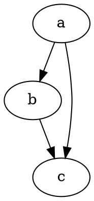

# Začínáme

@knowvah/dot-engine je věrná portace [Graphviz](https://graphviz.org/) do TypeScriptu.
Parsuje jazyk DOT, spouští moduly rozvržení Graphviz a vydává SVG — v
čistém TypeScriptu, bez C: žádná nativní binárka Graphviz a žádná WASM portace.

::: tip Jste u knihovny noví?
Nejdřív si přečtěte [Přehled](/cs/guide/overview) — ukazuje zřetězení zpracování
(parsování/sestavení → rozvržení → vykreslení / čtení geometrie) a tři vstupní body
(`@knowvah/dot-engine`, `@knowvah/dot-engine/api`, `@knowvah/dot-engine/render`), abyste před
instalací věděli, které dveře použít.
:::

## Instalace

@knowvah/dot-engine je publikován na npm:

```bash
npm i @knowvah/dot-engine
```

Žádné závislosti za běhu. Balíček `canvas` je volitelná peer závislost,
potřebná jen pro měření textu věrné hostiteli v Node — viz
[Měření textu](/cs/guide/text-measurement). Balíček dodává tři vstupní
body (`@knowvah/dot-engine`, `@knowvah/dot-engine/api`, `@knowvah/dot-engine/render`), každý s
vlastními typovými deklaracemi `.d.ts`, deklaračními mapami a source mapami — „přejít
na definici“ skočí do skutečného zdrojového kódu v TypeScriptu, který je
součástí sestavení.

Chcete-li místo toho sestavit ze zdrojového kódu:

```bash
git clone https://github.com/knowvah/dot-engine.git
cd dot-engine
npm install
npm run build        # → dist/index.js (ESM bundle, via esbuild) + .d.ts
```

## Vykreslení grafu

```ts
import { renderSvg } from '@knowvah/dot-engine';

const dot = `
  digraph {
    a -> b;
    b -> c;
    a -> c;
  }
`;

const svg = renderSvg(dot, 'dot');
console.log(svg); // <svg ...>...</svg>
```

`renderSvg(dotSource, engine)` parsuje zdrojový kód DOT, spustí pojmenovaný
[modul rozvržení](/cs/guide/engines), vykreslí do SVG a vrátí řetězec SVG.

Tady je přesně tentýž graf, vykreslený na této stránce samotným modulem (přes
[`@knowvah/vitepress-plugin-dot`](https://www.npmjs.com/package/@knowvah/vitepress-plugin-dot)):



Jste u DOT noví? Je to malý jazyk v prostém textu pro popis grafů —
kanonická **[reference jazyka DOT](https://graphviz.org/doc/info/lang.html)** je
průvodce syntaxí a [Přehled](/cs/guide/overview#co-je-dot-co-je-graphviz)
obsahuje úvod na jeden odstavec.

## Další kroky

- [Přehled](/cs/guide/overview) — mentální model a tři vstupní body.
- [Moduly rozvržení](/cs/guide/engines) — osm modulů a kdy který použít.
- [Sestavení grafu v kódu](/cs/guide/build-a-graph) — builder `createGraph`.
- [Recepty](/cs/guide/recipes) — spustitelná řešení podle úloh.
- [Čtení vypočtené geometrie](/cs/guide/geometry) — pozice a spliny přes
  `getLayout`.
- [Práce s obrázky](/cs/guide/images) — vkládání, nasazení a CSP.
- [Typy](/cs/guide/types) — veřejné datové tvary a jak spolu souvisejí.
- [Použití v prohlížeči](/cs/guide/browser) — bundling a háček `setImageSizer`.
- [Reference API](/cs/guide/api) — úplný veřejný povrch.
- [Hřiště](/cs/playground) — upravte DOT a sledujte SVG živě, ve svém prohlížeči.
