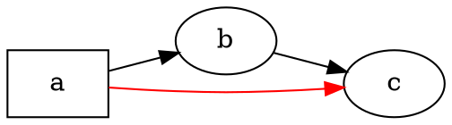

# Přehled

@knowvah/dot-engine je řádek po řádku přenesená portace [Graphviz](https://graphviz.org/) do TypeScriptu:
na vstupu je zdrojový kód DOT (nebo graf sestavený v kódu), na výstupu SVG — nebo JSON, xdot,
DOT či mapa obrázku — a vše se počítá výhradně v TypeScriptu, bez nativní binárky
Graphviz a bez WASM. Pokud jste zatím nic nevykreslili, začněte
v části [Začínáme](/cs/guide/getting-started); tato stránka je mapou nad ní — co knihovna
dělá a po kterém ze svých tří vstupních bodů sáhnout.

## Co je DOT? Co je Graphviz?

**DOT** je malý jazyk v prostém textu pro popis grafů — uzlů, hran
a jejich atributů:



To je celý vstupní formát: deklarujete uzly, spojíte je pomocí `->` (orientovaná hrana)
nebo `--` (neorientovaná hrana) a atributy nastavíte v `[...]`. Úplná gramatika —
příkazy, podgrafy, porty, popisky podobné HTML i všechny atributy — je definována
v kanonické **[referenci jazyka DOT](https://graphviz.org/doc/info/lang.html)**
(spolu s úplným [seznamem atributů](https://graphviz.org/doc/info/attrs.html)).
`@knowvah/dot-engine` tento jazyk parsuje přesně tak jako upstream — takže každé
DOT, které přijímají nástroje v C, přijme i tato knihovna.

**Graphviz** je open-source nástroj pro vizualizaci grafů, pro který byl DOT vytvořen.
Vznikl v **AT&T Bell Labs** (Murray Hill, NJ) — zásadní technická
zpráva Eleftheriose Koutsofiose a Stephena Northa pochází z roku **1991** — a dnes
je udržován pod licencí **Eclipse Public License** (stejnou licenci nese i tato
portace). Tato knihovna je věrnou reimplementací v TypeScriptu; kód v C je
specifikací, se kterou se shodujeme v úzké toleranci. K původnímu
projektu:

- **[graphviz.org](https://graphviz.org/)** — oficiální stránky projektu, dokumentace
  a reference DOT a atributů.
- **[gitlab.com/graphviz/graphviz](https://gitlab.com/graphviz/graphviz)** — kanonický
  zdrojový kód v C, ze kterého portujeme.
- **[Graphviz na Wikipedii](https://en.wikipedia.org/wiki/Graphviz)** — historie a
  souvislosti.

## Zřetězení zpracování

Každé vykreslení, ať ho spustí kterýkoli vstupní bod, má stejný tvar: získáte
`Graph` (parsováním DOT nebo programovým sestavením), nad ním spustíte modul
rozvržení a pak buď výsledek serializujete, nebo vypočtenou geometrii přečtete
zpět ze stejného objektu grafu.

```graphviz
digraph pipeline {
  rankdir=LR;
  bgcolor="transparent";
  node [shape=box, style=rounded, fontname="Helvetica", fontsize=11];
  edge [fontname="Helvetica", fontsize=10];

  src  [label="DOT source"];
  api  [label="createGraph()"];
  g    [label="Graph"];
  eng  [label="layout engine\n(dot · neato · fdp · sfdp ·\ncirco · twopi · osage · patchwork)"];
  out  [label="SVG / JSON / xdot /\nDOT / imagemap"];
  snap [label="LayoutSnapshot\n(nodes, edges, bounds)"];

  src -> g [label="parse()"];
  api -> g [label=".graph"];
  g -> eng;
  eng -> out  [label="render()"];
  eng -> snap [label="getLayout()"];
}
```

Samostatné volání „spustit rozvržení“ neexistuje: `renderSvg` a `render` spouštějí
rozvržení jako součást vykreslování a vypočtené souřadnice (pozice uzlů,
spliny hran, ohraničující obdélník) zůstávají po něm uloženy v objektu `Graph`.
`getLayout` rozvržení znovu nespouští — čte geometrii, kterou už dříve vypočetlo volání
`render`, takže se vždy volá *po* `render`, na stejném
grafu.

## Tři vstupní body — které dveře?

@knowvah/dot-engine dodává tři vstupní body: kořenový balíček reexportuje vše
z těch dvou dalších, takže po nich sáhnete jen tehdy, když chcete
užší povrch importu.

| Chci…                                                  | Použít                                  |
|--------------------------------------------------------|-----------------------------------------|
| Rychle převést text DOT na řetězec SVG                  | `@knowvah/dot-engine` — `renderSvg(dot, engine)` |
| Parsovat DOT bez vykreslení                             | `@knowvah/dot-engine` — `parse(dot)`             |
| Globálně nastavit měření textu nebo zjišťování obrázků  | `@knowvah/dot-engine` — `setTextMeasurer`, `setImageSizer`, `setImageResolver` |
| Sestavit graf v kódu, bez textu DOT                     | `@knowvah/dot-engine/api` — `createGraph`, `addEdge` |
| Přečíst vypočtené pozice uzlů/hran/clusterů              | `@knowvah/dot-engine/api` — `getLayout`          |
| Vykreslit do jiného formátu než SVG (JSON, xdot, DOT, mapa obrázku) | `@knowvah/dot-engine/render` — `render(g, format, opts?)` |
| Řídit vlastní backend pro canvas/WebGL/PDF               | `@knowvah/dot-engine/render` — `getDrawOps`      |

`@knowvah/dot-engine/api` jsou dveře *sestavit + zkontrolovat*: graf sestavíte
programově a čtete z něj geometrii. `@knowvah/dot-engine/render` jsou dveře
*výstupu*: graf (z `parse()` nebo z builderu) převedou na
serializovaný formát nebo strukturovaný proud kreslicích operací. Kořenový balíček
`@knowvah/dot-engine` reexportuje obojí, navíc jednorázovou pohodlnou funkci `renderSvg`
a globální konfigurační háčky — většina projektů importuje výhradně
z kořene.

## Souřadnicové soustavy ve stručnosti

Nativní souřadnice Graphviz mají osu y nahoru a počátek vlevo dole — konvence,
ve které moduly rozvržení počítají. Většina příjemců na obrazovce a v canvasu
chce osu y dolů a počátek vlevo nahoře. `getLayout` má výchozí hodnotu `yAxis:
'down'` a osu za vás převrátí; surové textové formáty (`svg`, `json`, `xdot`,
`plain`) nesou nativní souřadnice s osou y nahoru beze změny. Úplný souřadnicový přehled najdete v části
[Čtení vypočtené geometrie](/cs/guide/geometry)
a vzor pro převrácení a sjednocení v části [Recepty](/cs/guide/recipes), když
potřebujete smíchat výstup `getLayout` se souřadnicemi surového formátu.

## Hranice rozsahu

@knowvah/dot-engine vykresluje do SVG, JSON, xdot, DOT a HTML map obrázků (`imap` /
`cmapx`) — deterministických výstupních formátů založených na řetězcích nebo struktuře. Rastrové
obrázky (PNG, JPEG) ani PDF nevytváří a nemá žádný grafický prohlížeč;
to vše je mimo rozsah portace v čistém TypeScriptu bezpečné pro prohlížeč. Známé
rozdíly oproti chování nativního Graphviz — nejde o mezery ve výstupních formátech, ale o
místa, kde se výstup portace liší — jsou evidovány na stránce
[Odchylky](/cs/divergences).

## Kam dál

- [Začínáme](/cs/guide/getting-started) — instalace a vykreslení prvního grafu.
- [Moduly rozvržení](/cs/guide/engines) — osm modulů a kdy který použít.
- [Sestavení grafu v kódu](/cs/guide/build-a-graph) — builder `@knowvah/dot-engine/api`.
- [Čtení vypočtené geometrie](/cs/guide/geometry) — `getLayout`, souřadnicové soustavy, jednotky.
- [Recepty](/cs/guide/recipes) — běžné vzory podle úloh.
- [Obrázky](/cs/guide/images) — `setImageSizer`, `setImageResolver`, vkládání.
- [Reference typů](/cs/guide/types) — úplné tvary všech exportovaných typů.
- [Reference API](/reference/) — generovaná dokumentace jednotlivých symbolů.
- [Slovníček](/cs/guide/glossary) — terminologie Graphviz a @knowvah/dot-engine.
