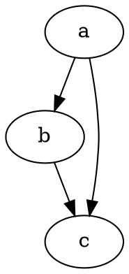

# Kom godt i gang

@knowvah/dot-engine er en tro TypeScript-portering af [Graphviz](https://graphviz.org/).
Det parser DOT-sproget, kører Graphviz' layoutmotorer og udsender SVG — i
ren TypeScript — uden C: ingen native Graphviz-binær og ingen WASM-portering.

::: tip Ny med biblioteket?
Læs først [Overblik](/da/guide/overview) — det kortlægger pipelinen
(parse/byg → layout → render / læs geometri) og de tre indgangspunkter
(`@knowvah/dot-engine`, `@knowvah/dot-engine/api`, `@knowvah/dot-engine/render`), så du ved, hvilken
dør du skal bruge, før du installerer.
:::

## Installation

@knowvah/dot-engine er udgivet på npm:

```bash
npm i @knowvah/dot-engine
```

Ingen runtime-afhængigheder. Pakken `canvas` er en valgfri peer-afhængighed,
som kun er nødvendig for værtstro tekstmåling i Node — se
[Tekstmåling](/da/guide/text-measurement). Pakken leveres med tre indgangspunkter
(`@knowvah/dot-engine`, `@knowvah/dot-engine/api`, `@knowvah/dot-engine/render`), hver med
sine egne `.d.ts`-typedeklarationer, deklarationskort og kildekort — „gå til
definition“ hopper ind i den rigtige TypeScript-kildekode, som leveres sammen med
buildet.

Sådan bygger du i stedet fra kildekoden:

```bash
git clone https://github.com/knowvah/dot-engine.git
cd @knowvah/dot-engine
npm install
npm run build        # → dist/index.js (ESM bundle, via esbuild) + .d.ts
```

## Rendér en graf

```ts
import { renderSvg } from '@knowvah/dot-engine';

const dot = `
  digraph {
    a -> b;
    b -> c;
    a -> c;
  }
`;

const svg = renderSvg(dot, 'dot');
console.log(svg); // <svg ...>...</svg>
```

`renderSvg(dotSource, engine)` parser DOT-kildekoden, kører den angivne
[layoutmotor](/da/guide/engines), renderer til SVG og returnerer SVG-strengen.

Her er præcis den graf, renderet på denne side af selve motoren (via
[`@knowvah/vitepress-plugin-dot`](https://www.npmjs.com/package/@knowvah/vitepress-plugin-dot)):



Ny med DOT? Det er et lille almindeligt tekstsprog til at beskrive grafer — den
kanoniske **[DOT-sprogreference](https://graphviz.org/doc/info/lang.html)** er
syntaksguiden, og [Overblik](/da/guide/overview#hvad-er-dot-hvad-er-graphviz)
har en indføring på ét afsnit.

## Næste skridt

- [Overblik](/da/guide/overview) — den mentale model og de tre indgangspunkter.
- [Layoutmotorer](/da/guide/engines) — de otte motorer, og hvornår du bruger hver af dem.
- [Byg en graf i kode](/da/guide/build-a-graph) — byggeren `createGraph`.
- [Opskrifter](/da/guide/recipes) — opgaveorienterede, kørbare løsninger.
- [Læs beregnet geometri](/da/guide/geometry) — positioner og splines via
  `getLayout`.
- [Arbejd med billeder](/da/guide/images) — indlejring, udrulning og CSP.
- [Typer](/da/guide/types) — de offentlige dataformer og hvordan de hænger sammen.
- [Brug i browseren](/da/guide/browser) — bundling og krogen `setImageSizer`.
- [API-reference](/da/guide/api) — hele den offentlige flade.
- [Legeplads](/da/playground) — redigér DOT og se SVG live, i din browser.
