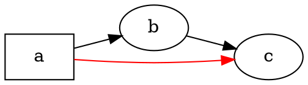

# Overblik

@knowvah/dot-engine er en linje-for-linje-TypeScript-portering af [Graphviz](https://graphviz.org/):
DOT-kildekode (eller en graf bygget i kode) går ind, SVG — eller JSON, xdot, DOT
eller et billedkort — kommer ud, beregnet udelukkende i TypeScript uden en native
Graphviz-binær og uden WASM. Hvis du endnu ikke har renderet noget, så start med
[Kom godt i gang](/da/guide/getting-started); denne side er kortet over det hele —
hvad biblioteket gør, og hvilket af dets tre indgangspunkter du skal vælge.

## Hvad er DOT? Hvad er Graphviz?

**DOT** er et lille, almindeligt tekstsprog til at beskrive grafer — knuder,
kanter og deres attributter:



Det er hele inputformatet: deklarér knuder, forbind dem med `->` (rettet)
eller `--` (urettet), og angiv attributter i `[...]`. Den fulde grammatik —
sætninger, delgrafer, porte, HTML-lignende etiketter og alle attributter — er
defineret i den kanoniske **[DOT-sprogreference](https://graphviz.org/doc/info/lang.html)**
(med den fulde [attributliste](https://graphviz.org/doc/info/attrs.html) ved siden af).
`@knowvah/dot-engine` parser dette sprog præcis, som upstream gør — så enhver
DOT, som C-værktøjerne accepterer, er DOT, som dette bibliotek accepterer.

**Graphviz** er det open source-værktøjssæt til grafvisualisering, som DOT blev
skabt til. Det opstod hos **AT&T Bell Labs** (Murray Hill, NJ) — en grundlæggende
teknisk rapport af Eleftherios Koutsofios og Stephen North stammer fra **1991** —
og vedligeholdes i dag under **Eclipse Public License** (den samme licens, som
denne portering bærer). Dette bibliotek er en tro TypeScript-genimplementering af
det; C-koden er specifikationen, som vi matcher inden for en snæver tolerance. For
det oprindelige projekt:

- **[graphviz.org](https://graphviz.org/)** — det officielle projektsite, dokumentationen
  og DOT- og attributreferencerne.
- **[gitlab.com/graphviz/graphviz](https://gitlab.com/graphviz/graphviz)** — den
  kanoniske C-kildekode, som vi porterer fra.
- **[Graphviz på Wikipedia](https://en.wikipedia.org/wiki/Graphviz)** — historie og
  baggrund.

## Pipelinen

Hvert render følger samme forløb, uanset hvilket indgangspunkt der starter det:
skaf en `Graph` (ved at parse DOT eller bygge en programmatisk), kør en
layoutmotor over den, og enten serialisér resultatet eller læs den beregnede
geometri tilbage fra det samme grafobjekt.

```graphviz
digraph pipeline {
  rankdir=LR;
  bgcolor="transparent";
  node [shape=box, style=rounded, fontname="Helvetica", fontsize=11];
  edge [fontname="Helvetica", fontsize=10];

  src  [label="DOT source"];
  api  [label="createGraph()"];
  g    [label="Graph"];
  eng  [label="layout engine\n(dot · neato · fdp · sfdp ·\ncirco · twopi · osage · patchwork)"];
  out  [label="SVG / JSON / xdot /\nDOT / imagemap"];
  snap [label="LayoutSnapshot\n(nodes, edges, bounds)"];

  src -> g [label="parse()"];
  api -> g [label=".graph"];
  g -> eng;
  eng -> out  [label="render()"];
  eng -> snap [label="getLayout()"];
}
```

Der er intet separat „kør layout“-kald: `renderSvg` og `render` udløser layout
som en del af renderingen, og de beregnede koordinater (knudepositioner,
kantsplines, afgrænsningsramme) bevares bagefter på `Graph`-objektet.
`getLayout` kører ikke layout igen — den læser geometri, som et tidligere
`render`-kald allerede har beregnet, så den kaldes altid *efter* `render`, på
den samme graf.

## De tre indgangspunkter — hvilken dør?

@knowvah/dot-engine leveres med tre indgangspunkter: rodpakken re-eksporterer alt
fra de to andre, så du kun behøver at række forbi den, når du vil have en
snævrere importflade.

| Jeg vil gerne…                                        | Brug                                   |
|--------------------------------------------------------|-----------------------------------------|
| Omdanne DOT-tekst til en SVG-streng, hurtigt            | `@knowvah/dot-engine` — `renderSvg(dot, engine)` |
| Parse DOT uden at rendere det                           | `@knowvah/dot-engine` — `parse(dot)`             |
| Konfigurere tekstmåling eller billedopløsning globalt   | `@knowvah/dot-engine` — `setTextMeasurer`, `setImageSizer`, `setImageResolver` |
| Bygge en graf i kode, uden DOT-tekst                    | `@knowvah/dot-engine/api` — `createGraph`, `addEdge` |
| Læse beregnede knude-/kant-/clusterpositioner tilbage    | `@knowvah/dot-engine/api` — `getLayout`          |
| Rendere til et andet format end SVG (JSON, xdot, DOT, billedkort) | `@knowvah/dot-engine/render` — `render(g, format, opts?)` |
| Drive en egen canvas-/WebGL-/PDF-backend                 | `@knowvah/dot-engine/render` — `getDrawOps`      |

`@knowvah/dot-engine/api` er *byg + inspicér*-døren: konstruér en graf
programmatisk og læs geometri fra den. `@knowvah/dot-engine/render` er
*output*-døren: omdan en graf (fra enten `parse()` eller byggeren) til et
serialiseret format eller en struktureret strøm af tegneoperationer. Rodpakken
`@knowvah/dot-engine` re-eksporterer begge, plus den hurtige `renderSvg`-hjælpefunktion
og de globale konfigurationskroge — de fleste projekter importerer kun fra
roden.

## Koordinatsystemer, kort fortalt

Native graphviz-koordinater har y opad og origo nederst til venstre — den
konvention, layoutmotorerne regner i. De fleste skærm- og canvas-forbrugere
vil have y nedad og origo øverst til venstre. `getLayout` bruger som standard
`yAxis: 'down'` og vender det for dig; de rå strengformater (`svg`, `json`, `xdot`,
`plain`) bærer uændrede native y-opad-koordinater. Se
[Læs beregnet geometri](/da/guide/geometry) for den fulde koordinatreference,
og [Opskrifter](/da/guide/recipes) for mønstret med at vende og afstemme, når du
skal blande `getLayout`-output med koordinaterne fra et råt format.

## Afgrænsning

@knowvah/dot-engine renderer til SVG, JSON, xdot, DOT og HTML-billedkort (`imap` /
`cmapx`) — de deterministiske, streng- eller strukturbaserede outputformater. Det
producerer ikke rasterbilleder (PNG, JPEG) eller PDF, og det har ingen GUI-viser;
det ligger uden for omfanget af en browsersikker, ren TypeScript-portering. Kendte
forskelle fra native Graphviz' adfærd — ikke huller i outputformater, men steder,
hvor portens output afviger — spores på siden
[Afvigelser](/da/divergences).

## Hvor går du hen herfra

- [Kom godt i gang](/da/guide/getting-started) — installér og rendér din første graf.
- [Layoutmotorer](/da/guide/engines) — de otte motorer, og hvornår du bruger hver af dem.
- [Byg en graf i kode](/da/guide/build-a-graph) — byggeren `@knowvah/dot-engine/api`.
- [Læs beregnet geometri](/da/guide/geometry) — `getLayout`, koordinatsystemer, enheder.
- [Opskrifter](/da/guide/recipes) — almindelige opgavebaserede mønstre.
- [Billeder](/da/guide/images) — `setImageSizer`, `setImageResolver`, indlejring.
- [Typereference](/da/guide/types) — fulde former for hver eksporteret type.
- [API-reference](/reference/) — genereret dokumentation pr. symbol.
- [Ordliste](/da/guide/glossary) — terminologi fra Graphviz og @knowvah/dot-engine.
