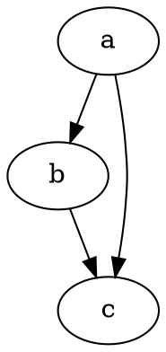

# Erste Schritte

@knowvah/dot-engine ist eine originalgetreue TypeScript-Portierung von [Graphviz](https://graphviz.org/).
Sie parst die Sprache DOT, führt die Layout-Engines von Graphviz aus und gibt SVG aus — in
reinem TypeScript, ohne C: kein natives Graphviz-Binary und keine WASM-Portierung.

::: tip Neu bei der Bibliothek?
Lesen Sie zuerst den [Überblick](/de/guide/overview) — er zeigt die Pipeline
(Parsen/Aufbauen → Layout → Rendern / Geometrie auslesen) und die drei Einstiegspunkte
(`@knowvah/dot-engine`, `@knowvah/dot-engine/api`, `@knowvah/dot-engine/render`), damit Sie vor
der Installation wissen, welche Tür Sie nehmen.
:::

## Installation

@knowvah/dot-engine ist auf npm veröffentlicht:

```bash
npm i @knowvah/dot-engine
```

Keine Laufzeitabhängigkeiten. Das Paket `canvas` ist eine optionale Peer-Abhängigkeit, die
nur für hostgetreue Textvermessung in Node benötigt wird — siehe
[Textvermessung](/de/guide/text-measurement). Das Paket liefert drei Einstiegspunkte
(`@knowvah/dot-engine`, `@knowvah/dot-engine/api`, `@knowvah/dot-engine/render`), jeweils mit
eigenen `.d.ts`-Typdeklarationen, Declaration Maps und Source Maps — „Zur Definition
springen“ landet im echten TypeScript-Quelltext, der dem Build beiliegt.

Um stattdessen aus dem Quelltext zu bauen:

```bash
git clone https://github.com/knowvah/dot-engine.git
cd dot-engine
npm install
npm run build        # → dist/index.js (ESM bundle, via esbuild) + .d.ts
```

## Einen Graphen rendern

```ts
import { renderSvg } from '@knowvah/dot-engine';

const dot = `
  digraph {
    a -> b;
    b -> c;
    a -> c;
  }
`;

const svg = renderSvg(dot, 'dot');
console.log(svg); // <svg ...>...</svg>
```

`renderSvg(dotSource, engine)` parst den DOT-Quelltext, führt die benannte
[Layout-Engine](/de/guide/engines) aus, rendert nach SVG und gibt den SVG-String zurück.

Hier ist genau dieser Graph, auf dieser Seite von der Engine selbst gerendert (über
[`@knowvah/vitepress-plugin-dot`](https://www.npmjs.com/package/@knowvah/vitepress-plugin-dot)):



Neu bei DOT? Es ist eine kleine Klartextsprache zur Beschreibung von Graphen — die
kanonische **[DOT-Sprachreferenz](https://graphviz.org/doc/info/lang.html)** ist der
Syntaxleitfaden, und der [Überblick](/de/guide/overview#was-ist-dot-was-ist-graphviz)
enthält eine einabsätzige Einführung.

## Nächste Schritte

- [Überblick](/de/guide/overview) — das Denkmodell und die drei Einstiegspunkte.
- [Layout-Engines](/de/guide/engines) — die acht Engines und wann Sie welche einsetzen.
- [Einen Graphen im Code aufbauen](/de/guide/build-a-graph) — der Builder `createGraph`.
- [Rezepte](/de/guide/recipes) — aufgabenorientierte, lauffähige Lösungen.
- [Berechnete Geometrie auslesen](/de/guide/geometry) — Positionen und Splines über
  `getLayout`.
- [Mit Bildern arbeiten](/de/guide/images) — Inlining, Deployment und CSP.
- [Typen](/de/guide/types) — die öffentlichen Datenformen und wie sie zusammenhängen.
- [Im Browser verwenden](/de/guide/browser) — Bundling und der Hook `setImageSizer`.
- [API-Referenz](/de/guide/api) — die vollständige öffentliche Oberfläche.
- [Spielwiese](/de/playground) — DOT bearbeiten und SVG live im Browser sehen.
