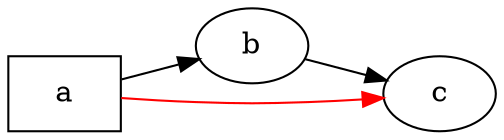

# Überblick

@knowvah/dot-engine ist eine zeilenweise TypeScript-Portierung von [Graphviz](https://graphviz.org/):
DOT-Quelltext (oder ein im Code aufgebauter Graph) geht hinein, SVG — oder JSON, xdot, DOT
oder eine Image-Map — kommt heraus, vollständig in TypeScript berechnet, ohne natives
Graphviz-Binary und ohne WASM. Wenn Sie noch nichts gerendert haben, beginnen Sie bei
[Erste Schritte](/de/guide/getting-started); diese Seite ist die Landkarte darüber — was die
Bibliothek tut und welchen ihrer drei Einstiegspunkte Sie wählen sollten.

## Was ist DOT? Was ist Graphviz?

**DOT** ist eine kleine Klartextsprache zur Beschreibung von Graphen — Knoten, Kanten und
ihre Attribute:



Das ist das gesamte Eingabeformat: Knoten deklarieren, mit `->` (gerichtet) oder `--`
(ungerichtet) verbinden und Attribute in `[...]` setzen. Die vollständige Grammatik —
Anweisungen, Teilgraphen, Ports, HTML-artige Labels und jedes Attribut — ist in der
kanonischen **[DOT-Sprachreferenz](https://graphviz.org/doc/info/lang.html)** definiert
(zusammen mit der [Attributliste](https://graphviz.org/doc/info/attrs.html)).
`@knowvah/dot-engine` parst diese Sprache genau wie das Original — jedes DOT, das die
C-Werkzeuge akzeptieren, akzeptiert also auch diese Bibliothek.

**Graphviz** ist das Open-Source-Toolkit zur Graphvisualisierung, für das DOT entwickelt
wurde. Es entstand bei **AT&T Bell Labs** (Murray Hill, NJ) — ein grundlegender technischer
Bericht von Eleftherios Koutsofios und Stephen North stammt aus dem Jahr **1991** — und
wird heute unter der **Eclipse Public License** gepflegt (derselben Lizenz, unter der diese
Portierung steht). Diese Bibliothek ist eine originalgetreue TypeScript-Neuimplementierung;
der C-Code ist die Spezifikation, der wir bis auf eine enge Toleranz entsprechen. Zum
ursprünglichen Projekt:

- **[graphviz.org](https://graphviz.org/)** — die offizielle Projektseite mit Dokumentation
  sowie den DOT- und Attributreferenzen.
- **[gitlab.com/graphviz/graphviz](https://gitlab.com/graphviz/graphviz)** — der
  kanonische C-Quelltext, den wir portieren.
- **[Graphviz auf Wikipedia](https://en.wikipedia.org/wiki/Graphviz)** — Geschichte und
  Hintergrund.

## Die Pipeline

Jedes Rendering folgt, unabhängig davon, welcher Einstiegspunkt es auslöst, demselben
Muster: einen `Graph` besorgen (durch Parsen von DOT oder programmatisches Aufbauen), eine
Layout-Engine darüber laufen lassen und dann entweder das Ergebnis serialisieren oder die
berechnete Geometrie vom selben Graph-Objekt zurücklesen.

```graphviz
digraph pipeline {
  rankdir=LR;
  bgcolor="transparent";
  node [shape=box, style=rounded, fontname="Helvetica", fontsize=11];
  edge [fontname="Helvetica", fontsize=10];

  src  [label="DOT source"];
  api  [label="createGraph()"];
  g    [label="Graph"];
  eng  [label="layout engine\n(dot · neato · fdp · sfdp ·\ncirco · twopi · osage · patchwork)"];
  out  [label="SVG / JSON / xdot /\nDOT / imagemap"];
  snap [label="LayoutSnapshot\n(nodes, edges, bounds)"];

  src -> g [label="parse()"];
  api -> g [label=".graph"];
  g -> eng;
  eng -> out  [label="render()"];
  eng -> snap [label="getLayout()"];
}
```

Es gibt keinen separaten Aufruf „Layout ausführen“: `renderSvg` und `render` lösen das
Layout als Teil des Renderings aus, und die berechneten Koordinaten (Knotenpositionen,
Kanten-Splines, Begrenzungsrahmen) bleiben danach am `Graph`-Objekt erhalten. `getLayout`
führt das Layout nicht erneut aus — es liest Geometrie, die ein früherer `render`-Aufruf
bereits berechnet hat, und wird daher immer *nach* `render` auf demselben Graphen
aufgerufen.

## Die drei Einstiegspunkte — welche Tür?

@knowvah/dot-engine liefert drei Einstiegspunkte: Das Wurzelpaket re-exportiert alles aus
den beiden anderen, sodass Sie nur dann daran vorbeigreifen müssen, wenn Sie eine
schmalere Importfläche wünschen.

| Ich möchte …                                          | Verwenden                              |
|--------------------------------------------------------|-----------------------------------------|
| DOT-Text schnell in einen SVG-String umwandeln          | `@knowvah/dot-engine` — `renderSvg(dot, engine)` |
| DOT parsen, ohne es zu rendern                          | `@knowvah/dot-engine` — `parse(dot)`             |
| Textvermessung oder Bildauflösung global konfigurieren  | `@knowvah/dot-engine` — `setTextMeasurer`, `setImageSizer`, `setImageResolver` |
| Einen Graphen im Code aufbauen, ohne DOT-Text           | `@knowvah/dot-engine/api` — `createGraph`, `addEdge` |
| Berechnete Knoten-/Kanten-/Cluster-Positionen auslesen   | `@knowvah/dot-engine/api` — `getLayout`          |
| In ein anderes Format als SVG rendern (JSON, xdot, DOT, Image-Map) | `@knowvah/dot-engine/render` — `render(g, format, opts?)` |
| Ein eigenes Canvas-/WebGL-/PDF-Backend ansteuern         | `@knowvah/dot-engine/render` — `getDrawOps`      |

`@knowvah/dot-engine/api` ist die Tür zum *Aufbauen und Untersuchen*: einen Graphen
programmatisch konstruieren und Geometrie davon auslesen. `@knowvah/dot-engine/render` ist
die *Ausgabe*-Tür: einen Graphen (aus `parse()` oder dem Builder) in ein serialisiertes
Format oder einen strukturierten Draw-Op-Strom umwandeln. Das Wurzelpaket
`@knowvah/dot-engine` re-exportiert beide, dazu die One-Shot-Komfortfunktion `renderSvg`
und die globalen Konfigurations-Hooks — die meisten Projekte importieren ausschließlich
aus dem Wurzelpaket.

## Koordinatensysteme, kurz

Native Graphviz-Koordinaten sind y-aufwärts mit dem Ursprung unten links — die Konvention,
in der die Layout-Engines rechnen. Die meisten Bildschirm- und Canvas-Verbraucher wollen
y-abwärts mit dem Ursprung oben links. `getLayout` verwendet standardmäßig `yAxis:
'down'` und spiegelt für Sie; die rohen String-Formate (`svg`, `json`, `xdot`,
`plain`) tragen unverändert die nativen y-aufwärts-Koordinaten. Siehe
[Berechnete Geometrie auslesen](/de/guide/geometry) für die vollständige Koordinatenreferenz
und [Rezepte](/de/guide/recipes) für das Muster zum Spiegeln und Abgleichen, wenn Sie
`getLayout`-Ausgaben mit den Koordinaten eines Rohformats mischen müssen.

## Geltungsbereich

@knowvah/dot-engine rendert nach SVG, JSON, xdot, DOT und HTML-Image-Maps (`imap` /
`cmapx`) — die deterministischen, string- oder strukturbasierten Ausgabeformate. Es
erzeugt keine Rasterbilder (PNG, JPEG) und kein PDF und hat keinen GUI-Viewer; das liegt
für eine browsersichere Portierung in reinem TypeScript außerhalb des Umfangs. Bekannte
Unterschiede zum Verhalten des nativen Graphviz — keine Lücken bei den Ausgabeformaten,
sondern Stellen, an denen die Ausgabe der Portierung abweicht — werden auf der Seite
[Abweichungen](/de/divergences) nachgehalten.

## Wie es weitergeht

- [Erste Schritte](/de/guide/getting-started) — installieren und den ersten Graphen rendern.
- [Layout-Engines](/de/guide/engines) — die acht Engines und wann Sie welche einsetzen.
- [Einen Graphen im Code aufbauen](/de/guide/build-a-graph) — der Builder `@knowvah/dot-engine/api`.
- [Berechnete Geometrie auslesen](/de/guide/geometry) — `getLayout`, Koordinatensysteme, Einheiten.
- [Rezepte](/de/guide/recipes) — gängige aufgabenbezogene Muster.
- [Bilder](/de/guide/images) — `setImageSizer`, `setImageResolver`, Inlining.
- [Typenreferenz](/de/guide/types) — vollständige Formen aller exportierten Typen.
- [API-Referenz](/reference/) — generierte Dokumentation pro Symbol.
- [Glossar](/de/guide/glossary) — Begriffe aus Graphviz und @knowvah/dot-engine.
