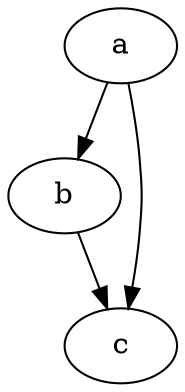

# Primeros pasos

@knowvah/dot-engine es una adaptación fiel a TypeScript de [Graphviz](https://graphviz.org/).
Analiza el lenguaje DOT, ejecuta los motores de diseño de Graphviz y emite SVG — en
TypeScript puro — sin C: sin binario nativo de Graphviz y sin adaptación a WASM.

::: tip ¿Eres nuevo en la biblioteca?
Lee primero la [Visión general](/es/guide/overview): describe la canalización
(analizar/construir → diseño → renderizar / leer la geometría) y los tres puntos de entrada
(`@knowvah/dot-engine`, `@knowvah/dot-engine/api`, `@knowvah/dot-engine/render`) para que sepas qué
puerta usar antes de instalar.
:::

## Instalar

@knowvah/dot-engine está publicado en npm:

```bash
npm i @knowvah/dot-engine
```

Sin dependencias en tiempo de ejecución. El paquete `canvas` es una dependencia par
opcional, necesaria solo para una medición de texto fiel al anfitrión en Node — consulta
[Medición de texto](/es/guide/text-measurement). El paquete incluye tres puntos
de entrada (`@knowvah/dot-engine`, `@knowvah/dot-engine/api`, `@knowvah/dot-engine/render`), cada uno con
sus propias declaraciones de tipos `.d.ts`, mapas de declaraciones y mapas de código fuente — «ir a la
definición» salta al código fuente real en TypeScript, que se distribuye junto con la
compilación.

Para compilar desde el código fuente en su lugar:

```bash
git clone https://github.com/knowvah/dot-engine.git
cd @knowvah/dot-engine
npm install
npm run build        # → dist/index.js (ESM bundle, via esbuild) + .d.ts
```

## Renderizar un grafo

```ts
import { renderSvg } from '@knowvah/dot-engine';

const dot = `
  digraph {
    a -> b;
    b -> c;
    a -> c;
  }
`;

const svg = renderSvg(dot, 'dot');
console.log(svg); // <svg ...>...</svg>
```

`renderSvg(dotSource, engine)` analiza el código fuente DOT, ejecuta el
[motor de diseño](/es/guide/engines) indicado, renderiza a SVG y devuelve la cadena SVG.

Este es exactamente ese grafo, renderizado en esta página por el propio motor (mediante
[`@knowvah/vitepress-plugin-dot`](https://www.npmjs.com/package/@knowvah/vitepress-plugin-dot)):



¿Eres nuevo en DOT? Es un lenguaje pequeño de texto plano para describir grafos — la
**[referencia del lenguaje DOT](https://graphviz.org/doc/info/lang.html)** canónica es
la guía de sintaxis, y la [Visión general](/es/guide/overview#what-is-dot-what-is-graphviz)
incluye una introducción de un párrafo.

## Siguientes pasos

- [Visión general](/es/guide/overview) — el modelo mental y los tres puntos de entrada.
- [Motores de diseño](/es/guide/engines) — los ocho motores y cuándo usar cada uno.
- [Construir un grafo en código](/es/guide/build-a-graph) — el constructor `createGraph`.
- [Recetas](/es/guide/recipes) — soluciones ejecutables orientadas a tareas.
- [Leer la geometría calculada](/es/guide/geometry) — posiciones y splines mediante
  `getLayout`.
- [Trabajar con imágenes](/es/guide/images) — inserción en línea, despliegue y CSP.
- [Tipos](/es/guide/types) — las formas de datos públicas y cómo se relacionan.
- [Uso en el navegador](/es/guide/browser) — empaquetado y el gancho `setImageSizer`.
- [Referencia de la API](/es/guide/api) — toda la superficie pública.
- [Zona de pruebas](/es/playground) — edita DOT y mira el SVG en vivo, en tu navegador.
