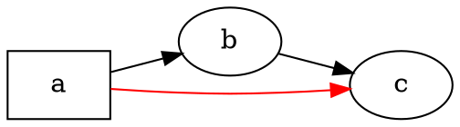

# Visión general

@knowvah/dot-engine es una adaptación a TypeScript, línea a línea, de [Graphviz](https://graphviz.org/):
entra código fuente DOT (o un grafo construido en código) y sale SVG — o JSON, xdot, DOT
o un mapa de imagen —, todo calculado íntegramente en TypeScript, sin binario nativo de
Graphviz y sin WASM. Si todavía no has renderizado nada, empieza por
[Primeros pasos](/es/guide/getting-started); esta página es el mapa que está
por encima de aquella: qué hace la biblioteca y a cuál de sus tres puntos de
entrada conviene recurrir.

## ¿Qué es DOT? ¿Qué es Graphviz? {#what-is-dot-what-is-graphviz}

**DOT** es un lenguaje pequeño, de texto plano, para describir grafos: nodos,
aristas y sus atributos:



Ese es todo el formato de entrada: declara nodos, conéctalos con `->` (dirigido)
o `--` (no dirigido) y define atributos entre `[...]`. La gramática completa —
sentencias, subgrafos, puertos, etiquetas de tipo HTML y todos los atributos— está definida
en la **[referencia del lenguaje DOT](https://graphviz.org/doc/info/lang.html)** canónica
(junto con la [lista de atributos](https://graphviz.org/doc/info/attrs.html)).
`@knowvah/dot-engine` analiza ese lenguaje exactamente igual que el original, de modo que cualquier
DOT que acepten las herramientas en C es DOT que acepta esta biblioteca.

**Graphviz** es el conjunto de herramientas de código abierto para la visualización de grafos para el que se creó
DOT. Nació en **AT&T Bell Labs** (Murray Hill, NJ) —un informe técnico fundacional de
Eleftherios Koutsofios y Stephen North data de **1991**— y hoy se mantiene bajo la
**Eclipse Public License** (la misma licencia que lleva esta adaptación). Esta biblioteca es una
reimplementación fiel en TypeScript; el código en C es la especificación con la que coincidimos dentro de una
tolerancia estrecha. Para el proyecto original:

- **[graphviz.org](https://graphviz.org/)** — el sitio oficial del proyecto, con la documentación y
  las referencias de DOT y de atributos.
- **[gitlab.com/graphviz/graphviz](https://gitlab.com/graphviz/graphviz)** — el
  código fuente canónico en C a partir del cual hacemos la adaptación.
- **[Graphviz en Wikipedia](https://en.wikipedia.org/wiki/Graphviz)** — historia y
  contexto.

## La canalización

Todo renderizado, sea cual sea el punto de entrada que lo inicie, sigue la misma
forma: obtener un `Graph` (analizando DOT o construyéndolo mediante programación), ejecutar un
motor de diseño sobre él y, después, serializar el resultado o leer la geometría
calculada del propio objeto grafo.

```graphviz
digraph pipeline {
  rankdir=LR;
  bgcolor="transparent";
  node [shape=box, style=rounded, fontname="Helvetica", fontsize=11];
  edge [fontname="Helvetica", fontsize=10];

  src  [label="DOT source"];
  api  [label="createGraph()"];
  g    [label="Graph"];
  eng  [label="layout engine\n(dot · neato · fdp · sfdp ·\ncirco · twopi · osage · patchwork)"];
  out  [label="SVG / JSON / xdot /\nDOT / imagemap"];
  snap [label="LayoutSnapshot\n(nodes, edges, bounds)"];

  src -> g [label="parse()"];
  api -> g [label=".graph"];
  g -> eng;
  eng -> out  [label="render()"];
  eng -> snap [label="getLayout()"];
}
```

No existe una llamada aparte para «ejecutar el diseño»: `renderSvg` y `render` lanzan
el diseño como parte del renderizado, y las coordenadas calculadas (posiciones de los nodos,
splines de las aristas, caja delimitadora) se conservan después en el objeto `Graph`.
`getLayout` no vuelve a ejecutar el diseño: lee la geometría que una llamada previa a
`render` ya calculó, por lo que siempre se llama *después* de `render`, sobre el mismo
grafo.

## Los tres puntos de entrada: ¿qué puerta?

@knowvah/dot-engine incluye tres puntos de entrada: el paquete raíz reexporta todo
lo de los otros dos, así que solo necesitas ir más allá de él cuando quieras una
superficie de importación más reducida.

| Quiero…                                               | Usar                                   |
|--------------------------------------------------------|-----------------------------------------|
| Convertir texto DOT en una cadena SVG, rápido           | `@knowvah/dot-engine` — `renderSvg(dot, engine)` |
| Analizar DOT sin renderizarlo                           | `@knowvah/dot-engine` — `parse(dot)`             |
| Configurar globalmente la medición de texto o la resolución de imágenes | `@knowvah/dot-engine` — `setTextMeasurer`, `setImageSizer`, `setImageResolver` |
| Construir un grafo en código, sin texto DOT             | `@knowvah/dot-engine/api` — `createGraph`, `addEdge` |
| Leer de vuelta las posiciones calculadas de nodos, aristas y clústeres | `@knowvah/dot-engine/api` — `getLayout`          |
| Renderizar a un formato distinto de SVG (JSON, xdot, DOT, mapa de imagen) | `@knowvah/dot-engine/render` — `render(g, format, opts?)` |
| Controlar un backend propio de canvas/WebGL/PDF          | `@knowvah/dot-engine/render` — `getDrawOps`      |

`@knowvah/dot-engine/api` es la puerta de *construir + inspeccionar*: construye un grafo
mediante programación y lee su geometría. `@knowvah/dot-engine/render` es la puerta de
*salida*: convierte un grafo (procedente de `parse()` o del constructor) en un
formato serializado o en un flujo estructurado de operaciones de dibujo. El paquete raíz
`@knowvah/dot-engine` reexporta ambos, además de la función de conveniencia `renderSvg`
de un solo paso y los puntos de configuración global — la mayoría de los proyectos solo
importan desde la raíz.

## Sistemas de coordenadas, en breve

Las coordenadas nativas de Graphviz tienen el eje y hacia arriba y el origen en la esquina inferior izquierda — la
convención en la que calculan los motores de diseño. La mayoría de los consumidores de pantalla y canvas
quieren el eje y hacia abajo y el origen en la esquina superior izquierda. `getLayout` usa por defecto `yAxis:
'down'` y lo invierte por ti; los formatos de cadena sin procesar (`svg`, `json`, `xdot`,
`plain`) conservan sin cambios las coordenadas nativas con el eje y hacia arriba. Consulta
[Leer la geometría calculada](/es/guide/geometry) para la referencia completa de coordenadas,
y [Recetas](/es/guide/recipes) para el patrón de inversión y conciliación cuando
necesites combinar la salida de `getLayout` con las coordenadas de un formato sin procesar.

## Límites del alcance

@knowvah/dot-engine renderiza a SVG, JSON, xdot, DOT y mapas de imagen HTML (`imap` /
`cmapx`) — los formatos de salida deterministas, basados en cadenas o en estructuras. No
produce imágenes ráster (PNG, JPEG) ni PDF, y no tiene visor gráfico;
eso queda fuera del alcance de una adaptación en TypeScript puro apta para el navegador. Las diferencias
conocidas respecto al comportamiento del Graphviz nativo —no lagunas en los formatos de salida, sino
lugares donde la salida de la adaptación diverge— se recogen en la página de
[Divergencias](/es/divergences).

## Siguientes pasos

- [Primeros pasos](/es/guide/getting-started) — instala y renderiza tu primer grafo.
- [Motores de diseño](/es/guide/engines) — los ocho motores y cuándo usar cada uno.
- [Construir un grafo en código](/es/guide/build-a-graph) — el constructor de `@knowvah/dot-engine/api`.
- [Leer la geometría calculada](/es/guide/geometry) — `getLayout`, sistemas de coordenadas, unidades.
- [Recetas](/es/guide/recipes) — patrones habituales orientados a tareas.
- [Imágenes](/es/guide/images) — `setImageSizer`, `setImageResolver`, inserción en línea.
- [Referencia de tipos](/es/guide/types) — las formas completas de cada tipo exportado.
- [Referencia de la API](/reference/) — documentación generada por símbolo.
- [Glosario](/es/guide/glossary) — terminología de Graphviz y de @knowvah/dot-engine.
