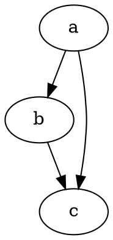

# Alustamine

@knowvah/dot-engine on [Graphvizi](https://graphviz.org/) truu TypeScripti-portimine.
See parsib DOT-keelt, käitab Graphvizi paigutusmootoreid ja väljastab SVG-d — puhtas
TypeScriptis — ilma C-ta: ei mingit natiivset Graphvizi binaari ega WASM-portimist.

::: tip Teek on teile uus?
Lugege esmalt [Ülevaadet](/et/guide/overview) — see kirjeldab torujuhet
(parsimine/koostamine → paigutus → renderdamine / geomeetria lugemine) ja kolme sisenemispunkti
(`@knowvah/dot-engine`, `@knowvah/dot-engine/api`, `@knowvah/dot-engine/render`), et te enne
paigaldamist teaksite, millist ust kasutada.
:::

## Paigaldamine

@knowvah/dot-engine on avaldatud npm-is:

```bash
npm i @knowvah/dot-engine
```

Null käitusaegset sõltuvust. Pakett `canvas` on valikuline peer-sõltuvus,
mida on vaja ainult hostiga kooskõlas oleva teksti mõõtmise jaoks Node'is — vt
[Teksti mõõtmine](/et/guide/text-measurement). Pakett sisaldab kolme sisenemispunkti
(`@knowvah/dot-engine`, `@knowvah/dot-engine/api`, `@knowvah/dot-engine/render`), millest igaühel on
oma `.d.ts` tüübideklaratsioonid, deklaratsioonikaardid ja lähtekoodikaardid — „mine definitsioonile“
viib päris TypeScripti lähtekoodi juurde, mis tarnitakse koos
ehitisega.

Selle asemel lähtekoodist ehitamiseks:

```bash
git clone https://github.com/knowvah/dot-engine.git
cd dot-engine
npm install
npm run build        # → dist/index.js (ESM bundle, via esbuild) + .d.ts
```

## Graafi renderdamine

```ts
import { renderSvg } from '@knowvah/dot-engine';

const dot = `
  digraph {
    a -> b;
    b -> c;
    a -> c;
  }
`;

const svg = renderSvg(dot, 'dot');
console.log(svg); // <svg ...>...</svg>
```

`renderSvg(dotSource, engine)` parsib DOT-lähtekoodi, käivitab nimetatud
[paigutusmootori](/et/guide/engines), renderdab SVG-ks ja tagastab SVG-stringi.

Siin on täpselt see graaf, mille mootor ise sellel lehel renderdas (läbi
[`@knowvah/vitepress-plugin-dot`](https://www.npmjs.com/package/@knowvah/vitepress-plugin-dot)):



DOT on teile uus? See on väike lihttekstikeel graafide kirjeldamiseks —
kanooniline **[DOT-keele teatmik](https://graphviz.org/doc/info/lang.html)** on
süntaksijuhend ja [Ülevaates](/et/guide/overview#mis-on-dot-mis-on-graphviz)
on ühe lõigu pikkune sissejuhatus.

## Järgmised sammud

- [Ülevaade](/et/guide/overview) — mõttemudel ja kolm sisenemispunkti.
- [Paigutusmootorid](/et/guide/engines) — kaheksa mootorit ja millal mida kasutada.
- [Graafi koostamine koodis](/et/guide/build-a-graph) — koostaja `createGraph`.
- [Retseptid](/et/guide/recipes) — ülesandekesksed, käivitatavad lahendused.
- [Arvutatud geomeetria lugemine](/et/guide/geometry) — asukohad ja splainid
  funktsiooniga `getLayout`.
- [Piltidega töötamine](/et/guide/images) — sisseehitamine, paigaldus ja CSP.
- [Tüübid](/et/guide/types) — avalikud andmekujud ja nende seosed.
- [Kasutamine brauseris](/et/guide/browser) — komplekteerimine ja konks `setImageSizer`.
- [API teatmik](/et/guide/api) — kogu avalik pind.
- [Mänguväljak](/et/playground) — muutke DOT-i ja vaadake SVG-d reaalajas oma brauseris.
