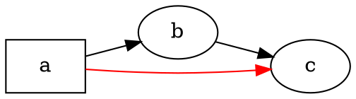

# Ülevaade

@knowvah/dot-engine on [Graphvizi](https://graphviz.org/) rida-realt TypeScripti-portimine:
sisse läheb DOT-lähtekood (või koodis koostatud graaf), välja tuleb SVG — või JSON, xdot, DOT
või pildikaart — arvutatuna täielikult TypeScriptis, ilma natiivse
Graphvizi binaari ja ilma WASM-ita. Kui te pole veel midagi renderdanud, alustage
lehelt [Alustamine](/et/guide/getting-started); see leht on kaart, mis asub selle kohal — mida
teek teeb ja milline selle kolmest sisenemispunktist tasub valida.

## Mis on DOT? Mis on Graphviz?

**DOT** on väike lihttekstikeel graafide kirjeldamiseks — sõlmed, servad
ja nende atribuudid:



See ongi kogu sisendvorming: deklareerige sõlmed, ühendage need märgiga `->` (suunatud)
või `--` (suunamata) ja määrake atribuudid sümbolites `[...]`. Täielik grammatika —
laused, alamgraafid, pordid, HTML-laadsed sildid ja kõik atribuudid — on määratletud
kanoonilises **[DOT-keele teatmikus](https://graphviz.org/doc/info/lang.html)**
(koos [atribuutide loeteluga](https://graphviz.org/doc/info/attrs.html)).
`@knowvah/dot-engine` parsib seda keelt täpselt nagu algupärand — seega iga DOT,
mille C-tööriistad vastu võtavad, võtab vastu ka see teek.

**Graphviz** on avatud lähtekoodiga graafide visualiseerimise tööriistakomplekt, mille
jaoks DOT loodi. See sai alguse **AT&T Bell Labsis** (Murray Hill, NJ) — Eleftherios
Koutsofiose ja Stephen Northi aluseks olev tehniline aruanne pärineb aastast **1991** — ja
seda hooldatakse praegu **Eclipse Public License** litsentsi all (sama litsents, mis on
sellel portimisel). See teek on selle truu TypeScripti-uusteostus; C-kood on
spetsifikatsioon, millele me range tolerantsi piires vastame. Algse projekti juurde:

- **[graphviz.org](https://graphviz.org/)** — ametlik projektisait koos dokumentatsiooni
  ning DOT-i ja atribuutide teatmikega.
- **[gitlab.com/graphviz/graphviz](https://gitlab.com/graphviz/graphviz)** — kanooniline
  C-lähtekood, mida me portime.
- **[Graphviz Vikipeedias](https://en.wikipedia.org/wiki/Graphviz)** — ajalugu ja
  taust.

## Torujuhe

Iga renderdus, olenemata sellest, milline sisenemispunkt selle käivitab, järgib sama
mustrit: hankige `Graph` (DOT-i parsides või programmipäraselt koostades), laske
sellel paigutusmootoril töötada ning seejärel kas serialiseerige tulemus või lugege
arvutatud geomeetria samast graafiobjektist tagasi.

```graphviz
digraph pipeline {
  rankdir=LR;
  bgcolor="transparent";
  node [shape=box, style=rounded, fontname="Helvetica", fontsize=11];
  edge [fontname="Helvetica", fontsize=10];

  src  [label="DOT source"];
  api  [label="createGraph()"];
  g    [label="Graph"];
  eng  [label="layout engine\n(dot · neato · fdp · sfdp ·\ncirco · twopi · osage · patchwork)"];
  out  [label="SVG / JSON / xdot /\nDOT / imagemap"];
  snap [label="LayoutSnapshot\n(nodes, edges, bounds)"];

  src -> g [label="parse()"];
  api -> g [label=".graph"];
  g -> eng;
  eng -> out  [label="render()"];
  eng -> snap [label="getLayout()"];
}
```

Eraldi kutset „käivita paigutus“ ei ole: `renderSvg` ja `render` käivitavad
paigutuse renderdamise osana ning arvutatud koordinaadid (sõlmede asukohad,
servade splainid, piirkast) jäävad pärast seda `Graph`-objekti külge alles.
`getLayout` ei käivita paigutust uuesti — see loeb geomeetriat, mille
varasem `render`-kutse on juba arvutanud, ja seetõttu kutsutakse seda alati
*pärast* `render`-it, samal graafil.

## Kolm sisenemispunkti — milline uks?

@knowvah/dot-engine tarnib kolm sisenemispunkti: juurpakett ekspordib uuesti kõik
kahest teisest, nii et peate sellest mööda küünitama vaid siis, kui soovite
kitsamat impordipinda.

| Soovin …                                              | Kasutage                               |
|--------------------------------------------------------|-----------------------------------------|
| Muuta DOT-teksti kiiresti SVG-stringiks                 | `@knowvah/dot-engine` — `renderSvg(dot, engine)` |
| Parsida DOT-i seda renderdamata                         | `@knowvah/dot-engine` — `parse(dot)`             |
| Seadistada teksti mõõtmist või piltide lahendamist globaalselt | `@knowvah/dot-engine` — `setTextMeasurer`, `setImageSizer`, `setImageResolver` |
| Koostada graaf koodis ilma DOT-tekstita                 | `@knowvah/dot-engine/api` — `createGraph`, `addEdge` |
| Lugeda arvutatud sõlmede/servade/klastrite asukohti     | `@knowvah/dot-engine/api` — `getLayout`          |
| Renderdada muusse vormingusse kui SVG (JSON, xdot, DOT, pildikaart) | `@knowvah/dot-engine/render` — `render(g, format, opts?)` |
| Juhtida oma canvas-/WebGL-/PDF-taustaprogrammi          | `@knowvah/dot-engine/render` — `getDrawOps`      |

`@knowvah/dot-engine/api` on *koostamise ja uurimise* uks: koostage graaf
programmipäraselt ja lugege sellest geomeetria. `@knowvah/dot-engine/render` on
*väljundi* uks: muutke graaf (kas `parse()`-ist või koostajast) serialiseeritud
vorminguks või struktureeritud joonistusoperatsioonide vooks. Juurpakett
`@knowvah/dot-engine` ekspordib mõlemad uuesti, lisaks ühekordse mugavusfunktsiooni `renderSvg`
ja globaalsed seadistuskonksud — enamik projekte impordib ainult
juurpaketist.

## Koordinaatsüsteemid lühidalt

Natiivsed Graphvizi koordinaadid on y-üles, alguspunktiga all vasakul — see on
konventsioon, milles paigutusmootorid arvutavad. Enamik ekraani- ja canvas-tarbijaid
soovib y-alla, alguspunktiga üleval vasakul. `getLayout` kasutab vaikimisi `yAxis:
'down'` ja pöörab teie eest ümber; toored stringivormingud (`svg`, `json`, `xdot`,
`plain`) kannavad muutmata natiivseid y-üles koordinaate. Täieliku koordinaatide
teatmiku leiate lehelt [Arvutatud geomeetria lugemine](/et/guide/geometry) ja
ümberpööramise ning ühtlustamise mustri lehelt [Retseptid](/et/guide/recipes), kui
peate `getLayout` väljundit segama toorvormingu koordinaatidega.

## Ulatuse piir

@knowvah/dot-engine renderdab SVG-sse, JSON-i, xdot-i, DOT-i ja HTML-i pildikaartidesse (`imap` /
`cmapx`) — deterministlikesse, stringi- või struktuuripõhistesse väljundvormingutesse. See
ei tooda rasterpilte (PNG, JPEG) ega PDF-i ning sellel pole graafilist vaatajat; need
jäävad brauseriohutu puhta TypeScripti-portimise ulatusest välja. Teadaolevad
erinevused natiivse Graphvizi käitumisest — mitte väljundvormingute lüngad,
vaid kohad, kus portimise väljund erineb — on koondatud lehele
[Erinevused](/et/divergences).

## Kuhu edasi

- [Alustamine](/et/guide/getting-started) — paigaldage ja renderdage oma esimene graaf.
- [Paigutusmootorid](/et/guide/engines) — kaheksa mootorit ja millal mida kasutada.
- [Graafi koostamine koodis](/et/guide/build-a-graph) — koostaja `@knowvah/dot-engine/api`.
- [Arvutatud geomeetria lugemine](/et/guide/geometry) — `getLayout`, koordinaatsüsteemid, ühikud.
- [Retseptid](/et/guide/recipes) — levinud ülesandepõhised mustrid.
- [Pildid](/et/guide/images) — `setImageSizer`, `setImageResolver`, sisseehitamine.
- [Tüüpide teatmik](/et/guide/types) — kõigi eksporditud tüüpide täielikud kujud.
- [API teatmik](/reference/) — genereeritud dokumentatsioon iga sümboli kohta.
- [Sõnastik](/et/guide/glossary) — Graphvizi ja @knowvah/dot-engine terminoloogia.
