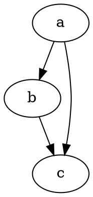

# Aloitus

@knowvah/dot-engine on uskollinen TypeScript-porttaus [Graphvizista](https://graphviz.org/).
Se jäsentää DOT-kielen, ajaa Graphvizin asettelumoottorit ja tuottaa SVG:tä —
puhtaana TypeScriptinä — ilman C:tä: ei natiivia Graphviz-binääriä eikä WASM-porttausta.

::: tip Uusi kirjaston parissa?
Lue ensin [Yleiskatsaus](/fi/guide/overview) — se kartoittaa putken
(jäsennä/rakenna → asettelu → renderöi / lue geometria) ja kolme sisääntulopistettä
(`@knowvah/dot-engine`, `@knowvah/dot-engine/api`, `@knowvah/dot-engine/render`), jotta tiedät,
mitä ovea käyttää, ennen kuin asennat mitään.
:::

## Asennus

@knowvah/dot-engine on julkaistu npm:ssä:

```bash
npm i @knowvah/dot-engine
```

Ei ajonaikaisia riippuvuuksia. `canvas`-paketti on valinnainen vertaisriippuvuus
(peer dependency), jota tarvitaan vain isäntäympäristöä myötäilevään tekstin mittaukseen
Nodessa — katso [Tekstin mittaus](/fi/guide/text-measurement). Paketti sisältää kolme
sisääntulopistettä (`@knowvah/dot-engine`, `@knowvah/dot-engine/api`, `@knowvah/dot-engine/render`),
joilla jokaisella on omat `.d.ts`-tyyppimäärittelynsä, määrittelykarttansa ja lähdekarttansa —
”siirry määrittelyyn” vie oikeaan TypeScript-lähdekoodiin, joka toimitetaan
koosteen rinnalla.

Jos haluat rakentaa lähdekoodista:

```bash
git clone https://github.com/knowvah/dot-engine.git
cd dot-engine
npm install
npm run build        # → dist/index.js (ESM bundle, via esbuild) + .d.ts
```

## Graafin renderöinti

```ts
import { renderSvg } from '@knowvah/dot-engine';

const dot = `
  digraph {
    a -> b;
    b -> c;
    a -> c;
  }
`;

const svg = renderSvg(dot, 'dot');
console.log(svg); // <svg ...>...</svg>
```

`renderSvg(dotSource, engine)` jäsentää DOT-lähdekoodin, ajaa nimetyn
[asettelumoottorin](/fi/guide/engines), renderöi SVG:n ja palauttaa SVG-merkkijonon.

Tässä on täsmälleen sama graafi renderöitynä tälle sivulle moottorin omin voimin
([`@knowvah/vitepress-plugin-dot`](https://www.npmjs.com/package/@knowvah/vitepress-plugin-dot) kautta):



Onko DOT uutta? Se on pieni pelkkää tekstiä oleva kieli graafien kuvaamiseen —
kanoninen **[DOT-kielen viite](https://graphviz.org/doc/info/lang.html)** on
syntaksiopas, ja [Yleiskatsauksessa](/fi/guide/overview#mika-on-dot-mika-on-graphviz)
on yhden kappaleen johdanto.

## Seuraavat askeleet

- [Yleiskatsaus](/fi/guide/overview) — ajattelumalli ja kolme sisääntulopistettä.
- [Asettelumoottorit](/fi/guide/engines) — kahdeksan moottoria ja milloin kutakin käytetään.
- [Graafin rakentaminen koodissa](/fi/guide/build-a-graph) — `createGraph`-rakentaja.
- [Reseptit](/fi/guide/recipes) — tehtäväkeskeisiä, ajettavia ratkaisuja.
- [Lasketun geometrian lukeminen](/fi/guide/geometry) — sijainnit ja splinit
  `getLayout`-funktiolla.
- [Kuvien käyttö](/fi/guide/images) — upottaminen, käyttöönotto ja CSP.
- [Tyypit](/fi/guide/types) — julkiset tietorakenteet ja niiden suhteet.
- [Käyttö selaimessa](/fi/guide/browser) — niputtaminen ja `setImageSizer`-liitäntäkohta.
- [API-viite](/fi/guide/api) — koko julkinen pinta.
- [Leikkikenttä](/fi/playground) — muokkaa DOT-koodia ja näe SVG reaaliajassa selaimessasi.
