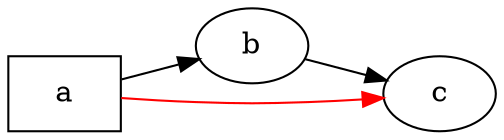

# Yleiskatsaus

@knowvah/dot-engine on rivi riviltä tehty TypeScript-porttaus [Graphvizista](https://graphviz.org/):
DOT-lähdekoodi (tai koodissa rakennettu graafi) menee sisään, ulos tulee SVG — tai JSON, xdot, DOT
tai kuvakartta — laskettuna kokonaan TypeScriptillä ilman natiivia
Graphviz-binääriä ja ilman WASM:ia. Jos et ole vielä renderöinyt mitään, aloita sivulta
[Aloitus](/fi/guide/getting-started); tämä sivu on sen yläpuolella oleva kartta —
mitä kirjasto tekee ja minkä kolmesta sisääntulopisteestä kannattaa valita.

## Mikä on DOT? Mikä on Graphviz?

**DOT** on pieni, pelkkää tekstiä oleva kieli graafien kuvaamiseen — solmut, kaaret
ja niiden attribuutit:



Siinä koko syöttömuoto: esittele solmut, yhdistä ne `->`-nuolella (suunnattu)
tai `--`-viivalla (suuntaamaton) ja aseta attribuutit `[...]`-lohkossa. Täydellinen kielioppi —
lauseet, aligraafit, portit, HTML-tyyppiset nimiöt ja jokainen attribuutti — on määritelty
kanonisessa **[DOT-kielen viitteessä](https://graphviz.org/doc/info/lang.html)**
(jonka rinnalla on täysi [attribuuttiluettelo](https://graphviz.org/doc/info/attrs.html)).
`@knowvah/dot-engine` jäsentää tuon kielen täsmälleen kuten alkuperäinen — joten kaikki
DOT, jonka C-työkalut hyväksyvät, kelpaa myös tälle kirjastolle.

**Graphviz** on avoimen lähdekoodin graafien visualisointityökalupakki, jota varten DOT
luotiin. Se sai alkunsa **AT&T Bell Labsissa** (Murray Hill, NJ) — Eleftherios Koutsofiosin
ja Stephen Northin perustava tekninen raportti on vuodelta **1991** — ja sitä ylläpidetään
nykyään **Eclipse Public License** -lisenssillä (sama lisenssi, jota tämä porttaus
noudattaa). Tämä kirjasto on uskollinen TypeScript-uudelleentoteutus siitä; C-koodi on
määrittely, jota vastaamme tiukalla toleranssilla. Alkuperäiseen projektiin pääset
näistä:

- **[graphviz.org](https://graphviz.org/)** — virallinen projektisivusto, dokumentaatio ja
  DOT- ja attribuuttiviitteet.
- **[gitlab.com/graphviz/graphviz](https://gitlab.com/graphviz/graphviz)** — kanoninen
  C-lähdekoodi, josta porttaamme.
- **[Graphviz Wikipediassa](https://en.wikipedia.org/wiki/Graphviz)** — historia ja
  taustaa.

## Putki

Jokainen renderöinti, riippumatta siitä, mikä sisääntulopiste sen käynnistää, noudattaa samaa
muotoa: hanki `Graph` (jäsentämällä DOT tai rakentamalla se ohjelmallisesti), aja sen
yli asettelumoottori ja joko serialisoi tulos tai lue laskettu
geometria takaisin samasta graafiobjektista.

```graphviz
digraph pipeline {
  rankdir=LR;
  bgcolor="transparent";
  node [shape=box, style=rounded, fontname="Helvetica", fontsize=11];
  edge [fontname="Helvetica", fontsize=10];

  src  [label="DOT source"];
  api  [label="createGraph()"];
  g    [label="Graph"];
  eng  [label="layout engine\n(dot · neato · fdp · sfdp ·\ncirco · twopi · osage · patchwork)"];
  out  [label="SVG / JSON / xdot /\nDOT / imagemap"];
  snap [label="LayoutSnapshot\n(nodes, edges, bounds)"];

  src -> g [label="parse()"];
  api -> g [label=".graph"];
  g -> eng;
  eng -> out  [label="render()"];
  eng -> snap [label="getLayout()"];
}
```

Erillistä ”aja asettelu” -kutsua ei ole: `renderSvg` ja `render` käynnistävät
asettelun osana renderöintiä, ja lasketut koordinaatit (solmujen sijainnit,
kaarten splinit, rajauslaatikko) säilyvät `Graph`-objektissa sen jälkeen.
`getLayout` ei aja asettelua uudelleen — se lukee geometrian, jonka aiempi `render`-kutsu
on jo laskenut, joten se kutsutaan aina *renderin jälkeen*, samalle
graafille.

## Kolme sisääntulopistettä — mikä ovi?

@knowvah/dot-engine sisältää kolme sisääntulopistettä: juuripaketti vie uudelleen kaiken
kahdesta muusta, joten sen ohi tarvitsee mennä vain, kun haluat
suppeamman tuontipinnan.

| Haluan…                                               | Käytä                                  |
|--------------------------------------------------------|-----------------------------------------|
| Muuttaa DOT-tekstin SVG-merkkijonoksi nopeasti          | `@knowvah/dot-engine` — `renderSvg(dot, engine)` |
| Jäsentää DOT:n renderöimättä sitä                       | `@knowvah/dot-engine` — `parse(dot)`             |
| Määrittää tekstin mittauksen tai kuvien ratkaisun globaalisti | `@knowvah/dot-engine` — `setTextMeasurer`, `setImageSizer`, `setImageResolver` |
| Rakentaa graafin koodissa ilman DOT-tekstiä             | `@knowvah/dot-engine/api` — `createGraph`, `addEdge` |
| Lukea takaisin lasketut solmujen/kaarten/klusterien sijainnit | `@knowvah/dot-engine/api` — `getLayout`          |
| Renderöidä muuhun kuin SVG-muotoon (JSON, xdot, DOT, kuvakartta) | `@knowvah/dot-engine/render` — `render(g, format, opts?)` |
| Ohjata omaa canvas-/WebGL-/PDF-taustaa                  | `@knowvah/dot-engine/render` — `getDrawOps`      |

`@knowvah/dot-engine/api` on *rakenna + tarkasta* -ovi: muodosta graafi
ohjelmallisesti ja lue siitä geometria. `@knowvah/dot-engine/render` on
*ulostulo*-ovi: muuta graafi (joko `parse()`-funktiosta tai rakentajasta)
serialisoiduksi muodoksi tai jäsennellyksi piirto-operaatioiden virraksi. Juuripaketti
`@knowvah/dot-engine` vie uudelleen molemmat sekä yhden kutsun `renderSvg`-apufunktion
ja globaalit asetuskoukut — useimmat projektit tuovat vain
juuripaketista.

## Koordinaatistot lyhyesti

Graphvizin natiivikoordinaatit ovat y-ylös, origo vasemmassa alakulmassa — se
käytäntö, jolla asettelumoottorit laskevat. Useimmat näyttö- ja canvas-kuluttajat
haluavat y-alas, origo vasemmassa yläkulmassa. `getLayout` käyttää oletuksena arvoa `yAxis:
'down'` ja kääntää puolestasi; raakamerkkijonomuodot (`svg`, `json`, `xdot`,
`plain`) kantavat natiivit y-ylös-koordinaatit muuttamattomina. Katso
[Lasketun geometrian lukeminen](/fi/guide/geometry) täydestä koordinaattiviitteestä ja
[Reseptit](/fi/guide/recipes) käännä-ja-täsmäytä-mallista, kun
`getLayout`-tulosta pitää yhdistää raakamuodon koordinaatteihin.

## Rajaus

@knowvah/dot-engine renderöi SVG-, JSON-, xdot-, DOT- ja HTML-kuvakarttamuotoihin (`imap` /
`cmapx`) — deterministisiin, merkkijono- tai rakennepohjaisiin tulostemuotoihin. Se
ei tuota rasterikuvia (PNG, JPEG) eikä PDF:ää, eikä siinä ole graafista katselinta;
ne ovat selaimessa toimivan, puhtaan TypeScript-porttauksen ulkopuolella. Tunnetut
erot natiivin Graphvizin käyttäytymiseen — ei aukkoja tulostemuodoissa, vaan
kohtia, joissa porttauksen tuotos poikkeaa — on kirjattu sivulle
[Poikkeamat](/fi/divergences).

## Mihin seuraavaksi

- [Aloitus](/fi/guide/getting-started) — asenna ja renderöi ensimmäinen graafisi.
- [Asettelumoottorit](/fi/guide/engines) — kahdeksan moottoria ja milloin kutakin käytetään.
- [Graafin rakentaminen koodissa](/fi/guide/build-a-graph) — `@knowvah/dot-engine/api`-rakentaja.
- [Lasketun geometrian lukeminen](/fi/guide/geometry) — `getLayout`, koordinaatistot, yksiköt.
- [Reseptit](/fi/guide/recipes) — yleisiä tehtäväpohjaisia malleja.
- [Kuvat](/fi/guide/images) — `setImageSizer`, `setImageResolver`, upottaminen.
- [Tyyppiviite](/fi/guide/types) — jokaisen viedyn tyypin täydet rakenteet.
- [API-viite](/reference/) — generoitu symbolikohtainen dokumentaatio.
- [Sanasto](/fi/guide/glossary) — Graphvizin ja @knowvah/dot-enginen terminologiaa.
