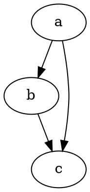

# Premiers pas

@knowvah/dot-engine est un portage TypeScript fidèle de [Graphviz](https://graphviz.org/).
Il analyse le langage DOT, exécute les moteurs de disposition de Graphviz et produit du SVG — en
TypeScript pur — sans C : ni binaire Graphviz natif ni portage WASM.

::: tip Vous découvrez la bibliothèque ?
Lisez d’abord la [Vue d’ensemble](/fr/guide/overview) — elle présente le pipeline
(analyser/construire → disposer → rendre / lire la géométrie) et les trois points d’entrée
(`@knowvah/dot-engine`, `@knowvah/dot-engine/api`, `@knowvah/dot-engine/render`) afin que vous sachiez quelle
porte utiliser avant d’installer.
:::

## Installation

@knowvah/dot-engine est publié sur npm :

```bash
npm i @knowvah/dot-engine
```

Aucune dépendance d’exécution. Le paquet `canvas` est une dépendance de pair
optionnelle, nécessaire uniquement pour une mesure du texte fidèle à l’hôte sous Node — voir
[Mesure du texte](/fr/guide/text-measurement). Le paquet fournit trois points
d’entrée (`@knowvah/dot-engine`, `@knowvah/dot-engine/api`, `@knowvah/dot-engine/render`), chacun avec
ses propres déclarations de types `.d.ts`, ses cartes de déclarations et ses source maps — « aller à la
définition » mène dans le vrai code source TypeScript, livré avec
le build.

Pour compiler depuis les sources à la place :

```bash
git clone https://github.com/knowvah/dot-engine.git
cd dot-engine
npm install
npm run build        # → dist/index.js (ESM bundle, via esbuild) + .d.ts
```

## Rendre un graphe

```ts
import { renderSvg } from '@knowvah/dot-engine';

const dot = `
  digraph {
    a -> b;
    b -> c;
    a -> c;
  }
`;

const svg = renderSvg(dot, 'dot');
console.log(svg); // <svg ...>...</svg>
```

`renderSvg(dotSource, engine)` analyse le source DOT, exécute le
[moteur de disposition](/fr/guide/engines) indiqué, rend en SVG et renvoie la chaîne SVG.

Voici ce même graphe, rendu sur cette page par le moteur lui-même (via
[`@knowvah/vitepress-plugin-dot`](https://www.npmjs.com/package/@knowvah/vitepress-plugin-dot)) :



Vous découvrez DOT ? C’est un petit langage en texte brut pour décrire des graphes — la
**[référence du langage DOT](https://graphviz.org/doc/info/lang.html)** canonique est
le guide de syntaxe, et la [Vue d’ensemble](/fr/guide/overview#what-is-dot-what-is-graphviz)
en propose une introduction en un paragraphe.

## Étapes suivantes

- [Vue d’ensemble](/fr/guide/overview) — le modèle mental et les trois points d’entrée.
- [Moteurs de disposition](/fr/guide/engines) — les huit moteurs et quand utiliser chacun.
- [Construire un graphe en code](/fr/guide/build-a-graph) — le constructeur `createGraph`.
- [Recettes](/fr/guide/recipes) — des solutions orientées tâche, prêtes à exécuter.
- [Lire la géométrie calculée](/fr/guide/geometry) — positions et splines via
  `getLayout`.
- [Travailler avec des images](/fr/guide/images) — inlining, déploiement et CSP.
- [Types](/fr/guide/types) — les formes de données publiques et leurs relations.
- [Utilisation dans le navigateur](/fr/guide/browser) — empaquetage et point d’accroche `setImageSizer`.
- [Référence de l’API](/fr/guide/api) — toute la surface publique.
- [Bac à sable](/fr/playground) — modifiez du DOT et voyez le SVG en direct, dans votre navigateur.
