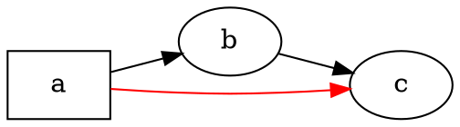

# Vue d’ensemble

@knowvah/dot-engine est un portage TypeScript ligne à ligne de [Graphviz](https://graphviz.org/) :
du code source DOT (ou un graphe construit en code) entre, du SVG — ou du JSON, du xdot, du DOT ou
une image map — sort, le tout calculé entièrement en TypeScript, sans binaire Graphviz natif et
sans WASM. Si vous n’avez encore rien rendu, commencez par
[Premiers pas](/fr/guide/getting-started) ; cette page est la carte qui le surplombe — ce que fait
la bibliothèque, et lequel de ses trois points d’entrée choisir.

## Qu’est-ce que DOT ? Qu’est-ce que Graphviz ? {#what-is-dot-what-is-graphviz}

**DOT** est un petit langage en texte brut pour décrire des graphes — des nœuds, des arêtes
et leurs attributs :



C’est là tout le format d’entrée : déclarez des nœuds, reliez-les avec `->` (orienté)
ou `--` (non orienté), et définissez des attributs dans `[...]`. La grammaire complète —
instructions, sous-graphes, ports, étiquettes de type HTML et chaque attribut — est définie
dans la **[référence du langage DOT](https://graphviz.org/doc/info/lang.html)** canonique
(accompagnée de la [liste des attributs](https://graphviz.org/doc/info/attrs.html)).
`@knowvah/dot-engine` analyse ce langage exactement comme le fait l’amont — tout
DOT accepté par les outils C est donc du DOT accepté par cette bibliothèque.

**Graphviz** est la boîte à outils open source de visualisation de graphes pour laquelle DOT a
été créé. Elle est née chez **AT&T Bell Labs** (Murray Hill, New Jersey) — un rapport technique
fondateur d’Eleftherios Koutsofios et Stephen North date de **1991** — et elle est
maintenue aujourd’hui sous la **licence publique Eclipse** (la même licence que porte ce
portage). Cette bibliothèque en est une réimplémentation fidèle en TypeScript ; le
code C est la spécification que nous respectons avec une tolérance serrée. Pour le projet
d’origine :

- **[graphviz.org](https://graphviz.org/)** — le site officiel du projet, avec la documentation et
  les références DOT / attributs.
- **[gitlab.com/graphviz/graphviz](https://gitlab.com/graphviz/graphviz)** — la
  source C canonique dont nous partons pour le portage.
- **[Graphviz sur Wikipédia](https://en.wikipedia.org/wiki/Graphviz)** — historique et
  contexte.

## Le pipeline

Chaque rendu, quel que soit le point d’entrée qui le déclenche, suit la même
forme : obtenir un `Graph` (en analysant du DOT ou en en construisant un par programmation), faire passer un
moteur de disposition dessus, puis soit sérialiser le résultat, soit relire la géométrie calculée
sur ce même objet graphe.

```graphviz
digraph pipeline {
  rankdir=LR;
  bgcolor="transparent";
  node [shape=box, style=rounded, fontname="Helvetica", fontsize=11];
  edge [fontname="Helvetica", fontsize=10];

  src  [label="DOT source"];
  api  [label="createGraph()"];
  g    [label="Graph"];
  eng  [label="layout engine\n(dot · neato · fdp · sfdp ·\ncirco · twopi · osage · patchwork)"];
  out  [label="SVG / JSON / xdot /\nDOT / imagemap"];
  snap [label="LayoutSnapshot\n(nodes, edges, bounds)"];

  src -> g [label="parse()"];
  api -> g [label=".graph"];
  g -> eng;
  eng -> out  [label="render()"];
  eng -> snap [label="getLayout()"];
}
```

Il n’y a pas d’appel distinct pour « lancer la disposition » : `renderSvg` et `render` déclenchent
la disposition dans le cadre du rendu, et les coordonnées calculées (positions des nœuds,
splines des arêtes, boîte englobante) sont ensuite conservées sur l’objet `Graph`.
`getLayout` ne relance pas la disposition — il lit la géométrie qu’un appel précédent à `render`
a déjà calculée ; il s’appelle donc toujours *après* `render`, sur le même
graphe.

## Les trois points d’entrée — quelle porte ?

@knowvah/dot-engine fournit trois points d’entrée : le paquet racine réexporte tout
le contenu des deux autres, vous n’avez donc besoin d’aller au-delà que lorsque vous voulez une
surface d’import plus étroite.

| Je veux…                                              | Utiliser                               |
|--------------------------------------------------------|-----------------------------------------|
| Transformer du texte DOT en chaîne SVG, rapidement      | `@knowvah/dot-engine` — `renderSvg(dot, engine)` |
| Analyser du DOT sans le rendre                          | `@knowvah/dot-engine` — `parse(dot)`             |
| Configurer globalement la mesure du texte ou la résolution des images | `@knowvah/dot-engine` — `setTextMeasurer`, `setImageSizer`, `setImageResolver` |
| Construire un graphe en code, sans texte DOT            | `@knowvah/dot-engine/api` — `createGraph`, `addEdge` |
| Relire les positions calculées des nœuds, arêtes et clusters | `@knowvah/dot-engine/api` — `getLayout`    |
| Rendre vers un format autre que SVG (JSON, xdot, DOT, image map) | `@knowvah/dot-engine/render` — `render(g, format, opts?)` |
| Piloter un backend canvas/WebGL/PDF personnalisé        | `@knowvah/dot-engine/render` — `getDrawOps`      |

`@knowvah/dot-engine/api` est la porte *construire + inspecter* : construisez un graphe
par programmation et lisez-en la géométrie. `@knowvah/dot-engine/render` est la
porte *sortie* : transformez un graphe (issu de `parse()` ou du constructeur) en
format sérialisé ou en flux structuré d’opérations de dessin. Le paquet racine `@knowvah/dot-engine`
réexporte les deux, ainsi que la fonction pratique `renderSvg` en un seul appel
et les points d’accroche de configuration globale — la plupart des projets n’importent jamais que depuis
la racine.

## Les repères de coordonnées, en bref

Les coordonnées natives de graphviz sont y vers le haut, origine en bas à gauche — la
convention dans laquelle les moteurs de disposition calculent. La plupart des consommateurs d’écran et de canvas
veulent y vers le bas, origine en haut à gauche. `getLayout` utilise par défaut `yAxis:
'down'` et inverse pour vous ; les formats textuels bruts (`svg`, `json`, `xdot`,
`plain`) conservent inchangées les coordonnées natives y vers le haut. Voir
[Lire la géométrie calculée](/fr/guide/geometry) pour la référence complète des coordonnées,
et [Recettes](/fr/guide/recipes) pour le motif d’inversion et de réconciliation lorsque vous
devez mélanger la sortie de `getLayout` avec les coordonnées d’un format brut.

## Limites du périmètre

@knowvah/dot-engine rend vers SVG, JSON, xdot, DOT et les image maps HTML (`imap` /
`cmapx`) — les formats de sortie déterministes, à base de chaînes ou de structures. Il
ne produit pas d’images matricielles (PNG, JPEG) ni de PDF, et n’a pas de visionneuse
graphique ; cela sort du périmètre d’un portage TypeScript pur sûr pour le navigateur. Les différences
connues avec le comportement de Graphviz natif — non pas des lacunes de formats de sortie, mais
des endroits où la sortie du portage diverge — sont suivies dans la page
[Divergences](/fr/divergences).

## Pour aller plus loin

- [Premiers pas](/fr/guide/getting-started) — installer et rendre votre premier graphe.
- [Moteurs de disposition](/fr/guide/engines) — les huit moteurs et quand utiliser chacun.
- [Construire un graphe en code](/fr/guide/build-a-graph) — le constructeur `@knowvah/dot-engine/api`.
- [Lire la géométrie calculée](/fr/guide/geometry) — `getLayout`, repères de coordonnées, unités.
- [Recettes](/fr/guide/recipes) — des motifs courants organisés par tâche.
- [Images](/fr/guide/images) — `setImageSizer`, `setImageResolver`, inlining.
- [Référence des types](/fr/guide/types) — les formes complètes de chaque type exporté.
- [Référence de l’API](/reference/) — documentation générée par symbole.
- [Glossaire](/fr/guide/glossary) — terminologie de Graphviz et de @knowvah/dot-engine.
