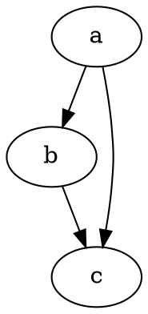

# Első lépések

A @knowvah/dot-engine a [Graphviz](https://graphviz.org/) hű TypeScript-portolása.
Feldolgozza a DOT nyelvet, lefuttatja a Graphviz elrendezésmotorjait, és SVG-t
állít elő — tiszta TypeScriptben — C nélkül: nincs natív Graphviz bináris és
nincs WASM-portolás.

::: tip Új a könyvtárban?
Olvassa el először az [Áttekintést](/hu/guide/overview) — bemutatja a folyamatot
(feldolgozás/építés → elrendezés → renderelés / geometria kiolvasása) és a három
belépési pontot (`@knowvah/dot-engine`, `@knowvah/dot-engine/api`, `@knowvah/dot-engine/render`),
hogy telepítés előtt tudja, melyik ajtót használja.
:::

## Telepítés

A @knowvah/dot-engine az npm-en érhető el:

```bash
npm i @knowvah/dot-engine
```

Futásidejű függőségek nélkül. A `canvas` csomag opcionális peer függőség, csak a
gazdagéphez hű szövegmérésnél kell Node-ban — lásd: [Szövegmérés](/hu/guide/text-measurement).
A csomag három belépési pontot szállít (`@knowvah/dot-engine`, `@knowvah/dot-engine/api`,
`@knowvah/dot-engine/render`), mindegyik saját `.d.ts` típusdeklarációkkal,
deklarációs térképekkel és forrástérképekkel — a „ugrás a definícióra” a valódi
TypeScript forráskódba visz, amely a build mellett szállításra kerül.

Ha inkább forrásból építene:

```bash
git clone https://github.com/knowvah/dot-engine.git
cd dot-engine
npm install
npm run build        # → dist/index.js (ESM bundle, via esbuild) + .d.ts
```

## Gráf renderelése

```ts
import { renderSvg } from '@knowvah/dot-engine';

const dot = `
  digraph {
    a -> b;
    b -> c;
    a -> c;
  }
`;

const svg = renderSvg(dot, 'dot');
console.log(svg); // <svg ...>...</svg>
```

A `renderSvg(dotSource, engine)` feldolgozza a DOT forráskódot, lefuttatja a megnevezett
[elrendezésmotort](/hu/guide/engines), SVG-be renderel, és visszaadja az SVG-sztringet.

Itt ugyanez a gráf, magán az oldalon, a motor által renderelve (a
[`@knowvah/vitepress-plugin-dot`](https://www.npmjs.com/package/@knowvah/vitepress-plugin-dot)
segítségével):



Új a DOT-ban? Ez egy kicsi, egyszerű szöveges nyelv gráfok leírására — a
kanonikus **[DOT nyelvi referencia](https://graphviz.org/doc/info/lang.html)** a
szintaxis útmutatója, az [Áttekintés](/hu/guide/overview#what-is-dot-what-is-graphviz)
pedig egyetlen bekezdéses bevezetőt ad.

## Következő lépések

- [Áttekintés](/hu/guide/overview) — a gondolati modell és a három belépési pont.
- [Elrendezésmotorok](/hu/guide/engines) — a nyolc motor, és mikor melyiket használja.
- [Gráf felépítése kódból](/hu/guide/build-a-graph) — a `createGraph` építő.
- [Receptek](/hu/guide/recipes) — feladatorientált, futtatható megoldások.
- [A kiszámított geometria kiolvasása](/hu/guide/geometry) — pozíciók és spline-ok a
  `getLayout` segítségével.
- [Munka képekkel](/hu/guide/images) — beágyazás, üzembe helyezés és CSP.
- [Típusok](/hu/guide/types) — a nyilvános adatalakok és kapcsolatuk.
- [Használat böngészőben](/hu/guide/browser) — csomagolás és a `setImageSizer` kampó.
- [API-referencia](/hu/guide/api) — a teljes nyilvános felület.
- [Játszótér](/hu/playground) — DOT szerkesztése és az SVG élő megtekintése a böngészőben.
