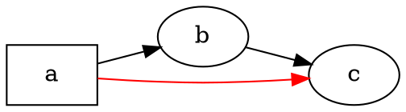

# Áttekintés

A @knowvah/dot-engine a [Graphviz](https://graphviz.org/) soronkénti TypeScript-portolása:
DOT forráskód (vagy kódból felépített gráf) megy be, SVG — vagy JSON, xdot, DOT,
esetleg képtérkép — jön ki, teljes egészében TypeScriptben kiszámítva, natív
Graphviz bináris és WASM nélkül. Ha még nem renderelt semmit, kezdje az
[Első lépések](/hu/guide/getting-started) oldalon; ez az oldal az afölötti
térkép — mit csinál a könyvtár, és a három belépési pontja közül melyikhez
érdemes nyúlni.

## Mi a DOT? Mi a Graphviz? {#what-is-dot-what-is-graphviz}

A **DOT** egy kicsi, egyszerű szöveges nyelv gráfok leírására — csúcsok, élek és
azok attribútumai:



Ez a teljes bemeneti formátum: deklarálja a csúcsokat, kösse össze őket a `->`
(irányított) vagy a `--` (irányítatlan) jellel, és adja meg az attribútumokat
`[...]` között. A teljes nyelvtant — utasítások, részgráfok, portok, HTML-szerű
címkék és minden attribútum — a kanonikus **[DOT nyelvi referencia](https://graphviz.org/doc/info/lang.html)**
határozza meg (mellette a teljes [attribútumlistával](https://graphviz.org/doc/info/attrs.html)).
A `@knowvah/dot-engine` ezt a nyelvet pontosan úgy értelmezi, mint az upstream —
így minden DOT, amelyet a C eszközök elfogadnak, ezt a könyvtár is elfogadja.

A **Graphviz** az a nyílt forrású gráfvizualizációs eszközkészlet, amelyhez a
DOT-ot létrehozták. Az **AT&T Bell Labsnál** (Murray Hill, NJ) indult — Eleftherios
Koutsofios és Stephen North alapvető műszaki jelentése **1991**-ből származik —,
és ma az **Eclipse Public License** alatt tartják karban (ugyanez a licenc vonatkozik
erre a portolásra is). Ez a könyvtár annak hű TypeScript-újraimplementációja; a C
kód az a specifikáció, amelyhez szűk tűréssel igazodunk. Az eredeti projekthez:

- **[graphviz.org](https://graphviz.org/)** — a hivatalos projektoldal, a dokumentáció
  és a DOT-/attribútumreferenciák.
- **[gitlab.com/graphviz/graphviz](https://gitlab.com/graphviz/graphviz)** — a
  kanonikus C forráskód, amelyből portolunk.
- **[A Graphviz a Wikipédián](https://en.wikipedia.org/wiki/Graphviz)** — történet és
  háttér.

## A folyamat

Minden renderelés — függetlenül attól, melyik belépési pont indítja — ugyanazt az
alakot követi: szerezzen egy `Graph`-ot (DOT feldolgozásával vagy programozott
felépítéssel), futtasson rajta egy elrendezésmotort, majd vagy szerializálja az
eredményt, vagy olvassa vissza a kiszámított geometriát ugyanarról a gráfobjektumról.

```graphviz
digraph pipeline {
  rankdir=LR;
  bgcolor="transparent";
  node [shape=box, style=rounded, fontname="Helvetica", fontsize=11];
  edge [fontname="Helvetica", fontsize=10];

  src  [label="DOT source"];
  api  [label="createGraph()"];
  g    [label="Graph"];
  eng  [label="layout engine\n(dot · neato · fdp · sfdp ·\ncirco · twopi · osage · patchwork)"];
  out  [label="SVG / JSON / xdot /\nDOT / imagemap"];
  snap [label="LayoutSnapshot\n(nodes, edges, bounds)"];

  src -> g [label="parse()"];
  api -> g [label=".graph"];
  g -> eng;
  eng -> out  [label="render()"];
  eng -> snap [label="getLayout()"];
}
```

Nincs külön „elrendezés futtatása” hívás: a `renderSvg` és a `render` a renderelés
részeként indítja el az elrendezést, a kiszámított koordináták (csúcspozíciók,
élspline-ok, befoglaló téglalap) pedig utána a `Graph` objektumon maradnak.
A `getLayout` nem futtatja újra az elrendezést — olyan geometriát olvas ki, amelyet
egy korábbi `render` hívás már kiszámított, ezért mindig a `render` *után*, ugyanazon
a gráfon hívjuk.

## A három belépési pont — melyik ajtó?

A @knowvah/dot-engine három belépési pontot szállít: a gyökércsomag újra
exportál mindent a másik kettőből, így csak akkor kell túlnyúlnia rajta, ha
szűkebb importfelületet szeretne.

| Szeretném… | Használja |
|--------------------------------------------------------|-----------------------------------------|
| A DOT szöveget gyorsan SVG-sztringgé alakítani | `@knowvah/dot-engine` — `renderSvg(dot, engine)` |
| A DOT-ot feldolgozni renderelés nélkül | `@knowvah/dot-engine` — `parse(dot)` |
| A szövegmérést vagy a képfeloldást globálisan beállítani | `@knowvah/dot-engine` — `setTextMeasurer`, `setImageSizer`, `setImageResolver` |
| Gráfot felépíteni kódból, DOT szöveg nélkül | `@knowvah/dot-engine/api` — `createGraph`, `addEdge` |
| A kiszámított csúcs-/él-/klaszterpozíciókat visszaolvasni | `@knowvah/dot-engine/api` — `getLayout` |
| Az SVG-től eltérő formátumba renderelni (JSON, xdot, DOT, képtérkép) | `@knowvah/dot-engine/render` — `render(g, format, opts?)` |
| Egyéni canvas/WebGL/PDF háttérrendszert meghajtani | `@knowvah/dot-engine/render` — `getDrawOps` |

A `@knowvah/dot-engine/api` az *építő + vizsgáló* ajtó: programozottan
felépíthet egy gráfot, és kiolvashatja belőle a geometriát. A
`@knowvah/dot-engine/render` a *kimeneti* ajtó: egy gráfot (akár a `parse()`-ból,
akár az építőből) szerializált formátummá vagy strukturált rajzolásiművelet-folyammá
alakít. A gyökér `@knowvah/dot-engine` csomag mindkettőt újra exportálja, plusz az
egylépéses `renderSvg` kényelmi függvényt és a globális konfigurációs kampókat —
a legtöbb projekt csak a gyökérből importál.

## Koordinátarendszerek röviden

A natív Graphviz-koordináták y felfelé nőnek, az origó a bal alsó sarokban van —
ebben a konvencióban számolnak az elrendezésmotorok. A legtöbb képernyő- és
canvas-fogyasztó y lefelé növekvő, bal felső origójú rendszert szeretne. A
`getLayout` alapértelmezése `yAxis: 'down'`, és helyette megfordítja a tengelyt; a
nyers szöveges formátumok (`svg`, `json`, `xdot`, `plain`) változatlanul natív,
y felfelé növekvő koordinátákat tartalmaznak. A teljes koordináta-referenciát
lásd: [A kiszámított geometria kiolvasása](/hu/guide/geometry); a
`getLayout` kimenetének és egy nyers formátum koordinátáinak keveréséhez szükséges
megfordítás-és-összeegyeztetés mintáját pedig a [Receptek](/hu/guide/recipes)
között találja.

## A hatókör határa

A @knowvah/dot-engine SVG-be, JSON-ba, xdot-ba, DOT-ba és HTML képtérképekbe
(`imap` / `cmapx`) renderel — a determinisztikus, sztring- vagy struktúraalapú
kimeneti formátumokba. Nem állít elő rasztergrafikus képeket (PNG, JPEG) vagy
PDF-et, és nincs grafikus megjelenítője; ezek egy böngészőbiztos, tiszta
TypeScript-portolás hatókörén kívül esnek. A natív Graphviz viselkedésétől
való ismert különbségeket — nem kimeneti formátumbeli hiányokat, hanem azokat a
helyeket, ahol a portolás kimenete eltér — az [Eltérések](/hu/divergences)
oldal tartja nyilván.

## Merre tovább

- [Első lépések](/hu/guide/getting-started) — telepítés és az első gráf renderelése.
- [Elrendezésmotorok](/hu/guide/engines) — a nyolc motor, és mikor melyiket használja.
- [Gráf felépítése kódból](/hu/guide/build-a-graph) — a `@knowvah/dot-engine/api` építő.
- [A kiszámított geometria kiolvasása](/hu/guide/geometry) — `getLayout`, koordinátarendszerek, mértékegységek.
- [Receptek](/hu/guide/recipes) — gyakori, feladatalapú minták.
- [Képek](/hu/guide/images) — `setImageSizer`, `setImageResolver`, beágyazás.
- [Típusreferencia](/hu/guide/types) — minden exportált típus teljes alakja.
- [API-referencia](/reference/) — generált, szimbólumonkénti dokumentáció.
- [Szószedet](/hu/guide/glossary) — a Graphviz és a @knowvah/dot-engine fogalmai.
