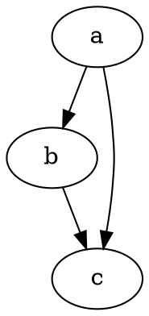

# Fyrstu skref

@knowvah/dot-engine er trú TypeScript-yfirfærsla á [Graphviz](https://graphviz.org/).
Það þáttar DOT-málið, keyrir uppsetningarvélar Graphviz og skilar SVG — í hreinu
TypeScript — án C: engin innbyggð Graphviz-keyrsluskrá og engin WASM-yfirfærsla.

::: tip Nýr í safninu?
Lestu fyrst [Yfirlit](/is/guide/overview) — það sýnir ferlið
(þátta/smíða → uppsetning → teikna / lesa rúmfræði) og inngangspunktana þrjá
(`@knowvah/dot-engine`, `@knowvah/dot-engine/api`, `@knowvah/dot-engine/render`) svo þú vitir
hvaða dyr á að nota áður en þú setur upp.
:::

## Uppsetning

@knowvah/dot-engine er gefið út á npm:

```bash
npm i @knowvah/dot-engine
```

Engin keyrsluháð söfn. Pakkinn `canvas` er valfrjáls jafningjaháður pakki
(peer dependency), sem aðeins þarf fyrir textamælingu sem fylgir hýsilnum í Node — sjá
[Textamæling](/is/guide/text-measurement). Pakkinn kemur með þremur inngangspunktum
(`@knowvah/dot-engine`, `@knowvah/dot-engine/api`, `@knowvah/dot-engine/render`), hver með
eigin `.d.ts`-tegundalýsingum, skilgreiningarkortum (declaration maps) og frumkóðakortum — „fara á
skilgreiningu“ stekkur inn í raunverulegan TypeScript-frumkóða, sem fylgir með
byggingunni.

Til að smíða úr frumkóða í staðinn:

```bash
git clone https://github.com/knowvah/dot-engine.git
cd dot-engine
npm install
npm run build        # → dist/index.js (ESM bundle, via esbuild) + .d.ts
```

## Teikna graf

```ts
import { renderSvg } from '@knowvah/dot-engine';

const dot = `
  digraph {
    a -> b;
    b -> c;
    a -> c;
  }
`;

const svg = renderSvg(dot, 'dot');
console.log(svg); // <svg ...>...</svg>
```

`renderSvg(dotSource, engine)` þáttar DOT-frumkóðann, keyrir tilgreinda
[uppsetningarvél](/is/guide/engines), teiknar SVG og skilar SVG-strengnum.

Hér er nákvæmlega þetta graf, teiknað á þessari síðu af vélinni sjálfri (með
[`@knowvah/vitepress-plugin-dot`](https://www.npmjs.com/package/@knowvah/vitepress-plugin-dot)):



Nýr í DOT? Það er lítið, venjulegt textamál til að lýsa gröfum — upprunalega
**[tilvísunin um DOT-málið](https://graphviz.org/doc/info/lang.html)** er
setningafræðileiðarvísirinn, og [Yfirlit](/is/guide/overview#what-is-dot-what-is-graphviz)
inniheldur stutta kynningu í einni málsgrein.

## Næstu skref

- [Yfirlit](/is/guide/overview) — hugarlíkanið og inngangspunktarnir þrír.
- [Uppsetningarvélar](/is/guide/engines) — vélarnar átta og hvenær á að nota hverja.
- [Smíða graf í kóða](/is/guide/build-a-graph) — smiðurinn `createGraph`.
- [Uppskriftir](/is/guide/recipes) — verkefnamiðaðar lausnir sem hægt er að keyra.
- [Lesa reiknaða rúmfræði](/is/guide/geometry) — staðsetningar og splínur með
  `getLayout`.
- [Unnið með myndir](/is/guide/images) — innfelling, dreifing og CSP.
- [Tegundir](/is/guide/types) — opinberu gagnaformin og hvernig þau tengjast.
- [Notkun í vafra](/is/guide/browser) — pökkun og krókurinn `setImageSizer`.
- [API-tilvísun](/is/guide/api) — allt opinbera yfirborðið.
- [Sandkassi](/is/playground) — breyttu DOT og sjáðu SVG jafnóðum, í vafranum þínum.
