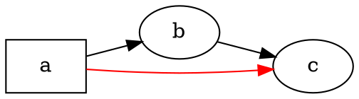

# Yfirlit

@knowvah/dot-engine er TypeScript-yfirfærsla á [Graphviz](https://graphviz.org/) línu fyrir línu:
DOT-frumkóði (eða graf sem smíðað er í kóða) fer inn, og SVG — eða JSON, xdot, DOT eða
myndakort (image map) — kemur út, allt reiknað í TypeScript án innbyggðrar
Graphviz-keyrsluskrár og án WASM. Ef þú hefur ekki teiknað neitt enn skaltu byrja á
[Fyrstu skref](/is/guide/getting-started); þessi síða er kortið sem situr þar fyrir
ofan — hvað safnið er að gera og hvaða inngangspunkt af þremur á að velja.

## Hvað er DOT? Hvað er Graphviz? {#what-is-dot-what-is-graphviz}

**DOT** er lítið, venjulegt textamál til að lýsa gröfum — hnútum, leggjum og
eigindum þeirra:



Þetta er allt inntakssniðið: lýstu hnútum, tengdu þá með `->` (stefnt)
eða `--` (óstefnt) og settu eigindi innan `[...]`. Fullt mál — setningar,
hlutnet, gáttir (ports), HTML-lík merki og öll eigindi — er skilgreint
í upprunalegu **[tilvísuninni um DOT-málið](https://graphviz.org/doc/info/lang.html)**
(með [eigindalistanum](https://graphviz.org/doc/info/attrs.html) til hliðar). `@knowvah/dot-engine`
þáttar það mál nákvæmlega eins og upprunalega útgáfan — svo allt DOT sem C-verkfærin taka við
er DOT sem þetta safn tekur við.

**Graphviz** er opna hugbúnaðarsafnið til sjónrænnar framsetningar á gröfum sem DOT var búið til
fyrir. Það hófst hjá **AT&T Bell Labs** (Murray Hill, NJ) — grundvallar tækniskýrsla eftir
Eleftherios Koutsofios og Stephen North er frá **1991** — og er í dag
viðhaldið undir **Eclipse Public License** (sama leyfi og þessi
yfirfærsla ber). Þetta safn er trú endurútfærsla á því í TypeScript; C-kóðinn
er skilgreiningin sem við samsvörum innan þröngra vikmarka. Um upprunalega
verkefnið:

- **[graphviz.org](https://graphviz.org/)** — opinber vefur verkefnisins, skjöl og
  tilvísanir um DOT og eigindi.
- **[gitlab.com/graphviz/graphviz](https://gitlab.com/graphviz/graphviz)** — upprunalegi
  C-frumkóðinn sem við yfirfærum úr.
- **[Graphviz á Wikipedia](https://en.wikipedia.org/wiki/Graphviz)** — saga og
  bakgrunnur.

## Ferlið

Sérhver teikning, sama hvaða inngangspunktur ræsir hana, fylgir sama
formi: fáðu `Graph` (með því að þátta DOT eða smíða það í kóða), keyrðu
uppsetningarvél yfir það og annaðhvort raðaðu niðurstöðunni í streng eða lestu reiknuðu
rúmfræðina til baka af sama grafhlutnum.

```graphviz
digraph pipeline {
  rankdir=LR;
  bgcolor="transparent";
  node [shape=box, style=rounded, fontname="Helvetica", fontsize=11];
  edge [fontname="Helvetica", fontsize=10];

  src  [label="DOT source"];
  api  [label="createGraph()"];
  g    [label="Graph"];
  eng  [label="layout engine\n(dot · neato · fdp · sfdp ·\ncirco · twopi · osage · patchwork)"];
  out  [label="SVG / JSON / xdot /\nDOT / imagemap"];
  snap [label="LayoutSnapshot\n(nodes, edges, bounds)"];

  src -> g [label="parse()"];
  api -> g [label=".graph"];
  g -> eng;
  eng -> out  [label="render()"];
  eng -> snap [label="getLayout()"];
}
```

Það er ekkert sérstakt „keyra uppsetningu“-kall: `renderSvg` og `render` kalla fram
uppsetningu sem hluta af teikningunni, og reiknuðu hnitin (staðsetningar hnúta,
splínur leggja, umgjörð) eru geymd á `Graph`-hlutnum á eftir.
`getLayout` keyrir uppsetninguna ekki aftur — það les rúmfræði sem fyrra `render`-kall
hefur þegar reiknað, svo það er alltaf kallað *eftir* `render`, á sama
grafinu.

## Inngangspunktarnir þrír — hvaða dyr?

@knowvah/dot-engine kemur með þremur inngangspunktum: rótarpakkinn endurflytur allt
úr hinum tveimur, svo þú þarft aðeins að seilast framhjá honum þegar þú vilt
þrengra innflutningsyfirborð.

| Ég vil…                                               | Nota                                   |
|--------------------------------------------------------|-----------------------------------------|
| Breyta DOT-texta í SVG-streng, hratt                    | `@knowvah/dot-engine` — `renderSvg(dot, engine)` |
| Þátta DOT án þess að teikna það                         | `@knowvah/dot-engine` — `parse(dot)`             |
| Stilla textamælingu eða myndaleysingu á heimsvísu       | `@knowvah/dot-engine` — `setTextMeasurer`, `setImageSizer`, `setImageResolver` |
| Smíða graf í kóða, án DOT-texta                         | `@knowvah/dot-engine/api` — `createGraph`, `addEdge` |
| Lesa til baka reiknaðar staðsetningar hnúta/leggja/klasa | `@knowvah/dot-engine/api` — `getLayout`          |
| Teikna á annað snið en SVG (JSON, xdot, DOT, myndakort) | `@knowvah/dot-engine/render` — `render(g, format, opts?)` |
| Knýja eigin canvas/WebGL/PDF-bakenda                    | `@knowvah/dot-engine/render` — `getDrawOps`      |

`@knowvah/dot-engine/api` eru *smíða + skoða* dyrnar: smíðaðu graf í
kóða og lestu rúmfræði af því. `@knowvah/dot-engine/render` eru
*úttaks*dyrnar: breyttu grafi (úr `parse()` eða smiðnum) í
raðað snið eða skipulagðan straum teikniaðgerða. Rótarpakkinn `@knowvah/dot-engine`
endurflytur báða, auk einskots-þægindafallsins `renderSvg` og
alþjóðlegu stillingarkrókanna — flest verkefni flytja aðeins inn úr
rótinni.

## Hnitakerfi, í stuttu máli

Upprunaleg hnit graphviz eru y-upp, með upphafspunkt neðst til vinstri — sú
venja sem uppsetningarvélarnar reikna í. Flestir skjá- og canvas-notendur
vilja y-niður, með upphafspunkt efst til vinstri. `getLayout` notar sjálfgefið `yAxis:
'down'` og snýr fyrir þig; hrásniðin sem eru strengir (`svg`, `json`, `xdot`,
`plain`) bera upprunaleg y-upp hnit óbreytt. Sjá
[Lesa reiknaða rúmfræði](/is/guide/geometry) fyrir fulla hnitatilvísun,
og [Uppskriftir](/is/guide/recipes) fyrir mynstrið að snúa-og-samræma þegar þú
þarft að blanda saman úttaki `getLayout` og hnitum hrásniðs.

## Umfang

@knowvah/dot-engine teiknar á SVG, JSON, xdot, DOT og HTML-myndakort (`imap` /
`cmapx`) — ákvarðandi úttakssniðin sem byggjast á strengjum eða gagnabyggingum. Það
býr ekki til punktamyndir (PNG, JPEG) eða PDF og hefur engan myndrænan skoðara;
það er utan umfangs fyrir vafraörugga yfirfærslu í hreinu TypeScript. Þekktur
munur á hegðun innbyggðs Graphviz — ekki eyður í úttakssniðum, heldur
staðir þar sem úttak yfirfærslunnar víkur frá — er skráður á síðunni
[Frávik](/is/divergences).

## Hvert næst

- [Fyrstu skref](/is/guide/getting-started) — settu upp og teiknaðu fyrsta grafið þitt.
- [Uppsetningarvélar](/is/guide/engines) — vélarnar átta og hvenær á að nota hverja.
- [Smíða graf í kóða](/is/guide/build-a-graph) — smiðurinn í `@knowvah/dot-engine/api`.
- [Lesa reiknaða rúmfræði](/is/guide/geometry) — `getLayout`, hnitakerfi, einingar.
- [Uppskriftir](/is/guide/recipes) — algeng verkefnamiðuð mynstur.
- [Myndir](/is/guide/images) — `setImageSizer`, `setImageResolver`, innfelling.
- [Tegundatilvísun](/is/guide/types) — full form allra útfluttra tegunda.
- [API-tilvísun](/reference/) — mynduð skjöl fyrir hvert tákn.
- [Orðasafn](/is/guide/glossary) — hugtök Graphviz og @knowvah/dot-engine.
