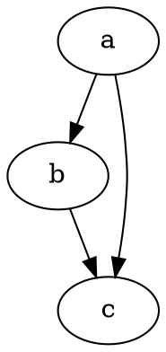

# Primi passi

@knowvah/dot-engine è un porting fedele di [Graphviz](https://graphviz.org/) in TypeScript.
Esegue il parsing del linguaggio DOT, lancia i motori di layout di Graphviz ed emette SVG — in
puro TypeScript, senza C: nessun binario nativo di Graphviz e nessun porting WASM.

::: tip Prima volta con la libreria?
Leggi prima la [Panoramica](/it/guide/overview) — mostra la pipeline
(parsing/costruzione → layout → rendering / lettura della geometria) e i tre punti di ingresso
(`@knowvah/dot-engine`, `@knowvah/dot-engine/api`, `@knowvah/dot-engine/render`), così sai quale
porta usare prima di installare.
:::

## Installazione

@knowvah/dot-engine è pubblicato su npm:

```bash
npm i @knowvah/dot-engine
```

Zero dipendenze a runtime. Il pacchetto `canvas` è una peer dependency opzionale, necessaria
solo per una misurazione del testo fedele all'host in Node — vedi
[Misurazione del testo](/it/guide/text-measurement). Il pacchetto fornisce tre punti di ingresso
(`@knowvah/dot-engine`, `@knowvah/dot-engine/api`, `@knowvah/dot-engine/render`), ciascuno con
le proprie dichiarazioni di tipo `.d.ts`, declaration map e source map — «vai alla
definizione» porta nel vero codice sorgente TypeScript, distribuito insieme alla
build.

Per compilare invece dal sorgente:

```bash
git clone https://github.com/knowvah/dot-engine.git
cd @knowvah/dot-engine
npm install
npm run build        # → dist/index.js (ESM bundle, via esbuild) + .d.ts
```

## Renderizzare un grafo

```ts
import { renderSvg } from '@knowvah/dot-engine';

const dot = `
  digraph {
    a -> b;
    b -> c;
    a -> c;
  }
`;

const svg = renderSvg(dot, 'dot');
console.log(svg); // <svg ...>...</svg>
```

`renderSvg(dotSource, engine)` esegue il parsing del sorgente DOT, lancia il
[motore di layout](/it/guide/engines) indicato, produce l'SVG e restituisce la stringa SVG.

Ecco esattamente quel grafo, renderizzato su questa pagina dal motore stesso (tramite
[`@knowvah/vitepress-plugin-dot`](https://www.npmjs.com/package/@knowvah/vitepress-plugin-dot)):



Non conosci DOT? È un piccolo linguaggio di testo semplice per descrivere grafi — il
**[riferimento del linguaggio DOT](https://graphviz.org/doc/info/lang.html)** canonico è
la guida alla sintassi, e la [Panoramica](/it/guide/overview#what-is-dot-what-is-graphviz)
ne offre un'introduzione in un paragrafo.

## Prossimi passi

- [Panoramica](/it/guide/overview) — il modello mentale e i tre punti di ingresso.
- [Motori di layout](/it/guide/engines) — gli otto motori e quando usare ciascuno.
- [Costruire un grafo nel codice](/it/guide/build-a-graph) — il builder `createGraph`.
- [Ricette](/it/guide/recipes) — soluzioni eseguibili orientate ai compiti.
- [Leggere la geometria calcolata](/it/guide/geometry) — posizioni e spline tramite
  `getLayout`.
- [Lavorare con le immagini](/it/guide/images) — inlining, distribuzione e CSP.
- [Tipi](/it/guide/types) — le forme dei dati pubblici e come si relazionano.
- [Uso nel browser](/it/guide/browser) — bundling e l'hook `setImageSizer`.
- [Riferimento API](/it/guide/api) — l'intera superficie pubblica.
- [Area di prova](/it/playground) — modifica il DOT e vedi l'SVG dal vivo, nel tuo browser.
