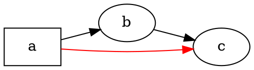

# Panoramica

@knowvah/dot-engine è un porting riga per riga in TypeScript di [Graphviz](https://graphviz.org/):
il sorgente DOT (o un grafo costruito nel codice) entra, SVG — oppure JSON, xdot, DOT o una
image map — esce, calcolato interamente in TypeScript senza alcun binario nativo di
Graphviz e senza WASM. Se non hai ancora renderizzato nulla, parti da
[Primi passi](/it/guide/getting-started); questa pagina è la mappa che sta sopra — cosa fa la
libreria e quale dei suoi tre punti di ingresso scegliere.

## Che cos'è DOT? Che cos'è Graphviz? {#what-is-dot-what-is-graphviz}

**DOT** è un piccolo linguaggio di testo semplice per descrivere grafi — nodi, archi e
i loro attributi:



Questo è l'intero formato di ingresso: dichiari i nodi, li colleghi con `->` (orientato)
o `--` (non orientato) e imposti gli attributi in `[...]`. La grammatica completa —
istruzioni, sottografi, porte, etichette in stile HTML e ogni attributo — è definita
nel **[riferimento del linguaggio DOT](https://graphviz.org/doc/info/lang.html)** canonico
(insieme all'[elenco degli attributi](https://graphviz.org/doc/info/attrs.html)).
`@knowvah/dot-engine` esegue il parsing di quel linguaggio esattamente come l'originale — quindi qualsiasi
DOT accettato dagli strumenti in C è DOT accettato da questa libreria.

**Graphviz** è il toolkit open source per la visualizzazione di grafi per cui è stato creato
DOT. Nasce presso **AT&T Bell Labs** (Murray Hill, NJ) — un rapporto tecnico fondativo di
Eleftherios Koutsofios e Stephen North risale al **1991** — ed è oggi
mantenuto sotto la **Eclipse Public License** (la stessa licenza di questo
porting). Questa libreria è una fedele reimplementazione in TypeScript; il
codice C è la specifica a cui ci atteniamo entro una tolleranza stretta. Per il progetto
originale:

- **[graphviz.org](https://graphviz.org/)** — il sito ufficiale del progetto, con la documentazione e
  i riferimenti a DOT e agli attributi.
- **[gitlab.com/graphviz/graphviz](https://gitlab.com/graphviz/graphviz)** — il
  sorgente C canonico da cui facciamo il porting.
- **[Graphviz su Wikipedia](https://en.wikipedia.org/wiki/Graphviz)** — storia e
  contesto.

## La pipeline

Ogni rendering, indipendentemente dal punto di ingresso che lo avvia, segue la stessa
struttura: ottenere un `Graph` (con il parsing di DOT o costruendolo da codice), eseguire un
motore di layout su di esso, quindi serializzare il risultato oppure rileggere la
geometria calcolata dallo stesso oggetto grafo.

```graphviz
digraph pipeline {
  rankdir=LR;
  bgcolor="transparent";
  node [shape=box, style=rounded, fontname="Helvetica", fontsize=11];
  edge [fontname="Helvetica", fontsize=10];

  src  [label="DOT source"];
  api  [label="createGraph()"];
  g    [label="Graph"];
  eng  [label="layout engine\n(dot · neato · fdp · sfdp ·\ncirco · twopi · osage · patchwork)"];
  out  [label="SVG / JSON / xdot /\nDOT / imagemap"];
  snap [label="LayoutSnapshot\n(nodes, edges, bounds)"];

  src -> g [label="parse()"];
  api -> g [label=".graph"];
  g -> eng;
  eng -> out  [label="render()"];
  eng -> snap [label="getLayout()"];
}
```

Non esiste una chiamata separata «esegui il layout»: `renderSvg` e `render` avviano
il layout come parte del rendering, e le coordinate calcolate (posizioni dei nodi,
spline degli archi, riquadro di delimitazione) restano poi conservate nell'oggetto `Graph`.
`getLayout` non riesegue il layout — legge la geometria che una precedente chiamata a `render`
ha già calcolato, quindi va sempre chiamata *dopo* `render`, sullo stesso
grafo.

## I tre punti di ingresso — quale porta?

@knowvah/dot-engine fornisce tre punti di ingresso: il pacchetto radice riesporta tutto
dagli altri due, quindi devi andare oltre solo quando vuoi una
superficie di importazione più ristretta.

| Voglio…                                               | Uso                                    |
|--------------------------------------------------------|-----------------------------------------|
| Trasformare testo DOT in una stringa SVG, in fretta     | `@knowvah/dot-engine` — `renderSvg(dot, engine)` |
| Fare il parsing di DOT senza renderizzarlo              | `@knowvah/dot-engine` — `parse(dot)`             |
| Configurare globalmente la misurazione del testo o la risoluzione delle immagini | `@knowvah/dot-engine` — `setTextMeasurer`, `setImageSizer`, `setImageResolver` |
| Costruire un grafo nel codice, senza testo DOT          | `@knowvah/dot-engine/api` — `createGraph`, `addEdge` |
| Rileggere le posizioni calcolate di nodi/archi/cluster   | `@knowvah/dot-engine/api` — `getLayout`          |
| Renderizzare in un formato diverso da SVG (JSON, xdot, DOT, image map) | `@knowvah/dot-engine/render` — `render(g, format, opts?)` |
| Pilotare un backend personalizzato canvas/WebGL/PDF      | `@knowvah/dot-engine/render` — `getDrawOps`      |

`@knowvah/dot-engine/api` è la porta per *costruire e ispezionare*: costruisci un grafo
in modo programmatico e leggi la geometria da esso. `@knowvah/dot-engine/render` è la
porta dell'*output*: trasforma un grafo (da `parse()` o dal builder) in un formato
serializzato o in un flusso strutturato di operazioni di disegno. Il pacchetto radice
`@knowvah/dot-engine` riesporta entrambi, più la funzione di comodo one-shot `renderSvg`
e gli hook di configurazione globale — la maggior parte dei progetti importa solo
dalla radice.

## Sistemi di coordinate, in breve

Le coordinate native di Graphviz hanno la y verso l'alto e l'origine in basso a sinistra — la
convenzione in cui calcolano i motori di layout. La maggior parte dei consumatori su schermo e canvas
vuole la y verso il basso con l'origine in alto a sinistra. `getLayout` usa per impostazione predefinita `yAxis:
'down'` e inverte l'asse per te; i formati stringa grezzi (`svg`, `json`, `xdot`,
`plain`) portano invariate le coordinate native con y verso l'alto. Vedi
[Leggere la geometria calcolata](/it/guide/geometry) per il riferimento completo alle coordinate
e [Ricette](/it/guide/recipes) per il pattern di inversione e riconciliazione quando
devi mescolare l'output di `getLayout` con le coordinate di un formato grezzo.

## Confini dell'ambito

@knowvah/dot-engine renderizza in SVG, JSON, xdot, DOT e image map HTML (`imap` /
`cmapx`) — i formati di output deterministici, basati su stringhe o su strutture. Non
produce immagini raster (PNG, JPEG) né PDF, e non ha un visualizzatore grafico;
queste cose sono fuori ambito per un porting in puro TypeScript sicuro per il browser. Le
differenze note rispetto al comportamento del Graphviz nativo — non lacune nei formati di output,
ma punti in cui l'output del porting diverge — sono tracciate nella pagina
[Divergenze](/it/divergences).

## Dove andare dopo

- [Primi passi](/it/guide/getting-started) — installa e renderizza il tuo primo grafo.
- [Motori di layout](/it/guide/engines) — gli otto motori e quando usare ciascuno.
- [Costruire un grafo nel codice](/it/guide/build-a-graph) — il builder `@knowvah/dot-engine/api`.
- [Leggere la geometria calcolata](/it/guide/geometry) — `getLayout`, sistemi di coordinate, unità.
- [Ricette](/it/guide/recipes) — pattern comuni orientati ai compiti.
- [Immagini](/it/guide/images) — `setImageSizer`, `setImageResolver`, inlining.
- [Riferimento dei tipi](/it/guide/types) — le forme complete di ogni tipo esportato.
- [Riferimento API](/reference/) — documentazione generata per ogni simbolo.
- [Glossario](/it/guide/glossary) — terminologia di Graphviz e di @knowvah/dot-engine.
