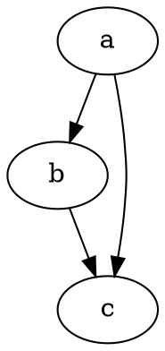

# はじめに

@knowvah/dot-engine は、[Graphviz](https://graphviz.org/) を忠実に TypeScript へ移植したものです。
DOT 言語を解析し、Graphviz のレイアウトエンジンを実行して、SVG を出力します。
すべて純粋な TypeScript で動作し、C は使いません。ネイティブの Graphviz バイナリも WASM 移植版もありません。

::: tip このライブラリは初めてですか?
最初に[概要](/ja/guide/overview)をお読みください。パイプライン
（解析/構築 → レイアウト → レンダリング / ジオメトリの読み取り）と 3 つのエントリポイント
（`@knowvah/dot-engine`、`@knowvah/dot-engine/api`、`@knowvah/dot-engine/render`）を整理してあるので、
インストールする前にどの入口を使うべきかがわかります。
:::

## インストール {#install}

@knowvah/dot-engine は npm で公開されています。

```bash
npm i @knowvah/dot-engine
```

ランタイム依存はゼロです。`canvas` パッケージはオプションのピア依存で、Node でホスト環境に忠実な
テキスト計測を行いたい場合にだけ必要です。詳しくは
[テキスト計測](/ja/guide/text-measurement)を参照してください。このパッケージは 3 つのエントリ
ポイント（`@knowvah/dot-engine`、`@knowvah/dot-engine/api`、`@knowvah/dot-engine/render`）を提供し、
それぞれに `.d.ts` 型宣言、宣言マップ、ソースマップが付属しています。「定義へ移動」を使うと、
ビルド成果物と一緒に配布される実際の TypeScript ソースにジャンプできます。

代わりにソースからビルドする場合は次のとおりです。

```bash
git clone https://github.com/knowvah/dot-engine.git
cd @knowvah/dot-engine
npm install
npm run build        # → dist/index.js (ESM bundle, via esbuild) + .d.ts
```

## グラフをレンダリングする {#render-a-graph}

```ts
import { renderSvg } from '@knowvah/dot-engine';

const dot = `
  digraph {
    a -> b;
    b -> c;
    a -> c;
  }
`;

const svg = renderSvg(dot, 'dot');
console.log(svg); // <svg ...>...</svg>
```

`renderSvg(dotSource, engine)` は DOT ソースを解析し、指定した
[レイアウトエンジン](/ja/guide/engines)を実行して SVG にレンダリングし、SVG 文字列を返します。

以下は、まさにそのグラフを、このページ上でエンジン自身がレンダリングしたものです
（[`@knowvah/vitepress-plugin-dot`](https://www.npmjs.com/package/@knowvah/vitepress-plugin-dot) 経由）。



DOT は初めてですか? グラフを記述するための小さなプレーンテキストの言語です。構文の手引きは
正式な **[DOT 言語リファレンス](https://graphviz.org/doc/info/lang.html)** で、
[概要](/ja/guide/overview#what-is-dot-what-is-graphviz)には 1 段落の入門説明があります。

## 次のステップ {#next-steps}

- [概要](/ja/guide/overview) — メンタルモデルと 3 つのエントリポイント。
- [レイアウトエンジン](/ja/guide/engines) — 8 つのエンジンと、それぞれをいつ使うか。
- [コードでグラフを構築する](/ja/guide/build-a-graph) — `createGraph` ビルダー。
- [レシピ](/ja/guide/recipes) — 作業単位で、そのまま実行できる解決策。
- [計算済みジオメトリを読む](/ja/guide/geometry) — `getLayout` による位置とスプライン。
- [画像の扱い](/ja/guide/images) — インライン化、デプロイ、CSP。
- [型](/ja/guide/types) — 公開されるデータ形状とその関係。
- [ブラウザーでの利用](/ja/guide/browser) — バンドルと `setImageSizer` フック。
- [API リファレンス](/ja/guide/api) — 公開されているすべての API。
- [プレイグラウンド](/ja/playground) — DOT を編集して、ブラウザー内で SVG をライブ表示します。
