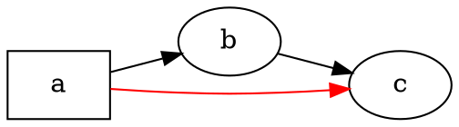

# 概要

@knowvah/dot-engine は、[Graphviz](https://graphviz.org/) を一行ずつ TypeScript に移植したものです。
DOT ソース（またはコードで構築したグラフ）を入力すると、SVG（あるいは JSON、xdot、DOT、
イメージマップ）が出力されます。計算はすべて TypeScript で行われ、ネイティブの
Graphviz バイナリも WASM も使いません。まだ何もレンダリングしていない場合は、
[はじめに](/ja/guide/getting-started)から始めてください。このページはその上位にある地図であり、
ライブラリが内部で何をしているのか、そして 3 つのエントリポイントのどれを使うべきかを説明します。

## DOT とは? Graphviz とは? {#what-is-dot-what-is-graphviz}

**DOT** は、グラフ（ノード、エッジ、およびそれらの属性）を記述するための、小さなプレーンテキストの言語です。



入力形式はこれがすべてです。ノードを宣言し、`->`（有向）または `--`（無向）で接続し、
`[...]` の中で属性を設定します。文、サブグラフ、ポート、HTML ライクなラベル、すべての属性を含む
完全な文法は、正式な **[DOT 言語リファレンス](https://graphviz.org/doc/info/lang.html)**
で定義されています（あわせて [属性一覧](https://graphviz.org/doc/info/attrs.html) もあります）。
`@knowvah/dot-engine` はこの言語を本家と全く同じように解析します。したがって、C 版のツールが受け付ける
DOT は、このライブラリでもそのまま受け付けられます。

**Graphviz** は、DOT のために作られたオープンソースのグラフ可視化ツールキットです。
始まりは **AT&T ベル研究所**（ニュージャージー州マレーヒル）で、Eleftherios Koutsofios と
Stephen North による基礎的な技術レポートは **1991** 年にさかのぼります。現在は
**Eclipse Public License**（この移植版と同じライセンス）の下で保守されています。
このライブラリは Graphviz を忠実に TypeScript で再実装したものであり、C のコードが、
私たちが厳密な許容誤差で一致を目指す仕様です。本家プロジェクトについては以下を参照してください。

- **[graphviz.org](https://graphviz.org/)** — 公式プロジェクトサイト。ドキュメントと
  DOT / 属性のリファレンスがあります。
- **[gitlab.com/graphviz/graphviz](https://gitlab.com/graphviz/graphviz)** — 移植元である
  正本の C ソースです。
- **[Wikipedia の Graphviz](https://en.wikipedia.org/wiki/Graphviz)** — 歴史と
  背景です。

## パイプライン {#the-pipeline}

どのエントリポイントから始めても、すべてのレンダリングは同じ流れをたどります。
まず `Graph` を得ます（DOT を解析するか、プログラムから構築します）。次にそのグラフに対して
レイアウトエンジンを実行し、結果をシリアライズするか、同じグラフオブジェクトから計算済みのジオメトリを
読み戻します。

```graphviz
digraph pipeline {
  rankdir=LR;
  bgcolor="transparent";
  node [shape=box, style=rounded, fontname="Helvetica", fontsize=11];
  edge [fontname="Helvetica", fontsize=10];

  src  [label="DOT source"];
  api  [label="createGraph()"];
  g    [label="Graph"];
  eng  [label="layout engine\n(dot · neato · fdp · sfdp ·\ncirco · twopi · osage · patchwork)"];
  out  [label="SVG / JSON / xdot /\nDOT / imagemap"];
  snap [label="LayoutSnapshot\n(nodes, edges, bounds)"];

  src -> g [label="parse()"];
  api -> g [label=".graph"];
  g -> eng;
  eng -> out  [label="render()"];
  eng -> snap [label="getLayout()"];
}
```

「レイアウトだけを実行する」独立した呼び出しはありません。`renderSvg` と `render` は
レンダリングの一部としてレイアウトを起動し、計算された座標（ノードの位置、
エッジのスプライン、バウンディングボックス）は、その後も `Graph` オブジェクトに保持されます。
`getLayout` はレイアウトを再実行しません。先に `render` を呼んだときに計算済みのジオメトリを
読み取るだけなので、常に同じグラフに対して `render` の*後*に呼び出します。

## 3 つのエントリポイント — どの入口を使うか {#the-three-entry-points}

@knowvah/dot-engine は 3 つのエントリポイントを提供しています。ルートパッケージは
他の 2 つのすべてを再エクスポートするので、インポートの範囲を絞りたい場合にだけ、
ルート以外を使えば十分です。

| やりたいこと                                            | 使うもの                                    |
|--------------------------------------------------------|-----------------------------------------|
| DOT テキストを SVG 文字列に素早く変換する                  | `@knowvah/dot-engine` — `renderSvg(dot, engine)` |
| レンダリングせずに DOT を解析する                          | `@knowvah/dot-engine` — `parse(dot)`             |
| テキスト計測や画像解決をグローバルに設定する | `@knowvah/dot-engine` — `setTextMeasurer`, `setImageSizer`, `setImageResolver` |
| DOT テキストなしで、コードでグラフを構築する                      | `@knowvah/dot-engine/api` — `createGraph`, `addEdge` |
| 計算済みのノード / エッジ / クラスターの位置を読み戻す           | `@knowvah/dot-engine/api` — `getLayout`          |
| SVG 以外の形式（JSON、xdot、DOT、イメージマップ）にレンダリングする | `@knowvah/dot-engine/render` — `render(g, format, opts?)` |
| 独自の canvas / WebGL / PDF バックエンドを駆動する                  | `@knowvah/dot-engine/render` — `getDrawOps`      |

`@knowvah/dot-engine/api` は*構築 + 検査*の入口です。グラフをプログラムから構築し、
そこからジオメトリを読み取ります。`@knowvah/dot-engine/render` は*出力*の入口です。
（`parse()` またはビルダーから得た）グラフを、シリアライズされた形式、
または構造化された描画オペレーションのストリームに変換します。ルートの `@knowvah/dot-engine`
パッケージは両方を再エクスポートし、さらにワンショットの便利関数 `renderSvg` と
グローバル設定フックも提供します。ほとんどのプロジェクトでは、ルートからのインポートだけで足ります。

## 座標系の概要 {#coordinate-frames-briefly}

Graphviz ネイティブの座標は y 軸が上向きで、原点は左下です。これはレイアウトエンジンが計算に使う
規約です。画面や canvas を扱う側の多くは、y 軸が下向きで原点が左上の座標を求めます。
`getLayout` は既定で `yAxis:
'down'` となっており、自動的に反転します。一方、生の文字列形式（`svg`、`json`、`xdot`、
`plain`）は、ネイティブの y 軸上向きの座標をそのまま保持します。座標系の完全なリファレンスは
[計算済みジオメトリを読む](/ja/guide/geometry)を、`getLayout` の出力と生の形式の座標を混在させる
必要があるときの反転と突き合わせのパターンは [レシピ](/ja/guide/recipes) を参照してください。

## スコープの境界 {#scope-boundary}

@knowvah/dot-engine がレンダリングできるのは、SVG、JSON、xdot、DOT、HTML イメージマップ
（`imap` / `cmapx`）です。いずれも決定論的で、文字列または構造ベースの出力形式です。
ラスター画像（PNG、JPEG）や PDF は生成せず、GUI ビューアーもありません。
これらは、ブラウザーで安全に動く純粋な TypeScript 移植版のスコープ外です。
ネイティブ Graphviz の動作との既知の違いは、出力形式の不足ではなく、
この移植版の出力が異なる箇所であり、[差異](/ja/divergences)のページで管理されています。

## 次に読むもの {#where-to-go-next}

- [はじめに](/ja/guide/getting-started) — インストールして最初のグラフをレンダリングします。
- [レイアウトエンジン](/ja/guide/engines) — 8 つのエンジンと、それぞれをいつ使うか。
- [コードでグラフを構築する](/ja/guide/build-a-graph) — `@knowvah/dot-engine/api` のビルダー。
- [計算済みジオメトリを読む](/ja/guide/geometry) — `getLayout`、座標系、単位。
- [レシピ](/ja/guide/recipes) — 作業単位でよく使うパターン。
- [画像](/ja/guide/images) — `setImageSizer`、`setImageResolver`、インライン化。
- [型リファレンス](/ja/guide/types) — エクスポートされるすべての型の完全な形。
- [API リファレンス](/reference/) — シンボルごとに生成されたドキュメント。
- [用語集](/ja/guide/glossary) — Graphviz と @knowvah/dot-engine の用語。
