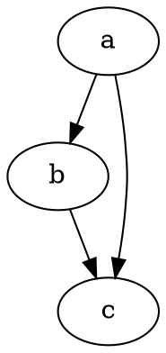

# 시작하기

@knowvah/dot-engine은 [Graphviz](https://graphviz.org/)를 충실하게 옮긴 TypeScript
포팅입니다. DOT 언어를 파싱하고, Graphviz의 레이아웃 엔진을 실행하여 SVG를 출력합니다.
순수 TypeScript로 동작하며 C는 없습니다. 네이티브 Graphviz 바이너리도, WASM 포팅도 없습니다.

::: tip 라이브러리가 처음이신가요?
먼저 [개요](/ko/guide/overview)를 읽어 보세요. 파이프라인(파싱/빌드 → 레이아웃 →
렌더링 / 지오메트리 읽기)과 세 가지 진입점(`@knowvah/dot-engine`,
`@knowvah/dot-engine/api`, `@knowvah/dot-engine/render`)을 정리해 두었으므로,
설치하기 전에 어떤 문을 사용해야 할지 알 수 있습니다.
:::

## 설치 {#install}

@knowvah/dot-engine은 npm에 게시되어 있습니다:

```bash
npm i @knowvah/dot-engine
```

런타임 의존성은 없습니다. `canvas` 패키지는 선택적 피어 의존성이며, Node에서 호스트에
충실한 텍스트 측정이 필요할 때만 사용합니다 — [텍스트 측정](/ko/guide/text-measurement)을
참조하세요. 이 패키지는 세 가지 진입점(`@knowvah/dot-engine`, `@knowvah/dot-engine/api`,
`@knowvah/dot-engine/render`)을 제공하며, 각각 자체 `.d.ts` 타입 선언, 선언 맵, 소스 맵을
갖추고 있습니다 — "정의로 이동"을 하면 빌드와 함께 배포되는 실제 TypeScript 소스로
이동합니다.

대신 소스에서 빌드하려면:

```bash
git clone https://github.com/knowvah/dot-engine.git
cd dot-engine
npm install
npm run build        # → dist/index.js (ESM bundle, via esbuild) + .d.ts
```

## 그래프 렌더링하기 {#render-a-graph}

```ts
import { renderSvg } from '@knowvah/dot-engine';

const dot = `
  digraph {
    a -> b;
    b -> c;
    a -> c;
  }
`;

const svg = renderSvg(dot, 'dot');
console.log(svg); // <svg ...>...</svg>
```

`renderSvg(dotSource, engine)`는 DOT 소스를 파싱하고, 지정한
[레이아웃 엔진](/ko/guide/engines)을 실행하고, SVG로 렌더링한 뒤 SVG 문자열을 반환합니다.

다음은 바로 그 그래프를 이 페이지에서 엔진이 직접 렌더링한 모습입니다
([`@knowvah/vitepress-plugin-dot`](https://www.npmjs.com/package/@knowvah/vitepress-plugin-dot) 사용):



DOT가 처음이신가요? 그래프를 기술하는 작고 단순한 텍스트 언어이며, 구문 안내서로는
표준 **[DOT 언어 레퍼런스](https://graphviz.org/doc/info/lang.html)**가 있습니다.
[개요](/ko/guide/overview#what-is-dot-what-is-graphviz)에도 한 단락짜리 입문 설명이 있습니다.

## 다음 단계 {#next-steps}

- [개요](/ko/guide/overview) — 멘탈 모델과 세 가지 진입점.
- [레이아웃 엔진](/ko/guide/engines) — 여덟 가지 엔진과 각각을 사용할 때.
- [코드로 그래프 만들기](/ko/guide/build-a-graph) — `createGraph` 빌더.
- [레시피](/ko/guide/recipes) — 작업 중심의 바로 실행 가능한 해결책.
- [계산된 지오메트리 읽기](/ko/guide/geometry) — `getLayout`을 통한 위치와 스플라인.
- [이미지 다루기](/ko/guide/images) — 인라인 처리, 배포, CSP.
- [타입](/ko/guide/types) — 공개 데이터 형태와 그 관계.
- [브라우저에서 사용하기](/ko/guide/browser) — 번들링과 `setImageSizer` 훅.
- [API 참고 자료](/ko/guide/api) — 전체 공개 인터페이스.
- [플레이그라운드](/ko/playground) — 브라우저에서 DOT를 편집하고 SVG를 실시간으로 확인.
