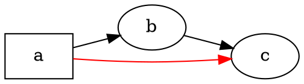

# 개요

@knowvah/dot-engine은 [Graphviz](https://graphviz.org/)를 한 줄씩 옮긴 TypeScript
포팅입니다. DOT 소스(또는 코드로 만든 그래프)를 넣으면 SVG — 또는 JSON, xdot, DOT,
이미지 맵 — 가 나오며, 모든 계산은 네이티브 Graphviz 바이너리나 WASM 없이 TypeScript만으로
이루어집니다. 아직 아무것도 렌더링해 보지 않았다면
[시작하기](/ko/guide/getting-started)부터 보세요. 이 페이지는 그 위에 놓인 지도로,
라이브러리가 무엇을 하는지, 그리고 세 가지 진입점 중 어느 것을 사용해야 하는지를 설명합니다.

## DOT란? Graphviz란? {#what-is-dot-what-is-graphviz}

**DOT**는 그래프 — 노드, 에지, 그리고 그 속성 — 를 기술하기 위한 작은 일반 텍스트
언어입니다:



입력 형식은 이것이 전부입니다. 노드를 선언하고, `->`(방향 있음) 또는 `--`(방향 없음)로
연결하고, `[...]` 안에 속성을 지정합니다. 구문, 서브그래프, 포트, HTML 유사 레이블,
모든 속성을 포함한 전체 문법은 표준 **[DOT 언어 레퍼런스](https://graphviz.org/doc/info/lang.html)**에
정의되어 있습니다(전체 [속성 목록](https://graphviz.org/doc/info/attrs.html)도 함께 있습니다).
`@knowvah/dot-engine`은 업스트림과 똑같이 그 언어를 파싱하므로, C 도구가 받아들이는 DOT라면
이 라이브러리도 받아들입니다.

**Graphviz**는 DOT를 위해 만들어진 오픈 소스 그래프 시각화 툴킷입니다. 시작은
**AT&T Bell Labs**(뉴저지주 머리힐)였으며 — Eleftherios Koutsofios와 Stephen North의 기초
기술 보고서가 **1991년**으로 거슬러 올라갑니다 — 현재는 **Eclipse Public License**(이 포팅이
따르는 것과 같은 라이선스)로 유지되고 있습니다. 이 라이브러리는 그것을 충실하게 TypeScript로
다시 구현한 것이며, C 코드가 우리가 엄격한 허용 오차로 맞추는 사양입니다. 원래 프로젝트는
다음에서 볼 수 있습니다:

- **[graphviz.org](https://graphviz.org/)** — 공식 프로젝트 사이트, 문서, DOT / 속성 레퍼런스.
- **[gitlab.com/graphviz/graphviz](https://gitlab.com/graphviz/graphviz)** — 우리가 포팅하는
  표준 C 소스.
- **[Wikipedia의 Graphviz](https://en.wikipedia.org/wiki/Graphviz)** — 역사와 배경.

## 파이프라인 {#the-pipeline}

어떤 진입점에서 시작하든 모든 렌더링은 같은 형태를 따릅니다. `Graph`를 얻고(DOT를 파싱하거나
프로그래밍 방식으로 만들어서), 그 위에서 레이아웃 엔진을 실행한 다음, 결과를 직렬화하거나
같은 그래프 객체에서 계산된 지오메트리를 읽어 옵니다.

```graphviz
digraph pipeline {
  rankdir=LR;
  bgcolor="transparent";
  node [shape=box, style=rounded, fontname="Helvetica", fontsize=11];
  edge [fontname="Helvetica", fontsize=10];

  src  [label="DOT source"];
  api  [label="createGraph()"];
  g    [label="Graph"];
  eng  [label="layout engine\n(dot · neato · fdp · sfdp ·\ncirco · twopi · osage · patchwork)"];
  out  [label="SVG / JSON / xdot /\nDOT / imagemap"];
  snap [label="LayoutSnapshot\n(nodes, edges, bounds)"];

  src -> g [label="parse()"];
  api -> g [label=".graph"];
  g -> eng;
  eng -> out  [label="render()"];
  eng -> snap [label="getLayout()"];
}
```

별도의 "레이아웃 실행" 호출은 없습니다. `renderSvg`와 `render`는 렌더링의 일부로 레이아웃을
실행하며, 계산된 좌표(노드 위치, 에지 스플라인, 경계 상자)는 이후에도 `Graph` 객체에
유지됩니다. `getLayout`은 레이아웃을 다시 실행하지 않고, 앞서 `render` 호출이 이미 계산한
지오메트리를 읽기만 하므로 항상 같은 그래프에서 `render` *이후에* 호출합니다.

## 세 가지 진입점 — 어느 문으로? {#the-three-entry-points}

@knowvah/dot-engine은 세 가지 진입점을 제공합니다. 루트 패키지는 나머지 둘의 모든 것을
다시 내보내므로, 더 좁은 임포트 범위가 필요할 때만 루트 바깥으로 손을 뻗으면 됩니다.

| 하고 싶은 일                                            | 사용할 것                                    |
|--------------------------------------------------------|-----------------------------------------|
| DOT 텍스트를 SVG 문자열로 빠르게 변환                    | `@knowvah/dot-engine` — `renderSvg(dot, engine)` |
| 렌더링하지 않고 DOT만 파싱                               | `@knowvah/dot-engine` — `parse(dot)`             |
| 텍스트 측정이나 이미지 해석을 전역으로 설정               | `@knowvah/dot-engine` — `setTextMeasurer`, `setImageSizer`, `setImageResolver` |
| DOT 텍스트 없이 코드로 그래프 만들기                      | `@knowvah/dot-engine/api` — `createGraph`, `addEdge` |
| 계산된 노드/에지/클러스터 위치 읽기                       | `@knowvah/dot-engine/api` — `getLayout`          |
| SVG가 아닌 형식(JSON, xdot, DOT, 이미지 맵)으로 렌더링    | `@knowvah/dot-engine/render` — `render(g, format, opts?)` |
| 사용자 지정 캔버스/WebGL/PDF 백엔드 구동                  | `@knowvah/dot-engine/render` — `getDrawOps`      |

`@knowvah/dot-engine/api`는 *빌드 + 검사*의 문입니다. 그래프를 프로그래밍 방식으로 구성하고
거기서 지오메트리를 읽습니다. `@knowvah/dot-engine/render`는 *출력*의 문입니다. (`parse()`나
빌더로 만든) 그래프를 직렬화된 형식이나 구조화된 그리기 연산 스트림으로 바꿉니다. 루트
`@knowvah/dot-engine` 패키지는 둘 다 다시 내보내며, 여기에 한 번에 처리하는 편의 함수
`renderSvg`와 전역 설정 훅도 포함합니다 — 대부분의 프로젝트는 루트에서만 임포트합니다.

## 좌표계 간단히 {#coordinate-frames-briefly}

네이티브 Graphviz 좌표는 y가 위쪽이고 원점이 왼쪽 아래이며, 레이아웃 엔진은 이 규약으로
계산합니다. 대부분의 화면 및 캔버스 소비자는 y가 아래쪽이고 원점이 왼쪽 위인 좌표를
원합니다. `getLayout`은 기본값이 `yAxis: 'down'`이며 자동으로 뒤집어 줍니다. 원시 문자열
형식(`svg`, `json`, `xdot`, `plain`)은 네이티브 y-up 좌표를 그대로 담고 있습니다.
전체 좌표 레퍼런스는 [계산된 지오메트리 읽기](/ko/guide/geometry)를, `getLayout` 출력과 원시
형식의 좌표를 섞어야 할 때의 뒤집기-조정 패턴은 [레시피](/ko/guide/recipes)를 참조하세요.

## 범위의 경계 {#scope-boundary}

@knowvah/dot-engine은 SVG, JSON, xdot, DOT, HTML 이미지 맵(`imap` / `cmapx`)으로
렌더링합니다. 문자열 또는 구조 기반의 결정적 출력 형식들입니다. 래스터 이미지(PNG, JPEG)나
PDF는 생성하지 않으며 GUI 뷰어도 없습니다. 이들은 브라우저에서 안전한 순수 TypeScript
포팅의 범위 밖입니다. 네이티브 Graphviz 동작과의 알려진 차이 — 출력 형식의 빈틈이 아니라
포팅의 출력이 달라지는 지점 — 는 [차이](/ko/divergences) 페이지에서 추적합니다.

## 다음으로 갈 곳 {#where-to-go-next}

- [시작하기](/ko/guide/getting-started) — 설치하고 첫 그래프를 렌더링합니다.
- [레이아웃 엔진](/ko/guide/engines) — 여덟 가지 엔진과 각각을 사용할 때.
- [코드로 그래프 만들기](/ko/guide/build-a-graph) — `@knowvah/dot-engine/api` 빌더.
- [계산된 지오메트리 읽기](/ko/guide/geometry) — `getLayout`, 좌표계, 단위.
- [레시피](/ko/guide/recipes) — 작업 중심의 일반적인 패턴.
- [이미지](/ko/guide/images) — `setImageSizer`, `setImageResolver`, 인라인 처리.
- [타입 참고 자료](/ko/guide/types) — 내보낸 모든 타입의 전체 형태.
- [API 참고 자료](/reference/) — 심볼별로 생성된 문서.
- [용어집](/ko/guide/glossary) — Graphviz와 @knowvah/dot-engine 용어.
