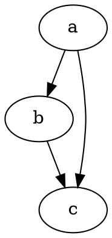

# Aan de slag

@knowvah/dot-engine is een getrouwe TypeScript-port van [Graphviz](https://graphviz.org/).
Het parseert de taal DOT, voert de lay-out-engines van Graphviz uit en levert SVG op — in
pure TypeScript, zonder C: geen native Graphviz-binary en geen WASM-port.

::: tip Nieuw bij de bibliotheek?
Lees eerst het [Overzicht](/nl/guide/overview) — het brengt de pijplijn in kaart
(parseren/bouwen → lay-out → renderen / geometrie uitlezen) en de drie ingangen
(`@knowvah/dot-engine`, `@knowvah/dot-engine/api`, `@knowvah/dot-engine/render`), zodat u vóór
de installatie weet welke ingang u moet nemen.
:::

## Installatie

@knowvah/dot-engine is gepubliceerd op npm:

```bash
npm i @knowvah/dot-engine
```

Geen runtime-afhankelijkheden. Het pakket `canvas` is een optionele peer-afhankelijkheid die
alleen nodig is voor hostgetrouwe tekstmeting in Node — zie
[Tekstmeting](/nl/guide/text-measurement). Het pakket levert drie ingangen
(`@knowvah/dot-engine`, `@knowvah/dot-engine/api`, `@knowvah/dot-engine/render`), elk met
eigen `.d.ts`-typedeclaraties, declaration maps en source maps — "ga naar
definitie" brengt u in de echte TypeScript-broncode, die naast de build wordt meegeleverd.

Om in plaats daarvan vanuit de broncode te bouwen:

```bash
git clone https://github.com/knowvah/dot-engine.git
cd @knowvah/dot-engine
npm install
npm run build        # → dist/index.js (ESM bundle, via esbuild) + .d.ts
```

## Een graaf renderen

```ts
import { renderSvg } from '@knowvah/dot-engine';

const dot = `
  digraph {
    a -> b;
    b -> c;
    a -> c;
  }
`;

const svg = renderSvg(dot, 'dot');
console.log(svg); // <svg ...>...</svg>
```

`renderSvg(dotSource, engine)` parseert de DOT-broncode, voert de genoemde
[lay-out-engine](/nl/guide/engines) uit, rendert naar SVG en geeft de SVG-string terug.

Hier is precies die graaf, op deze pagina door de engine zelf gerenderd (via
[`@knowvah/vitepress-plugin-dot`](https://www.npmjs.com/package/@knowvah/vitepress-plugin-dot)):



Nieuw met DOT? Het is een kleine platte-tekstentaal voor het beschrijven van grafen — de
canonieke **[DOT-taalreferentie](https://graphviz.org/doc/info/lang.html)** is de
syntaxisgids, en het [Overzicht](/nl/guide/overview#what-is-dot-what-is-graphviz)
bevat een inleiding van één alinea.

## Volgende stappen

- [Overzicht](/nl/guide/overview) — het denkmodel en de drie ingangen.
- [Lay-out-engines](/nl/guide/engines) — de acht engines en wanneer u welke gebruikt.
- [Een graaf bouwen in code](/nl/guide/build-a-graph) — de builder `createGraph`.
- [Recepten](/nl/guide/recipes) — taakgerichte, uitvoerbare oplossingen.
- [Berekende geometrie uitlezen](/nl/guide/geometry) — posities en splines via
  `getLayout`.
- [Werken met afbeeldingen](/nl/guide/images) — inlining, deployment en CSP.
- [Typen](/nl/guide/types) — de openbare datavormen en hoe ze samenhangen.
- [Gebruik in de browser](/nl/guide/browser) — bundelen en de hook `setImageSizer`.
- [API-referentie](/nl/guide/api) — het volledige openbare oppervlak.
- [Speeltuin](/nl/playground) — DOT bewerken en SVG live in uw browser zien.
