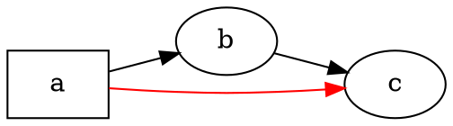

# Overzicht

@knowvah/dot-engine is een regel-voor-regel TypeScript-port van [Graphviz](https://graphviz.org/):
DOT-broncode (of een in code opgebouwde graaf) gaat erin, SVG — of JSON, xdot, DOT
of een image map — komt eruit, volledig in TypeScript berekend, zonder native
Graphviz-binary en zonder WASM. Hebt u nog niets gerenderd, begin dan bij
[Aan de slag](/nl/guide/getting-started); deze pagina is de kaart die erboven hangt — wat de
bibliotheek doet en welke van de drie ingangen u moet kiezen.

## Wat is DOT? Wat is Graphviz? {#what-is-dot-what-is-graphviz}

**DOT** is een kleine platte-tekstentaal voor het beschrijven van grafen — knopen, kanten en
hun attributen:



Dat is het hele invoerformaat: declareer knopen, verbind ze met `->` (gericht) of `--`
(ongericht) en stel attributen in met `[...]`. De volledige grammatica —
statements, subgrafen, ports, HTML-achtige labels en elk attribuut — is vastgelegd in de
canonieke **[DOT-taalreferentie](https://graphviz.org/doc/info/lang.html)**
(met de [attributenlijst](https://graphviz.org/doc/info/attrs.html) ernaast).
`@knowvah/dot-engine` parseert die taal precies zoals het origineel — elke DOT die de
C-hulpmiddelen accepteren, accepteert deze bibliotheek dus ook.

**Graphviz** is de opensource-toolkit voor graafvisualisatie waarvoor DOT is ontwikkeld.
Het ontstond bij **AT&T Bell Labs** (Murray Hill, NJ) — een fundamenteel technisch
rapport van Eleftherios Koutsofios en Stephen North dateert uit **1991** — en
wordt vandaag onderhouden onder de **Eclipse Public License** (dezelfde licentie als die
van deze port). Deze bibliotheek is een getrouwe TypeScript-herimplementatie; de
C-code is de specificatie waaraan wij binnen een strakke tolerantie voldoen. Voor het
oorspronkelijke project:

- **[graphviz.org](https://graphviz.org/)** — de officiële projectsite, met documentatie
  en de DOT- en attribuutreferenties.
- **[gitlab.com/graphviz/graphviz](https://gitlab.com/graphviz/graphviz)** — de
  canonieke C-broncode waarvan wij porten.
- **[Graphviz op Wikipedia](https://en.wikipedia.org/wiki/Graphviz)** — geschiedenis en
  achtergrond.

## De pijplijn

Elke rendering volgt, ongeacht welke ingang haar start, hetzelfde patroon: een
`Graph` verkrijgen (door DOT te parseren of er programmatisch een te bouwen), een
lay-out-engine eroverheen laten lopen en vervolgens ofwel het resultaat serialiseren
ofwel de berekende geometrie uit hetzelfde graafobject teruglezen.

```graphviz
digraph pipeline {
  rankdir=LR;
  bgcolor="transparent";
  node [shape=box, style=rounded, fontname="Helvetica", fontsize=11];
  edge [fontname="Helvetica", fontsize=10];

  src  [label="DOT source"];
  api  [label="createGraph()"];
  g    [label="Graph"];
  eng  [label="layout engine\n(dot · neato · fdp · sfdp ·\ncirco · twopi · osage · patchwork)"];
  out  [label="SVG / JSON / xdot /\nDOT / imagemap"];
  snap [label="LayoutSnapshot\n(nodes, edges, bounds)"];

  src -> g [label="parse()"];
  api -> g [label=".graph"];
  g -> eng;
  eng -> out  [label="render()"];
  eng -> snap [label="getLayout()"];
}
```

Er is geen aparte aanroep "lay-out uitvoeren": `renderSvg` en `render` starten de
lay-out als onderdeel van het renderen, en de berekende coördinaten (knooppunten,
kantsplines, omhullende rechthoek) blijven daarna op het `Graph`-object bewaard.
`getLayout` voert de lay-out niet opnieuw uit — het leest geometrie die een eerdere
`render`-aanroep al heeft berekend, en wordt dus altijd *na* `render` op dezelfde
graaf aangeroepen.

## De drie ingangen — welke deur?

@knowvah/dot-engine levert drie ingangen: het rootpakket re-exporteert alles uit
de andere twee, zodat u er alleen voorbij hoeft te grijpen wanneer u een
smaller importoppervlak wilt.

| Ik wil…                                               | Gebruik                                |
|--------------------------------------------------------|-----------------------------------------|
| DOT-tekst snel omzetten in een SVG-string               | `@knowvah/dot-engine` — `renderSvg(dot, engine)` |
| DOT parseren zonder te renderen                         | `@knowvah/dot-engine` — `parse(dot)`             |
| Tekstmeting of afbeeldingsresolutie globaal configureren | `@knowvah/dot-engine` — `setTextMeasurer`, `setImageSizer`, `setImageResolver` |
| Een graaf in code bouwen, zonder DOT-tekst              | `@knowvah/dot-engine/api` — `createGraph`, `addEdge` |
| Berekende knoop-/kant-/clusterposities uitlezen          | `@knowvah/dot-engine/api` — `getLayout`          |
| Naar een ander formaat dan SVG renderen (JSON, xdot, DOT, image map) | `@knowvah/dot-engine/render` — `render(g, format, opts?)` |
| Een eigen canvas-/WebGL-/PDF-backend aansturen           | `@knowvah/dot-engine/render` — `getDrawOps`      |

`@knowvah/dot-engine/api` is de deur voor *bouwen en inspecteren*: een graaf
programmatisch construeren en er geometrie uit uitlezen. `@knowvah/dot-engine/render` is
de *uitvoer*-deur: een graaf (uit `parse()` of de builder) omzetten in een
geserialiseerd formaat of een gestructureerde draw-op-stroom. Het rootpakket
`@knowvah/dot-engine` re-exporteert beide, plus de one-shot-gemaksfunctie `renderSvg`
en de globale configuratiehooks — de meeste projecten importeren uitsluitend
uit het rootpakket.

## Coördinatenstelsels, in het kort

Native Graphviz-coördinaten zijn y-omhoog met de oorsprong linksonder — de conventie
waarin de lay-out-engines rekenen. De meeste scherm- en canvasconsumenten willen
y-omlaag met de oorsprong linksboven. `getLayout` gebruikt standaard `yAxis:
'down'` en spiegelt voor u; de ruwe stringformaten (`svg`, `json`, `xdot`,
`plain`) dragen ongewijzigd de native y-omhoog-coördinaten. Zie
[Berekende geometrie uitlezen](/nl/guide/geometry) voor de volledige coördinatenreferentie
en [Recepten](/nl/guide/recipes) voor het patroon om te spiegelen en af te stemmen wanneer u
`getLayout`-uitvoer moet combineren met de coördinaten van een ruw formaat.

## Reikwijdte

@knowvah/dot-engine rendert naar SVG, JSON, xdot, DOT en HTML-image maps (`imap` /
`cmapx`) — de deterministische, op strings of structuren gebaseerde uitvoerformaten. Het
produceert geen rasterafbeeldingen (PNG, JPEG) en geen PDF en heeft geen GUI-viewer; dat valt
voor een browserveilige port in pure TypeScript buiten de reikwijdte. Bekende
verschillen met het gedrag van de native Graphviz — geen hiaten in uitvoerformaten,
maar plekken waar de uitvoer van de port afwijkt — worden bijgehouden op de pagina
[Afwijkingen](/nl/divergences).

## Hoe verder

- [Aan de slag](/nl/guide/getting-started) — installeren en uw eerste graaf renderen.
- [Lay-out-engines](/nl/guide/engines) — de acht engines en wanneer u welke gebruikt.
- [Een graaf bouwen in code](/nl/guide/build-a-graph) — de builder `@knowvah/dot-engine/api`.
- [Berekende geometrie uitlezen](/nl/guide/geometry) — `getLayout`, coördinatenstelsels, eenheden.
- [Recepten](/nl/guide/recipes) — veelvoorkomende taakgerichte patronen.
- [Afbeeldingen](/nl/guide/images) — `setImageSizer`, `setImageResolver`, inlining.
- [Typenreferentie](/nl/guide/types) — volledige vormen van alle geëxporteerde typen.
- [API-referentie](/reference/) — gegenereerde documentatie per symbool.
- [Woordenlijst](/nl/guide/glossary) — termen uit Graphviz en @knowvah/dot-engine.
