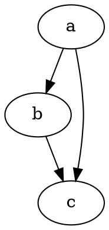

# Komme i gang

@knowvah/dot-engine er en tro TypeScript-portering av [Graphviz](https://graphviz.org/).
Det parser DOT-språket, kjører Graphviz' layoutmotorer og lager SVG — i
ren TypeScript — uten C: ingen innebygd Graphviz-binærfil og ingen WASM-portering.

::: tip Ny i biblioteket?
Les [Oversikt](/no/guide/overview) først — den kartlegger pipelinen
(parse/bygg → layout → render / les geometri) og de tre inngangspunktene
(`@knowvah/dot-engine`, `@knowvah/dot-engine/api`, `@knowvah/dot-engine/render`), slik at du vet hvilken
dør du skal bruke før du installerer.
:::

## Installer

@knowvah/dot-engine er publisert på npm:

```bash
npm i @knowvah/dot-engine
```

Ingen kjøretidsavhengigheter. Pakken `canvas` er en valgfri peer-avhengighet,
som bare trengs for vertstro tekstmåling i Node — se
[Tekstmåling](/no/guide/text-measurement). Pakken leveres med tre
inngangspunkter (`@knowvah/dot-engine`, `@knowvah/dot-engine/api`, `@knowvah/dot-engine/render`), hvert med
egne `.d.ts`-typedeklarasjoner, deklarasjonskart og kildekart — «gå til
definisjon» hopper inn i den virkelige TypeScript-kildekoden, som følger med
bygget.

For å bygge fra kildekoden i stedet:

```bash
git clone https://github.com/knowvah/dot-engine.git
cd dot-engine
npm install
npm run build        # → dist/index.js (ESM bundle, via esbuild) + .d.ts
```

## Render en graf

```ts
import { renderSvg } from '@knowvah/dot-engine';

const dot = `
  digraph {
    a -> b;
    b -> c;
    a -> c;
  }
`;

const svg = renderSvg(dot, 'dot');
console.log(svg); // <svg ...>...</svg>
```

`renderSvg(dotSource, engine)` parser DOT-kildekoden, kjører den navngitte
[layoutmotoren](/no/guide/engines), rendrer til SVG og returnerer SVG-strengen.

Her er akkurat den grafen, rendret på denne siden av selve motoren (via
[`@knowvah/vitepress-plugin-dot`](https://www.npmjs.com/package/@knowvah/vitepress-plugin-dot)):



Ny til DOT? Det er et lite språk i ren tekst for å beskrive grafer — den
kanoniske **[DOT-språkreferansen](https://graphviz.org/doc/info/lang.html)** er
syntaksveiledningen, og [Oversikt](/no/guide/overview#what-is-dot-what-is-graphviz)
har en kort introduksjon på ett avsnitt.

## Neste steg

- [Oversikt](/no/guide/overview) — den mentale modellen og de tre inngangspunktene.
- [Layoutmotorer](/no/guide/engines) — de åtte motorene og når du bruker hver av dem.
- [Bygg en graf i kode](/no/guide/build-a-graph) — byggeren `createGraph`.
- [Oppskrifter](/no/guide/recipes) — oppgaveorienterte løsninger som kan kjøres.
- [Les beregnet geometri](/no/guide/geometry) — posisjoner og splines via
  `getLayout`.
- [Arbeid med bilder](/no/guide/images) — innbygging, utrulling og CSP.
- [Typer](/no/guide/types) — de offentlige dataformene og hvordan de henger sammen.
- [Bruk i nettleseren](/no/guide/browser) — bunting og kroken `setImageSizer`.
- [API-referanse](/no/guide/api) — hele den offentlige flaten.
- [Lekeplass](/no/playground) — rediger DOT og se SVG live, i nettleseren din.
