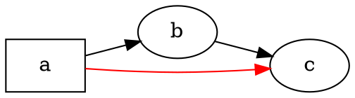

# Oversikt

@knowvah/dot-engine er en linje-for-linje-portering av [Graphviz](https://graphviz.org/) til TypeScript:
DOT-kildekode (eller en graf bygget i kode) går inn, SVG — eller JSON, xdot, DOT
eller et bildekart — kommer ut, beregnet helt og holdent i TypeScript uten
innebygd Graphviz-binærfil og uten WASM. Hvis du ikke har rendret noe ennå, start med
[Komme i gang](/no/guide/getting-started); denne siden er kartet som ligger
over den — hva biblioteket gjør, og hvilket av de tre inngangspunktene du bør
velge.

## Hva er DOT? Hva er Graphviz? {#what-is-dot-what-is-graphviz}

**DOT** er et lite språk i ren tekst for å beskrive grafer — noder, kanter
og attributtene deres:



Det er hele inndataformatet: deklarer noder, koble dem sammen med `->` (rettet)
eller `--` (urettet), og sett attributter i `[...]`. Den fullstendige grammatikken —
setninger, delgrafer, porter, HTML-lignende etiketter og alle attributter — er definert
i den kanoniske **[DOT-språkreferansen](https://graphviz.org/doc/info/lang.html)**
(med den fullstendige [attributtlisten](https://graphviz.org/doc/info/attrs.html) ved siden av).
`@knowvah/dot-engine` parser dette språket nøyaktig slik upstream gjør — så all
DOT som C-verktøyene godtar, er DOT som dette biblioteket godtar.

**Graphviz** er det åpne verktøysettet for grafvisualisering som DOT ble laget
for. Det startet ved **AT&T Bell Labs** (Murray Hill, NJ) — en grunnleggende teknisk
rapport av Eleftherios Koutsofios og Stephen North er datert **1991** — og
vedlikeholdes i dag under **Eclipse Public License** (den samme lisensen denne
porteringen bærer). Dette biblioteket er en tro reimplementering av det i TypeScript; C-koden
er spesifikasjonen vi samsvarer med innenfor en stram toleranse. For det opprinnelige
prosjektet:

- **[graphviz.org](https://graphviz.org/)** — prosjektets offisielle nettsted, dokumentasjon og
  DOT- og attributtreferansene.
- **[gitlab.com/graphviz/graphviz](https://gitlab.com/graphviz/graphviz)** — den
  kanoniske C-kildekoden vi porterer fra.
- **[Graphviz på Wikipedia](https://en.wikipedia.org/wiki/Graphviz)** — historie og
  bakgrunn.

## Pipelinen {#the-pipeline}

Hver rendering, uansett hvilket inngangspunkt som setter den i gang, følger den samme
formen: hent en `Graph` (ved å parse DOT eller bygge en programmatisk), kjør en
layoutmotor over den, og enten serialiser resultatet eller les den beregnede
geometrien tilbake fra det samme grafobjektet.

```graphviz
digraph pipeline {
  rankdir=LR;
  bgcolor="transparent";
  node [shape=box, style=rounded, fontname="Helvetica", fontsize=11];
  edge [fontname="Helvetica", fontsize=10];

  src  [label="DOT source"];
  api  [label="createGraph()"];
  g    [label="Graph"];
  eng  [label="layout engine\n(dot · neato · fdp · sfdp ·\ncirco · twopi · osage · patchwork)"];
  out  [label="SVG / JSON / xdot /\nDOT / imagemap"];
  snap [label="LayoutSnapshot\n(nodes, edges, bounds)"];

  src -> g [label="parse()"];
  api -> g [label=".graph"];
  g -> eng;
  eng -> out  [label="render()"];
  eng -> snap [label="getLayout()"];
}
```

Det finnes ikke noe eget «kjør layout»-kall: `renderSvg` og `render` utløser
layout som en del av renderingen, og de beregnede koordinatene (nodeposisjoner,
kantsplines, avgrensningsboks) beholdes på `Graph`-objektet etterpå.
`getLayout` kjører ikke layout på nytt — den leser geometri som et tidligere `render`-kall
allerede har beregnet, så den kalles alltid *etter* `render`, på den samme
grafen.

## De tre inngangspunktene — hvilken dør? {#the-three-entry-points-which-door}

@knowvah/dot-engine leveres med tre inngangspunkter: rotpakken re-eksporterer alt
fra de to andre, så du trenger bare å gå forbi den når du vil ha en
smalere importflate.

| Jeg vil …                                              | Bruk                                   |
|--------------------------------------------------------|-----------------------------------------|
| Gjøre DOT-tekst om til en SVG-streng, raskt             | `@knowvah/dot-engine` — `renderSvg(dot, engine)` |
| Parse DOT uten å rendre det                             | `@knowvah/dot-engine` — `parse(dot)`             |
| Konfigurere tekstmåling eller bildeløsning globalt      | `@knowvah/dot-engine` — `setTextMeasurer`, `setImageSizer`, `setImageResolver` |
| Bygge en graf i kode, uten DOT-tekst                    | `@knowvah/dot-engine/api` — `createGraph`, `addEdge` |
| Lese tilbake beregnede node-, kant- og klyngeposisjoner | `@knowvah/dot-engine/api` — `getLayout`          |
| Rendre til et annet format enn SVG (JSON, xdot, DOT, bildekart) | `@knowvah/dot-engine/render` — `render(g, format, opts?)` |
| Styre en egen canvas-/WebGL-/PDF-backend                | `@knowvah/dot-engine/render` — `getDrawOps`      |

`@knowvah/dot-engine/api` er *bygg + inspiser*-døren: konstruer en graf
programmatisk og les geometri fra den. `@knowvah/dot-engine/render` er
*utdata*-døren: gjør en graf (fra enten `parse()` eller byggeren) om til et
serialisert format eller en strukturert strøm av tegneoperasjoner. Rotpakken
`@knowvah/dot-engine` re-eksporterer begge, pluss engangsfunksjonen
`renderSvg` og de globale konfigurasjonskoblingene — de fleste prosjekter importerer
bare fra roten.

## Koordinatrammer, kort fortalt {#coordinate-frames-briefly}

Graphviz' native koordinater er y-opp, med origo nede til venstre — konvensjonen
layoutmotorene beregner i. De fleste skjerm- og canvas-forbrukere
vil ha y-ned, med origo oppe til venstre. `getLayout` har `yAxis:
'down'` som standard og snur for deg; de rå strengformatene (`svg`, `json`, `xdot`,
`plain`) bærer native y-opp-koordinater uendret. Se
[Les beregnet geometri](/no/guide/geometry) for den fullstendige koordinatreferansen,
og [Oppskrifter](/no/guide/recipes) for mønsteret med snu-og-avstem når du
må blande `getLayout`-utdata med koordinatene fra et rått format.

## Avgrensning {#scope-boundary}

@knowvah/dot-engine rendrer til SVG, JSON, xdot, DOT og HTML-bildekart (`imap` /
`cmapx`) — de deterministiske, streng- eller strukturbaserte utdataformatene. Det
produserer ikke rasterbilder (PNG, JPEG) eller PDF, og det har ingen GUI-visning;
dette er utenfor omfanget for en nettlesersikker, ren TypeScript-portering. Kjente
forskjeller fra native Graphviz' oppførsel — ikke hull i utdataformatene, men
steder der portens utdata avviker — spores på siden
[Avvik](/no/divergences).

## Veien videre {#where-to-go-next}

- [Komme i gang](/no/guide/getting-started) — installer og render din første graf.
- [Layoutmotorer](/no/guide/engines) — de åtte motorene og når du bruker hver av dem.
- [Bygg en graf i kode](/no/guide/build-a-graph) — byggeren `@knowvah/dot-engine/api`.
- [Les beregnet geometri](/no/guide/geometry) — `getLayout`, koordinatrammer, enheter.
- [Oppskrifter](/no/guide/recipes) — vanlige oppgavebaserte mønstre.
- [Bilder](/no/guide/images) — `setImageSizer`, `setImageResolver`, innbygging.
- [Typereferanse](/no/guide/types) — fullstendige former for hver eksporterte type.
- [API-referanse](/reference/) — generert dokumentasjon per symbol.
- [Ordliste](/no/guide/glossary) — terminologi for Graphviz og @knowvah/dot-engine.
