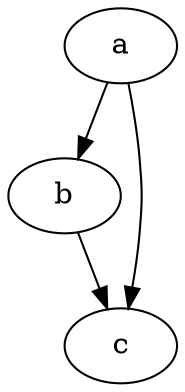

# Pierwsze kroki

@knowvah/dot-engine to wierny port [Graphviz](https://graphviz.org/) do TypeScriptu.
Parsuje język DOT, uruchamia silniki układu Graphviz i generuje SVG — w czystym
TypeScripcie — bez C: bez natywnej binarki Graphviz i bez portu WASM.

::: tip Nowość w bibliotece?
Najpierw przeczytaj [Przegląd](/pl/guide/overview) — przedstawia potok
(parsowanie/budowanie → układ → renderowanie / odczyt geometrii) i trzy punkty wejścia
(`@knowvah/dot-engine`, `@knowvah/dot-engine/api`, `@knowvah/dot-engine/render`), żeby wiedzieć,
którego użyć, zanim zainstalujesz.
:::

## Instalacja

@knowvah/dot-engine jest opublikowany w npm:

```bash
npm i @knowvah/dot-engine
```

Zero zależności uruchomieniowych. Pakiet `canvas` jest opcjonalną zależnością
peer, potrzebną tylko do pomiaru tekstu wiernego środowisku w Node — zobacz
[Pomiar tekstu](/pl/guide/text-measurement). Pakiet udostępnia trzy punkty wejścia
(`@knowvah/dot-engine`, `@knowvah/dot-engine/api`, `@knowvah/dot-engine/render`), każdy
z własnymi deklaracjami typów `.d.ts`, mapami deklaracji i mapami źródeł — „przejdź do
definicji” prowadzi do prawdziwego kodu TypeScript, który jest dołączony
do builda.

Aby zamiast tego zbudować ze źródeł:

```bash
git clone https://github.com/knowvah/dot-engine.git
cd @knowvah/dot-engine
npm install
npm run build        # → dist/index.js (ESM bundle, via esbuild) + .d.ts
```

## Renderowanie grafu

```ts
import { renderSvg } from '@knowvah/dot-engine';

const dot = `
  digraph {
    a -> b;
    b -> c;
    a -> c;
  }
`;

const svg = renderSvg(dot, 'dot');
console.log(svg); // <svg ...>...</svg>
```

`renderSvg(dotSource, engine)` parsuje źródło DOT, uruchamia wskazany
[silnik układu](/pl/guide/engines), renderuje do SVG i zwraca ciąg znaków SVG.

Oto dokładnie ten graf, wyrenderowany na tej stronie przez sam silnik (za pomocą
[`@knowvah/vitepress-plugin-dot`](https://www.npmjs.com/package/@knowvah/vitepress-plugin-dot)):



Nie znasz DOT? To mały, tekstowy język do opisywania grafów — kanoniczna
**[referencja języka DOT](https://graphviz.org/doc/info/lang.html)** jest
przewodnikiem po składni, a [Przegląd](/pl/guide/overview#what-is-dot-what-is-graphviz)
zawiera krótki wstęp w jednym akapicie.

## Następne kroki

- [Przegląd](/pl/guide/overview) — model mentalny i trzy punkty wejścia.
- [Silniki układu](/pl/guide/engines) — osiem silników i kiedy używać którego.
- [Budowanie grafu w kodzie](/pl/guide/build-a-graph) — builder `createGraph`.
- [Przepisy](/pl/guide/recipes) — rozwiązania zorientowane na zadania, gotowe do uruchomienia.
- [Odczyt obliczonej geometrii](/pl/guide/geometry) — pozycje i spline'y przez
  `getLayout`.
- [Praca z obrazami](/pl/guide/images) — wstawianie inline, wdrażanie i CSP.
- [Typy](/pl/guide/types) — publiczne kształty danych i jak się ze sobą wiążą.
- [Użycie w przeglądarce](/pl/guide/browser) — pakowanie i hak `setImageSizer`.
- [Referencja API](/pl/guide/api) — pełna powierzchnia publiczna.
- [Plac zabaw](/pl/playground) — edytuj DOT i oglądaj SVG na żywo, w przeglądarce.
