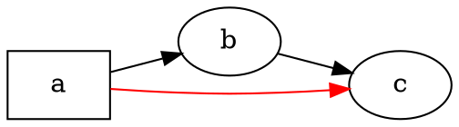

# Przegląd

@knowvah/dot-engine to port [Graphviz](https://graphviz.org/) do TypeScriptu, linia po linii:
na wejściu trafia kod źródłowy DOT (lub graf zbudowany w kodzie), a na wyjściu
otrzymujesz SVG — albo JSON, xdot, DOT lub mapę obrazu — obliczone w całości
w TypeScripcie, bez natywnej binarki Graphviz i bez WASM. Jeśli to Twój pierwszy
kontakt z renderowaniem, zacznij od
[Pierwszych kroków](/pl/guide/getting-started); ta strona jest mapą ponad nimi —
pokazuje, co robi biblioteka i po który z jej trzech punktów wejścia sięgnąć.

## Czym jest DOT? Czym jest Graphviz? {#what-is-dot-what-is-graphviz}

**DOT** to mały, tekstowy język do opisywania grafów — węzłów, krawędzi
i ich atrybutów:



To cały format wejściowy: deklarujesz węzły, łączysz je za pomocą `->` (skierowane)
lub `--` (nieskierowane) i ustawiasz atrybuty w `[...]`. Pełna gramatyka —
instrukcje, podgrafy, porty, etykiety w stylu HTML i każdy atrybut — jest zdefiniowana
w kanonicznej **[referencji języka DOT](https://graphviz.org/doc/info/lang.html)**
(wraz z pełną [listą atrybutów](https://graphviz.org/doc/info/attrs.html)).
`@knowvah/dot-engine` parsuje ten język dokładnie tak jak oryginał — więc każdy
DOT, który akceptują narzędzia w C, akceptuje także ta biblioteka.

**Graphviz** to otwartoźródłowy zestaw narzędzi do wizualizacji grafów, dla którego
stworzono DOT. Powstał w **AT&T Bell Labs** (Murray Hill, NJ) — fundamentalny raport
techniczny Eleftheriosa Koutsofiosa i Stephena Northa pochodzi z **1991** roku — a dziś
jest rozwijany na **Eclipse Public License** (tej samej licencji, na której jest
ten port). Ta biblioteka jest wierną reimplementacją Graphviz w TypeScripcie; kod w C
jest specyfikacją, do której dopasowujemy się w wąskiej tolerancji. Oryginalny
projekt znajdziesz tutaj:

- **[graphviz.org](https://graphviz.org/)** — oficjalna strona projektu, dokumentacja
  oraz referencje DOT i atrybutów.
- **[gitlab.com/graphviz/graphviz](https://gitlab.com/graphviz/graphviz)** — kanoniczne
  źródło w C, z którego portujemy.
- **[Graphviz w Wikipedii](https://en.wikipedia.org/wiki/Graphviz)** — historia i
  tło.

## Potok

Każde renderowanie, niezależnie od tego, który punkt wejścia je uruchamia, ma ten sam
kształt: weź `Graph` (parsując DOT lub budując go programowo), uruchom na nim silnik
układu, a następnie albo zserializuj wynik, albo odczytaj obliczoną geometrię z tego
samego obiektu grafu.

```graphviz
digraph pipeline {
  rankdir=LR;
  bgcolor="transparent";
  node [shape=box, style=rounded, fontname="Helvetica", fontsize=11];
  edge [fontname="Helvetica", fontsize=10];

  src  [label="DOT source"];
  api  [label="createGraph()"];
  g    [label="Graph"];
  eng  [label="layout engine\n(dot · neato · fdp · sfdp ·\ncirco · twopi · osage · patchwork)"];
  out  [label="SVG / JSON / xdot /\nDOT / imagemap"];
  snap [label="LayoutSnapshot\n(nodes, edges, bounds)"];

  src -> g [label="parse()"];
  api -> g [label=".graph"];
  g -> eng;
  eng -> out  [label="render()"];
  eng -> snap [label="getLayout()"];
}
```

Nie ma osobnego wywołania „uruchom układ”: `renderSvg` i `render` uruchamiają
układ w ramach renderowania, a obliczone współrzędne (pozycje węzłów,
spline'y krawędzi, ramka ograniczająca) są potem przechowywane w obiekcie `Graph`.
`getLayout` nie uruchamia układu ponownie — odczytuje geometrię, którą wcześniejsze
wywołanie `render` już obliczyło, więc zawsze wywołuje się go *po* `render`, na tym
samym grafie.

## Trzy punkty wejścia — które drzwi?

@knowvah/dot-engine udostępnia trzy punkty wejścia: pakiet główny re-eksportuje wszystko
z dwóch pozostałych, więc musisz sięgać dalej tylko wtedy, gdy chcesz węższej
powierzchni importu.

| Chcę…                                                 | Użyj                                    |
|--------------------------------------------------------|-----------------------------------------|
| Zamienić tekst DOT na ciąg znaków SVG, szybko           | `@knowvah/dot-engine` — `renderSvg(dot, engine)` |
| Sparsować DOT bez renderowania                          | `@knowvah/dot-engine` — `parse(dot)`             |
| Skonfigurować globalnie pomiar tekstu lub rozwiązywanie obrazów | `@knowvah/dot-engine` — `setTextMeasurer`, `setImageSizer`, `setImageResolver` |
| Zbudować graf w kodzie, bez tekstu DOT                  | `@knowvah/dot-engine/api` — `createGraph`, `addEdge` |
| Odczytać obliczone pozycje węzłów / krawędzi / klastrów  | `@knowvah/dot-engine/api` — `getLayout`          |
| Wyrenderować do formatu innego niż SVG (JSON, xdot, DOT, mapa obrazu) | `@knowvah/dot-engine/render` — `render(g, format, opts?)` |
| Obsłużyć własny backend canvas/WebGL/PDF                 | `@knowvah/dot-engine/render` — `getDrawOps`      |

`@knowvah/dot-engine/api` to drzwi *budowania i inspekcji*: konstruujesz graf
programowo i odczytujesz z niego geometrię. `@knowvah/dot-engine/render` to drzwi
*wyjścia*: zamieniasz graf (z `parse()` lub z buildera) na zserializowany format
albo ustrukturyzowany strumień operacji rysowania. Pakiet główny `@knowvah/dot-engine`
re-eksportuje oba, a do tego jednorazową funkcję `renderSvg` i globalne haki
konfiguracyjne — większość projektów importuje wyłącznie z pakietu głównego.

## Układy współrzędnych w skrócie

Natywne współrzędne Graphviz mają oś y skierowaną w górę, a początek w lewym dolnym
rogu — to konwencja, w której liczą silniki układu. Większość odbiorców ekranowych
i canvasowych oczekuje osi y skierowanej w dół i początku w lewym górnym rogu.
`getLayout` domyślnie używa `yAxis:
'down'` i odwraca oś za Ciebie; surowe formaty tekstowe (`svg`, `json`, `xdot`,
`plain`) niosą natywne współrzędne z osią y w górę bez zmian. Pełną referencję
współrzędnych znajdziesz w
[Odczyt obliczonej geometrii](/pl/guide/geometry), a wzorzec odwracania i uzgadniania —
w [Przepisach](/pl/guide/recipes), na wypadek gdybyś musiał mieszać wynik `getLayout`
ze współrzędnymi z surowego formatu.

## Granica zakresu

@knowvah/dot-engine renderuje do SVG, JSON, xdot, DOT i map obrazów HTML (`imap` /
`cmapx`) — deterministycznych formatów wyjściowych opartych na ciągach znaków lub
strukturach. Nie tworzy obrazów rastrowych (PNG, JPEG) ani PDF i nie ma graficznej
przeglądarki; to wszystko jest poza zakresem przeglądarkowo bezpiecznego portu w czystym
TypeScripcie. Znane różnice względem zachowania natywnego Graphviz — nie braki
w formatach wyjściowych, lecz miejsca, w których wynik portu się rozchodzi — są
śledzone na stronie
[Rozbieżności](/pl/divergences).

## Dokąd dalej

- [Pierwsze kroki](/pl/guide/getting-started) — zainstaluj i wyrenderuj swój pierwszy graf.
- [Silniki układu](/pl/guide/engines) — osiem silników i kiedy używać którego.
- [Budowanie grafu w kodzie](/pl/guide/build-a-graph) — builder `@knowvah/dot-engine/api`.
- [Odczyt obliczonej geometrii](/pl/guide/geometry) — `getLayout`, układy współrzędnych, jednostki.
- [Przepisy](/pl/guide/recipes) — typowe wzorce zorientowane na zadania.
- [Obrazy](/pl/guide/images) — `setImageSizer`, `setImageResolver`, wstawianie inline.
- [Referencja typów](/pl/guide/types) — pełne kształty każdego eksportowanego typu.
- [Referencja API](/reference/) — wygenerowana dokumentacja poszczególnych symboli.
- [Słowniczek](/pl/guide/glossary) — terminologia Graphviz i @knowvah/dot-engine.
