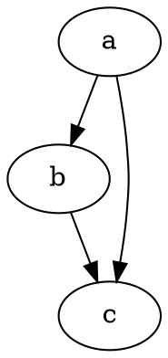

# Primeiros passos

@knowvah/dot-engine é um port fiel do [Graphviz](https://graphviz.org/) em TypeScript.
Ele interpreta a linguagem DOT, executa os mecanismos de layout do Graphviz e
emite SVG — em TypeScript puro — sem C: sem binário nativo do Graphviz e sem port
para WASM.

::: tip Novo na biblioteca?
Leia primeiro a [Visão geral](/pt-br/guide/overview) — ela mapeia o pipeline
(interpretar/construir → layout → renderizar / ler geometria) e os três pontos
de entrada (`@knowvah/dot-engine`, `@knowvah/dot-engine/api`, `@knowvah/dot-engine/render`)
para que você saiba qual porta usar antes de instalar.
:::

## Instalar

O @knowvah/dot-engine é publicado no npm:

```bash
npm i @knowvah/dot-engine
```

Zero dependências em tempo de execução. O pacote `canvas` é uma dependência peer
opcional, necessária apenas para a medição de texto fiel ao host no Node — veja
[Medição de texto](/pt-br/guide/text-measurement). O pacote traz três pontos de
entrada (`@knowvah/dot-engine`, `@knowvah/dot-engine/api`, `@knowvah/dot-engine/render`),
cada um com suas próprias declarações de tipos `.d.ts`, mapas de declaração e
mapas de código-fonte — "ir para a definição" leva ao código-fonte TypeScript
real, que é distribuído junto com a build.

Para compilar a partir do código-fonte:

```bash
git clone https://github.com/knowvah/dot-engine.git
cd dot-engine
npm install
npm run build        # → dist/index.js (ESM bundle, via esbuild) + .d.ts
```

## Renderizar um grafo

```ts
import { renderSvg } from '@knowvah/dot-engine';

const dot = `
  digraph {
    a -> b;
    b -> c;
    a -> c;
  }
`;

const svg = renderSvg(dot, 'dot');
console.log(svg); // <svg ...>...</svg>
```

`renderSvg(dotSource, engine)` interpreta o código-fonte DOT, executa o
[mecanismo de layout](/pt-br/guide/engines) indicado, renderiza em SVG e retorna
a string SVG.

Aqui está exatamente esse grafo, renderizado nesta página pelo próprio mecanismo
(via [`@knowvah/vitepress-plugin-dot`](https://www.npmjs.com/package/@knowvah/vitepress-plugin-dot)):



Novo no DOT? É uma linguagem pequena, em texto simples, para descrever grafos — a
**[referência da linguagem DOT](https://graphviz.org/doc/info/lang.html)** canônica
é o guia de sintaxe, e a [Visão geral](/pt-br/guide/overview#what-is-dot-what-is-graphviz)
traz uma introdução de um parágrafo.

## Próximos passos

- [Visão geral](/pt-br/guide/overview) — o modelo mental e os três pontos de entrada.
- [Mecanismos de layout](/pt-br/guide/engines) — os oito mecanismos e quando usar cada um.
- [Construir um grafo em código](/pt-br/guide/build-a-graph) — o construtor `createGraph`.
- [Receitas](/pt-br/guide/recipes) — soluções executáveis orientadas a tarefas.
- [Ler a geometria calculada](/pt-br/guide/geometry) — posições e splines via
  `getLayout`.
- [Trabalhar com imagens](/pt-br/guide/images) — incorporação, implantação e CSP.
- [Tipos](/pt-br/guide/types) — as formas de dados públicas e como se relacionam.
- [Uso no navegador](/pt-br/guide/browser) — empacotamento e o gancho `setImageSizer`.
- [Referência da API](/pt-br/guide/api) — toda a superfície pública.
- [Área de testes](/pt-br/playground) — edite DOT e veja o SVG ao vivo, no seu navegador.
