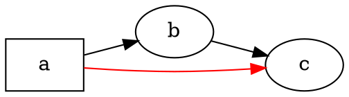

# Visão geral

@knowvah/dot-engine é um port em TypeScript, linha a linha, do [Graphviz](https://graphviz.org/):
entra código-fonte DOT (ou um grafo construído em código) e sai SVG — ou JSON,
xdot, DOT ou um mapa de imagem —, tudo calculado inteiramente em TypeScript,
sem binário nativo do Graphviz e sem WASM. Se você ainda não renderizou nada,
comece em [Primeiros passos](/pt-br/guide/getting-started); esta página é o mapa
que fica acima dele — o que a biblioteca está fazendo e qual dos seus três
pontos de entrada escolher.

## O que é DOT? O que é Graphviz? {#what-is-dot-what-is-graphviz}

**DOT** é uma linguagem pequena, em texto simples, para descrever grafos — nós,
arestas e seus atributos:



Esse é todo o formato de entrada: declare nós, conecte-os com `->` (dirigido)
ou `--` (não dirigido) e defina atributos em `[...]`. A gramática completa —
instruções, subgrafos, portas, rótulos no estilo HTML e todos os atributos — é
definida na **[referência da linguagem DOT](https://graphviz.org/doc/info/lang.html)**
canônica (com a [lista de atributos](https://graphviz.org/doc/info/attrs.html) completa
ao lado). O `@knowvah/dot-engine` interpreta essa linguagem exatamente como o
projeto original — portanto, qualquer DOT que as ferramentas em C aceitam é DOT
que esta biblioteca aceita.

O **Graphviz** é o kit de ferramentas de visualização de grafos de código aberto
para o qual o DOT foi criado. Ele nasceu nos **AT&T Bell Labs** (Murray Hill, NJ)
— um relatório técnico fundamental de Eleftherios Koutsofios e Stephen North data
de **1991** — e hoje é mantido sob a **Eclipse Public License** (a mesma licença
que este port adota). Esta biblioteca é uma reimplementação fiel dele em
TypeScript; o código C é a especificação com a qual nos alinhamos dentro de uma
tolerância estreita. Para o projeto original:

- **[graphviz.org](https://graphviz.org/)** — o site oficial do projeto, com a
  documentação e as referências de DOT e de atributos.
- **[gitlab.com/graphviz/graphviz](https://gitlab.com/graphviz/graphviz)** — o
  código-fonte C canônico a partir do qual fazemos o port.
- **[Graphviz na Wikipédia](https://en.wikipedia.org/wiki/Graphviz)** — histórico
  e contexto.

## O pipeline

Toda renderização, qualquer que seja o ponto de entrada que a inicia, segue o
mesmo formato: obter um `Graph` (interpretando DOT ou construindo um
programaticamente), executar um mecanismo de layout sobre ele e, então, ou
serializar o resultado ou ler a geometria calculada de volta do mesmo objeto de
grafo.

```graphviz
digraph pipeline {
  rankdir=LR;
  bgcolor="transparent";
  node [shape=box, style=rounded, fontname="Helvetica", fontsize=11];
  edge [fontname="Helvetica", fontsize=10];

  src  [label="DOT source"];
  api  [label="createGraph()"];
  g    [label="Graph"];
  eng  [label="layout engine\n(dot · neato · fdp · sfdp ·\ncirco · twopi · osage · patchwork)"];
  out  [label="SVG / JSON / xdot /\nDOT / imagemap"];
  snap [label="LayoutSnapshot\n(nodes, edges, bounds)"];

  src -> g [label="parse()"];
  api -> g [label=".graph"];
  g -> eng;
  eng -> out  [label="render()"];
  eng -> snap [label="getLayout()"];
}
```

Não existe uma chamada separada para "executar o layout": `renderSvg` e `render`
disparam o layout como parte da renderização, e as coordenadas calculadas
(posições dos nós, splines das arestas, caixa delimitadora) ficam retidas no
objeto `Graph` depois disso. `getLayout` não executa o layout de novo — ele lê a
geometria que uma chamada anterior a `render` já calculou, por isso é sempre
chamado *depois* de `render`, no mesmo grafo.

## Os três pontos de entrada — qual porta?

@knowvah/dot-engine oferece três pontos de entrada: o pacote raiz reexporta tudo
dos outros dois, então você só precisa ir além dele quando quiser uma superfície
de importação mais enxuta.

| Quero…                                                | Use                                    |
|--------------------------------------------------------|-----------------------------------------|
| Transformar texto DOT em uma string SVG, rapidamente    | `@knowvah/dot-engine` — `renderSvg(dot, engine)` |
| Interpretar DOT sem renderizá-lo                        | `@knowvah/dot-engine` — `parse(dot)`             |
| Configurar globalmente a medição de texto ou a resolução de imagens | `@knowvah/dot-engine` — `setTextMeasurer`, `setImageSizer`, `setImageResolver` |
| Construir um grafo em código, sem texto DOT             | `@knowvah/dot-engine/api` — `createGraph`, `addEdge` |
| Ler de volta as posições calculadas de nós/arestas/clusters | `@knowvah/dot-engine/api` — `getLayout`          |
| Renderizar para um formato diferente de SVG (JSON, xdot, DOT, mapa de imagem) | `@knowvah/dot-engine/render` — `render(g, format, opts?)` |
| Controlar um backend próprio de canvas/WebGL/PDF         | `@knowvah/dot-engine/render` — `getDrawOps`      |

`@knowvah/dot-engine/api` é a porta de *construção + inspeção*: construa um grafo
programaticamente e leia a geometria a partir dele. `@knowvah/dot-engine/render`
é a porta de *saída*: transforme um grafo (vindo de `parse()` ou do construtor)
em um formato serializado ou em um fluxo estruturado de operações de desenho. O
pacote raiz `@knowvah/dot-engine` reexporta ambos, além da função de conveniência
de uma só chamada `renderSvg` e dos ganchos de configuração global — a maioria
dos projetos só importa do pacote raiz.

## Sistemas de coordenadas, em resumo

As coordenadas nativas do Graphviz têm y para cima e origem no canto inferior
esquerdo — a convenção em que os mecanismos de layout calculam. A maioria dos
consumidores de tela e canvas quer y para baixo, com origem no canto superior
esquerdo. `getLayout` usa `yAxis: 'down'` por padrão e inverte para você; os
formatos de texto brutos (`svg`, `json`, `xdot`, `plain`) carregam as
coordenadas nativas com y para cima, sem alteração. Veja
[Ler a geometria calculada](/pt-br/guide/geometry) para a referência completa de
coordenadas e [Receitas](/pt-br/guide/recipes) para o padrão de inverter e
reconciliar quando você precisar misturar a saída de `getLayout` com as
coordenadas de um formato bruto.

## Limite do escopo

O @knowvah/dot-engine renderiza para SVG, JSON, xdot, DOT e mapas de imagem HTML
(`imap` / `cmapx`) — os formatos de saída determinísticos, baseados em string ou
em estrutura. Ele não produz imagens raster (PNG, JPEG) nem PDF e não tem
visualizador gráfico; isso está fora do escopo de um port em TypeScript puro e
seguro para o navegador. As diferenças conhecidas em relação ao comportamento do
Graphviz nativo — não lacunas de formato de saída, mas pontos em que a saída do
port diverge — são acompanhadas na página [Divergências](/pt-br/divergences).

## Para onde ir em seguida

- [Primeiros passos](/pt-br/guide/getting-started) — instale e renderize seu primeiro grafo.
- [Mecanismos de layout](/pt-br/guide/engines) — os oito mecanismos e quando usar cada um.
- [Construir um grafo em código](/pt-br/guide/build-a-graph) — o construtor de `@knowvah/dot-engine/api`.
- [Ler a geometria calculada](/pt-br/guide/geometry) — `getLayout`, sistemas de coordenadas, unidades.
- [Receitas](/pt-br/guide/recipes) — padrões comuns orientados a tarefas.
- [Imagens](/pt-br/guide/images) — `setImageSizer`, `setImageResolver`, incorporação.
- [Referência de tipos](/pt-br/guide/types) — as formas completas de cada tipo exportado.
- [Referência da API](/reference/) — documentação gerada por símbolo.
- [Glossário](/pt-br/guide/glossary) — terminologia do Graphviz e do @knowvah/dot-engine.
