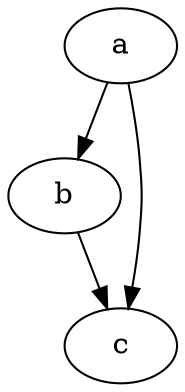

# Primii pași

@knowvah/dot-engine este un port TypeScript fidel al [Graphviz](https://graphviz.org/).
Analizează limbajul DOT, rulează motoarele de aranjare ale Graphviz și emite SVG — în
TypeScript pur — fără C: fără binar Graphviz nativ și fără port WASM.

::: tip Sunteți nou în bibliotecă?
Citiți mai întâi [Prezentarea generală](/ro/guide/overview) — ea descrie conducta
(analizare/construire → aranjare → randare / citirea geometriei) și cele trei puncte de intrare
(`@knowvah/dot-engine`, `@knowvah/dot-engine/api`, `@knowvah/dot-engine/render`), astfel încât să știți ce
ușă să folosiți înainte de instalare.
:::

## Instalare

@knowvah/dot-engine este publicat pe npm:

```bash
npm i @knowvah/dot-engine
```

Zero dependențe la rulare. Pachetul `canvas` este o dependență peer opțională,
necesară doar pentru măsurarea textului fidelă gazdei în Node — vedeți
[Măsurarea textului](/ro/guide/text-measurement). Pachetul oferă trei puncte
de intrare (`@knowvah/dot-engine`, `@knowvah/dot-engine/api`, `@knowvah/dot-engine/render`), fiecare cu
propriile declarații de tip `.d.ts`, hărți de declarații și hărți sursă — „salt la
definiție” duce în codul sursă TypeScript real, care este livrat alături de
build.

Pentru a-l compila din sursă:

```bash
git clone https://github.com/knowvah/dot-engine.git
cd @knowvah/dot-engine
npm install
npm run build        # → dist/index.js (ESM bundle, via esbuild) + .d.ts
```

## Randarea unui graf

```ts
import { renderSvg } from '@knowvah/dot-engine';

const dot = `
  digraph {
    a -> b;
    b -> c;
    a -> c;
  }
`;

const svg = renderSvg(dot, 'dot');
console.log(svg); // <svg ...>...</svg>
```

`renderSvg(dotSource, engine)` analizează sursa DOT, rulează
[motorul de aranjare](/ro/guide/engines) indicat, randează în SVG și returnează șirul SVG.

Iată exact acel graf, randat pe această pagină chiar de motor (prin
[`@knowvah/vitepress-plugin-dot`](https://www.npmjs.com/package/@knowvah/vitepress-plugin-dot)):



Sunteți nou în DOT? Este un limbaj simplu, în text, pentru descrierea grafurilor — 
**[referința limbajului DOT](https://graphviz.org/doc/info/lang.html)** canonică este
ghidul de sintaxă, iar [Prezentarea generală](/ro/guide/overview#what-is-dot-what-is-graphviz)
conține un scurt paragraf introductiv.

## Pașii următori

- [Prezentare generală](/ro/guide/overview) — modelul mental și cele trei puncte de intrare.
- [Motoare de aranjare](/ro/guide/engines) — cele opt motoare și când se folosește fiecare.
- [Construirea unui graf în cod](/ro/guide/build-a-graph) — constructorul `createGraph`.
- [Rețete](/ro/guide/recipes) — soluții orientate pe sarcini, executabile.
- [Citirea geometriei calculate](/ro/guide/geometry) — poziții și spline-uri prin
  `getLayout`.
- [Lucrul cu imagini](/ro/guide/images) — încorporare, publicare și CSP.
- [Tipuri](/ro/guide/types) — structurile de date publice și relațiile dintre ele.
- [Utilizare în browser](/ro/guide/browser) — includerea în pachet și hook-ul `setImageSizer`.
- [Referință API](/ro/guide/api) — întreaga suprafață publică.
- [Zonă de testare](/ro/playground) — editați DOT și vedeți SVG live, în browser.
