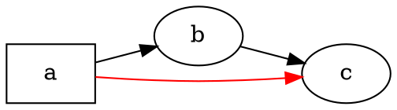

# Prezentare generală

@knowvah/dot-engine este un port TypeScript linie cu linie al [Graphviz](https://graphviz.org/):
sursa DOT (sau un graf construit în cod) intră, iar SVG — sau JSON, xdot, DOT ori o
hartă de imagine — iese, calculat integral în TypeScript, fără binar
Graphviz nativ și fără WASM. Dacă nu ați randat încă nimic, începeți cu
[Primii pași](/ro/guide/getting-started); această pagină este harta de deasupra
acesteia — ce face biblioteca și pe care dintre cele trei puncte de intrare să îl alegeți.

## Ce este DOT? Ce este Graphviz? {#what-is-dot-what-is-graphviz}

**DOT** este un limbaj mic, în text simplu, pentru descrierea grafurilor — noduri, muchii
și atributele lor:



Acesta este întregul format de intrare: declarați noduri, conectați-le cu `->` (orientat)
sau `--` (neorientat) și setați atribute în `[...]`. Gramatica completă —
instrucțiuni, subgrafuri, porturi, etichete de tip HTML și fiecare atribut — este definită
în **[referința limbajului DOT](https://graphviz.org/doc/info/lang.html)** canonică
(împreună cu [lista de atribute](https://graphviz.org/doc/info/attrs.html) completă).
`@knowvah/dot-engine` analizează acel limbaj exact ca originalul — deci orice
DOT acceptat de uneltele în C este DOT acceptat de această bibliotecă.

**Graphviz** este setul de unelte open-source de vizualizare a grafurilor pentru care a fost creat
DOT. A apărut la **AT&T Bell Labs** (Murray Hill, NJ) — un raport tehnic fundamental
al lui Eleftherios Koutsofios și Stephen North datează din **1991** — și este
întreținut astăzi sub **Eclipse Public License** (aceeași licență pe care o poartă acest
port). Această bibliotecă este o reimplementare fidelă a lui în TypeScript; codul
C este specificația pe care o urmăm într-o toleranță strânsă. Pentru proiectul
original:

- **[graphviz.org](https://graphviz.org/)** — site-ul oficial al proiectului, documentația și
  referințele DOT / atribute.
- **[gitlab.com/graphviz/graphviz](https://gitlab.com/graphviz/graphviz)** — sursa
  canonică în C din care realizăm portul.
- **[Graphviz pe Wikipedia](https://en.wikipedia.org/wiki/Graphviz)** — istoric și
  context.

## Conducta

Fiecare randare, indiferent de punctul de intrare care o declanșează, urmează aceeași
formă: obțineți un `Graph` (analizând DOT sau construind unul programatic), rulați
un motor de aranjare peste el, apoi fie serializați rezultatul, fie citiți geometria calculată
direct de pe același obiect graf.

```graphviz
digraph pipeline {
  rankdir=LR;
  bgcolor="transparent";
  node [shape=box, style=rounded, fontname="Helvetica", fontsize=11];
  edge [fontname="Helvetica", fontsize=10];

  src  [label="DOT source"];
  api  [label="createGraph()"];
  g    [label="Graph"];
  eng  [label="layout engine\n(dot · neato · fdp · sfdp ·\ncirco · twopi · osage · patchwork)"];
  out  [label="SVG / JSON / xdot /\nDOT / imagemap"];
  snap [label="LayoutSnapshot\n(nodes, edges, bounds)"];

  src -> g [label="parse()"];
  api -> g [label=".graph"];
  g -> eng;
  eng -> out  [label="render()"];
  eng -> snap [label="getLayout()"];
}
```

Nu există un apel separat „rulează aranjarea”: `renderSvg` și `render` declanșează
aranjarea ca parte a randării, iar coordonatele calculate (pozițiile nodurilor,
spline-urile muchiilor, caseta de încadrare) sunt păstrate ulterior pe obiectul `Graph`.
`getLayout` nu rulează din nou aranjarea — citește geometria pe care un apel
anterior la `render` a calculat-o deja, deci se apelează întotdeauna *după* `render`, pe același
graf.

## Cele trei puncte de intrare — ce ușă?

@knowvah/dot-engine oferă trei puncte de intrare: pachetul rădăcină reexportă tot
din celelalte două, deci trebuie să mergeți dincolo de el doar atunci când doriți o
suprafață de import mai îngustă.

| Vreau să…                                            | Folosiți                                    |
|--------------------------------------------------------|-----------------------------------------|
| Transform text DOT într-un șir SVG, rapid                  | `@knowvah/dot-engine` — `renderSvg(dot, engine)` |
| Analizez DOT fără a-l randa                          | `@knowvah/dot-engine` — `parse(dot)`             |
| Configurez global măsurarea textului sau rezolvarea imaginilor | `@knowvah/dot-engine` — `setTextMeasurer`, `setImageSizer`, `setImageResolver` |
| Construiesc un graf în cod, fără text DOT                      | `@knowvah/dot-engine/api` — `createGraph`, `addEdge` |
| Citesc înapoi pozițiile calculate ale nodurilor/muchiilor/clusterelor           | `@knowvah/dot-engine/api` — `getLayout`          |
| Randez într-un alt format decât SVG (JSON, xdot, DOT, hartă de imagine) | `@knowvah/dot-engine/render` — `render(g, format, opts?)` |
| Controlez un backend propriu canvas/WebGL/PDF                  | `@knowvah/dot-engine/render` — `getDrawOps`      |

`@knowvah/dot-engine/api` este ușa *construire + inspectare*: construiți un graf
programatic și citiți geometria de pe el. `@knowvah/dot-engine/render` este ușa
*ieșirii*: transformați un graf (provenit din `parse()` sau din constructor) într-un
format serializat sau într-un flux structurat de operații de desenare. Pachetul rădăcină
`@knowvah/dot-engine` le reexportă pe ambele, plus funcția de conveniență `renderSvg`
dintr-un singur pas și hook-urile de configurare globală — majoritatea proiectelor
importă doar din rădăcină.

## Sisteme de coordonate, pe scurt

Coordonatele native ale graphviz au y în sus, originea în colțul din stânga jos — convenția
în care lucrează motoarele de aranjare. Majoritatea consumatorilor de ecran și canvas
doresc y în jos, originea în colțul din stânga sus. `getLayout` folosește implicit `yAxis:
'down'` și inversează pentru dumneavoastră; formatele brute de tip șir (`svg`, `json`, `xdot`,
`plain`) păstrează neschimbate coordonatele native cu y în sus. Vedeți
[Citirea geometriei calculate](/ro/guide/geometry) pentru referința completă a coordonatelor,
și [Rețete](/ro/guide/recipes) pentru tiparul de inversare și reconciliere atunci când
trebuie să combinați rezultatul `getLayout` cu coordonatele unui format brut.

## Limita domeniului

@knowvah/dot-engine randează în SVG, JSON, xdot, DOT și hărți de imagine HTML (`imap` /
`cmapx`) — formatele de ieșire deterministe, bazate pe șiruri sau pe structuri. Nu
produce imagini raster (PNG, JPEG) sau PDF și nu are vizualizator GUI;
acestea sunt în afara domeniului pentru un port TypeScript pur, sigur pentru browser. Diferențele
cunoscute față de comportamentul Graphviz nativ — nu lacune ale formatelor de ieșire, ci
locuri în care ieșirea portului diferă — sunt urmărite în pagina
[Divergențe](/ro/divergences).

## Unde mergeți mai departe

- [Primii pași](/ro/guide/getting-started) — instalați și randați primul graf.
- [Motoare de aranjare](/ro/guide/engines) — cele opt motoare și când se folosește fiecare.
- [Construirea unui graf în cod](/ro/guide/build-a-graph) — constructorul `@knowvah/dot-engine/api`.
- [Citirea geometriei calculate](/ro/guide/geometry) — `getLayout`, sisteme de coordonate, unități.
- [Rețete](/ro/guide/recipes) — tipare frecvente orientate pe sarcini.
- [Imagini](/ro/guide/images) — `setImageSizer`, `setImageResolver`, încorporare.
- [Referință de tipuri](/ro/guide/types) — structura completă a fiecărui tip exportat.
- [Referință API](/reference/) — documentație generată pentru fiecare simbol.
- [Glosar](/ro/guide/glossary) — terminologia Graphviz și @knowvah/dot-engine.
