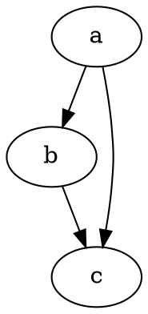

# Начало работы

@knowvah/dot-engine — это точный перенос [Graphviz](https://graphviz.org/) на TypeScript.
Он разбирает язык DOT, запускает механизмы компоновки Graphviz и выдаёт SVG — на
чистом TypeScript, без C: без нативного бинарника Graphviz и без порта на WASM.

::: tip Впервые с библиотекой?
Сначала прочитайте [Обзор](/ru/guide/overview) — он описывает конвейер
(разбор или построение → компоновка → рендеринг / чтение геометрии) и три точки входа
(`@knowvah/dot-engine`, `@knowvah/dot-engine/api`, `@knowvah/dot-engine/render`), чтобы
до установки вы знали, какой дверью пользоваться.
:::

## Установка

@knowvah/dot-engine опубликован в npm:

```bash
npm i @knowvah/dot-engine
```

Нулевые зависимости времени выполнения. Пакет `canvas` — необязательная peer-зависимость,
нужная только для измерения текста в Node с учётом шрифтов хоста — см.
[Измерение текста](/ru/guide/text-measurement). Пакет поставляется с тремя точками входа
(`@knowvah/dot-engine`, `@knowvah/dot-engine/api`, `@knowvah/dot-engine/render`), у каждой из
которых есть собственные объявления типов `.d.ts`, карты объявлений и карты исходного
кода — «перейти к определению» ведёт в настоящий исходный код на TypeScript, который
поставляется вместе со сборкой.

Чтобы вместо этого собрать из исходников:

```bash
git clone https://github.com/knowvah/dot-engine.git
cd @knowvah/dot-engine
npm install
npm run build        # → dist/index.js (ESM bundle, via esbuild) + .d.ts
```

## Отрисовка графа

```ts
import { renderSvg } from '@knowvah/dot-engine';

const dot = `
  digraph {
    a -> b;
    b -> c;
    a -> c;
  }
`;

const svg = renderSvg(dot, 'dot');
console.log(svg); // <svg ...>...</svg>
```

`renderSvg(dotSource, engine)` разбирает исходный код DOT, запускает указанный
[механизм компоновки](/ru/guide/engines), выполняет рендеринг в SVG и возвращает строку
SVG.

Вот этот же граф, отрисованный на данной странице самим механизмом (с помощью
[`@knowvah/vitepress-plugin-dot`](https://www.npmjs.com/package/@knowvah/vitepress-plugin-dot)):



Не знакомы с DOT? Это небольшой текстовый язык для описания графов — каноническое
**[справочное руководство по языку DOT](https://graphviz.org/doc/info/lang.html)**
служит руководством по синтаксису, а в [Обзоре](/ru/guide/overview#what-is-dot-what-is-graphviz)
есть краткое введение в один абзац.

## Дальнейшие шаги

- [Обзор](/ru/guide/overview) — ментальная модель и три точки входа.
- [Механизмы компоновки](/ru/guide/engines) — восемь механизмов и когда какой использовать.
- [Построение графа в коде](/ru/guide/build-a-graph) — построитель `createGraph`.
- [Рецепты](/ru/guide/recipes) — готовые к запуску решения, организованные по задачам.
- [Чтение вычисленной геометрии](/ru/guide/geometry) — позиции и сплайны через
  `getLayout`.
- [Работа с изображениями](/ru/guide/images) — встраивание, развёртывание и CSP.
- [Типы](/ru/guide/types) — публичные формы данных и как они связаны.
- [Использование в браузере](/ru/guide/browser) — сборка в бандл и хук `setImageSizer`.
- [Справочник API](/ru/guide/api) — вся публичная поверхность.
- [Песочница](/ru/playground) — редактируйте DOT и смотрите SVG на лету, прямо в браузере.
