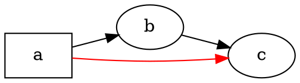

# Обзор

@knowvah/dot-engine — это построчный перенос [Graphviz](https://graphviz.org/) на TypeScript:
на вход подаётся исходный код DOT (или граф, построенный в коде), на выходе получается
SVG — либо JSON, xdot, DOT или карта изображения (image map), — причём всё вычисляется
целиком на TypeScript, без нативного бинарника Graphviz и без WASM. Если вы ещё ничего
не отрисовывали, начните с раздела [Начало работы](/ru/guide/getting-started); эта страница —
карта, которая лежит над ним: что именно делает библиотека и какой из трёх её
входов выбрать.

## Что такое DOT? Что такое Graphviz? {#what-is-dot-what-is-graphviz}

**DOT** — это небольшой текстовый язык для описания графов: узлов, рёбер и их атрибутов:



Это и есть весь входной формат: объявите узлы, соедините их с помощью `->`
(ориентированное ребро) или `--` (неориентированное) и задайте атрибуты в `[...]`.
Полная грамматика — операторы, подграфы, порты, HTML-подобные метки и все атрибуты —
описана в каноническом **[справочнике по языку DOT](https://graphviz.org/doc/info/lang.html)**
(рядом с ним лежит полный [список атрибутов](https://graphviz.org/doc/info/attrs.html)).
`@knowvah/dot-engine` разбирает этот язык точно так же, как оригинал, — поэтому любой
DOT, который принимают инструменты на C, принимает и эта библиотека.

**Graphviz** — это набор инструментов с открытым исходным кодом для визуализации
графов, для которого и был создан DOT. Он появился в **AT&T Bell Labs** (Мюррей-Хилл,
Нью-Джерси) — основополагающий технический отчёт Элефтериоса Куцофиоса и Стивена
Норта датируется **1991** годом, — а сегодня поддерживается под **Eclipse Public
License** (той же лицензией, под которой выпущен этот порт). Эта библиотека — точная
реализация Graphviz на TypeScript; код на C служит спецификацией, с которой мы
сверяемся с жёстким допуском. Об оригинальном проекте:

- **[graphviz.org](https://graphviz.org/)** — официальный сайт проекта, документация
  и справочники по DOT и атрибутам.
- **[gitlab.com/graphviz/graphviz](https://gitlab.com/graphviz/graphviz)** —
  канонический исходный код на C, с которого выполнен перенос.
- **[Graphviz в Википедии](https://en.wikipedia.org/wiki/Graphviz)** — история и
  общие сведения.

## Конвейер

Каждый рендеринг, каким бы входом он ни запускался, устроен одинаково: получить
`Graph` (разобрав DOT или построив граф программно), запустить над ним механизм
компоновки, а затем либо сериализовать результат, либо прочитать вычисленную
геометрию с того же объекта графа.

```graphviz
digraph pipeline {
  rankdir=LR;
  bgcolor="transparent";
  node [shape=box, style=rounded, fontname="Helvetica", fontsize=11];
  edge [fontname="Helvetica", fontsize=10];

  src  [label="DOT source"];
  api  [label="createGraph()"];
  g    [label="Graph"];
  eng  [label="layout engine\n(dot · neato · fdp · sfdp ·\ncirco · twopi · osage · patchwork)"];
  out  [label="SVG / JSON / xdot /\nDOT / imagemap"];
  snap [label="LayoutSnapshot\n(nodes, edges, bounds)"];

  src -> g [label="parse()"];
  api -> g [label=".graph"];
  g -> eng;
  eng -> out  [label="render()"];
  eng -> snap [label="getLayout()"];
}
```

Отдельного вызова «запустить компоновку» нет: `renderSvg` и `render` запускают
компоновку как часть рендеринга, а вычисленные координаты (позиции узлов, сплайны
рёбер, ограничивающий прямоугольник) после этого сохраняются в объекте `Graph`.
`getLayout` не запускает компоновку заново — он читает геометрию, которую уже
вычислил предшествующий вызов `render`, поэтому его всегда вызывают *после*
`render`, для того же графа.

## Три точки входа — какую дверь выбрать?

@knowvah/dot-engine поставляется с тремя точками входа: корневой пакет реэкспортирует
всё из двух остальных, так что выходить за его пределы нужно, только если вам нужна
более узкая поверхность импорта.

| Я хочу…                                               | Использовать                           |
|--------------------------------------------------------|-----------------------------------------|
| Быстро превратить текст DOT в строку SVG                | `@knowvah/dot-engine` — `renderSvg(dot, engine)` |
| Разобрать DOT, не отрисовывая его                       | `@knowvah/dot-engine` — `parse(dot)`             |
| Глобально настроить измерение текста или разрешение изображений | `@knowvah/dot-engine` — `setTextMeasurer`, `setImageSizer`, `setImageResolver` |
| Построить граф в коде, без текста DOT                   | `@knowvah/dot-engine/api` — `createGraph`, `addEdge` |
| Прочитать вычисленные позиции узлов, рёбер и кластеров  | `@knowvah/dot-engine/api` — `getLayout`          |
| Выполнить рендеринг в формат, отличный от SVG (JSON, xdot, DOT, image map) | `@knowvah/dot-engine/render` — `render(g, format, opts?)` |
| Управлять собственным бэкендом для canvas, WebGL или PDF | `@knowvah/dot-engine/render` — `getDrawOps`      |

`@knowvah/dot-engine/api` — дверь «построить и изучить»: создайте граф программно и
прочитайте с него геометрию. `@knowvah/dot-engine/render` — дверь «вывод»: превратите
граф (полученный из `parse()` или из построителя) в сериализованный формат или в
структурированный поток операций рисования. Корневой пакет `@knowvah/dot-engine`
реэкспортирует обе, а также одноразовую вспомогательную функцию `renderSvg` и
глобальные хуки конфигурации — большинство проектов импортируют только из корня.

## Системы координат, коротко

Нативные координаты Graphviz направлены вверх по оси y, начало — в нижнем левом углу:
в этом соглашении вычисляют компоновку механизмы. Большинству потребителей на экране и
в canvas нужна ось y вниз и начало в верхнем левом углу. `getLayout` по умолчанию
использует `yAxis: 'down'` и переворачивает координаты за вас; «сырые» строковые
форматы (`svg`, `json`, `xdot`, `plain`) несут нативные координаты с осью y вверх без
изменений. Полную справку по координатам см. в разделе
[Чтение вычисленной геометрии](/ru/guide/geometry), а о шаблоне «перевернуть и
согласовать», когда нужно смешивать вывод `getLayout` с координатами «сырого» формата,
— в разделе [Рецепты](/ru/guide/recipes).

## Границы применимости

@knowvah/dot-engine выполняет рендеринг в SVG, JSON, xdot, DOT и HTML-карты изображений
(`imap` / `cmapx`) — детерминированные форматы вывода на основе строк или структур.
Растровые изображения (PNG, JPEG) и PDF он не создаёт, графического просмотрщика у него
нет; для браузерного порта на чистом TypeScript это за рамками задачи. Известные
отличия от поведения нативного Graphviz — не пробелы в форматах вывода, а места, где
вывод порта расходится с оригиналом, — отслеживаются на странице
[Расхождения](/ru/divergences).

## Куда двигаться дальше

- [Начало работы](/ru/guide/getting-started) — установите библиотеку и отрисуйте первый граф.
- [Механизмы компоновки](/ru/guide/engines) — восемь механизмов и когда какой использовать.
- [Построение графа в коде](/ru/guide/build-a-graph) — построитель `@knowvah/dot-engine/api`.
- [Чтение вычисленной геометрии](/ru/guide/geometry) — `getLayout`, системы координат, единицы.
- [Рецепты](/ru/guide/recipes) — распространённые шаблоны, организованные по задачам.
- [Изображения](/ru/guide/images) — `setImageSizer`, `setImageResolver`, встраивание.
- [Справочник по типам](/ru/guide/types) — полные формы всех экспортируемых типов.
- [Справочник API](/reference/) — сгенерированная документация по каждому символу.
- [Глоссарий](/ru/guide/glossary) — терминология Graphviz и @knowvah/dot-engine.
