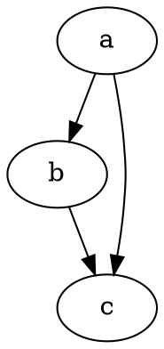

# Začíname

@knowvah/dot-engine je verný port [Graphviz](https://graphviz.org/) do TypeScriptu.
Parsuje jazyk DOT, spúšťa moduly rozloženia Graphviz a vytvára SVG — v
čistom TypeScripte, bez C: žiadna natívna binárka Graphviz a žiadny port do WASM.

::: tip Ste v knižnici noví?
Najprv si prečítajte [Prehľad](/sk/guide/overview) — zobrazuje pipeline
(parsovanie/zostavenie → rozloženie → vykreslenie / čítanie geometrie) a tri vstupné body
(`@knowvah/dot-engine`, `@knowvah/dot-engine/api`, `@knowvah/dot-engine/render`), aby ste
pred inštaláciou vedeli, ktoré dvere použiť.
:::

## Inštalácia

@knowvah/dot-engine je publikovaný na npm:

```bash
npm i @knowvah/dot-engine
```

Žiadne runtime závislosti. Balík `canvas` je voliteľná peer závislosť, potrebná
iba pre meranie textu verné hostiteľovi v Node — pozrite si
[Meranie textu](/sk/guide/text-measurement). Balík dodáva tri vstupné body
(`@knowvah/dot-engine`, `@knowvah/dot-engine/api`, `@knowvah/dot-engine/render`), každý s
vlastnými typovými deklaráciami `.d.ts`, mapami deklarácií a mapami zdrojového kódu — „prejsť na
definíciu“ vás zavedie do skutočného zdrojového kódu v TypeScripte, ktorý sa dodáva spolu
s buildom.

Ak chcete namiesto toho zostaviť zo zdrojových kódov:

```bash
git clone https://github.com/knowvah/dot-engine.git
cd @knowvah/dot-engine
npm install
npm run build        # → dist/index.js (ESM bundle, via esbuild) + .d.ts
```

## Vykreslenie grafu

```ts
import { renderSvg } from '@knowvah/dot-engine';

const dot = `
  digraph {
    a -> b;
    b -> c;
    a -> c;
  }
`;

const svg = renderSvg(dot, 'dot');
console.log(svg); // <svg ...>...</svg>
```

`renderSvg(dotSource, engine)` naparsuje zdrojový kód DOT, spustí pomenovaný
[modul rozloženia](/sk/guide/engines), vykreslí do SVG a vráti reťazec SVG.

Tu je presne ten istý graf, vykreslený na tejto stránke samotným modulom (cez
[`@knowvah/vitepress-plugin-dot`](https://www.npmjs.com/package/@knowvah/vitepress-plugin-dot)):



Ste v DOT noví? Je to malý textový jazyk na opis grafov — kanonická
**[referenčná príručka jazyka DOT](https://graphviz.org/doc/info/lang.html)** je
sprievodca syntaxou a [Prehľad](/sk/guide/overview#what-is-dot-what-is-graphviz)
obsahuje úvod v jednom odseku.

## Ďalšie kroky

- [Prehľad](/sk/guide/overview) — mentálny model a tri vstupné body.
- [Moduly rozloženia](/sk/guide/engines) — osem modulov a kedy ktorý použiť.
- [Zostavenie grafu v kóde](/sk/guide/build-a-graph) — builder `createGraph`.
- [Recepty](/sk/guide/recipes) — spustiteľné riešenia orientované na úlohy.
- [Čítanie vypočítanej geometrie](/sk/guide/geometry) — polohy a splajny cez
  `getLayout`.
- [Práca s obrázkami](/sk/guide/images) — vkladanie, nasadenie a CSP.
- [Typy](/sk/guide/types) — verejné dátové tvary a ako spolu súvisia.
- [Použitie v prehliadači](/sk/guide/browser) — zbaľovanie a háčik `setImageSizer`.
- [Referencia API](/sk/guide/api) — celý verejný povrch.
- [Ihrisko](/sk/playground) — upravujte DOT a pozerajte SVG naživo, vo svojom prehliadači.
