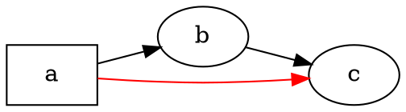

# Prehľad

@knowvah/dot-engine je riadok po riadku portovaný TypeScriptový port [Graphviz](https://graphviz.org/):
na vstupe je zdrojový kód DOT (alebo graf zostavený v kóde), na výstupe SVG — alebo JSON, xdot, DOT či
mapa obrázka — a všetko sa počíta výlučne v TypeScripte, bez natívnej binárky
Graphviz a bez WASM. Ak ste ešte nič nevykreslili, začnite na stránke
[Začíname](/sk/guide/getting-started); táto stránka je mapa, ktorá sa nad ňou nachádza —
čo knižnica robí a ktorý z jej troch vstupných bodov zvoliť.

## Čo je DOT? Čo je Graphviz? {#what-is-dot-what-is-graphviz}

**DOT** je malý textový jazyk na opis grafov — uzlov, hrán
a ich atribútov:



To je celý vstupný formát: deklarujete uzly, spojíte ich pomocou `->` (orientované)
alebo `--` (neorientované) a atribúty nastavíte v `[...]`. Úplná gramatika —
príkazy, podgrafy, porty, HTML-like popisky a každý atribút — je definovaná
v kanonickej **[referenčnej príručke jazyka DOT](https://graphviz.org/doc/info/lang.html)**
(spolu s úplným [zoznamom atribútov](https://graphviz.org/doc/info/attrs.html)).
`@knowvah/dot-engine` parsuje tento jazyk presne ako upstream — takže každý
DOT, ktorý akceptujú nástroje v C, akceptuje aj táto knižnica.

**Graphviz** je open-source nástroj na vizualizáciu grafov, pre ktorý DOT vznikol.
Začal v **AT&T Bell Labs** (Murray Hill, NJ) — základná technická
správa Eleftheriosa Koutsofiosa a Stephena Northa pochádza z roku **1991** — a dnes
je udržiavaný pod licenciou **Eclipse Public License** (rovnakou, akú má tento
port). Táto knižnica je verná reimplementácia v TypeScripte; kód v C
je špecifikácia, s ktorou sa zhodujeme v úzkej tolerancii. K pôvodnému
projektu:

- **[graphviz.org](https://graphviz.org/)** — oficiálna stránka projektu, dokumentácia
  a referencie k DOT a atribútom.
- **[gitlab.com/graphviz/graphviz](https://gitlab.com/graphviz/graphviz)** —
  kanonický zdrojový kód v C, z ktorého portujeme.
- **[Graphviz na Wikipédii](https://en.wikipedia.org/wiki/Graphviz)** — história a
  súvislosti.

## Pipeline {#the-pipeline}

Každé vykreslenie, bez ohľadu na to, ktorý vstupný bod ho spustí, má rovnaký
tvar: získate `Graph` (parsovaním DOT alebo jeho programovým zostavením), nad ním
spustíte modul rozloženia a potom výsledok buď serializujete, alebo si vypočítanú
geometriu prečítate späť z toho istého objektu grafu.

```graphviz
digraph pipeline {
  rankdir=LR;
  bgcolor="transparent";
  node [shape=box, style=rounded, fontname="Helvetica", fontsize=11];
  edge [fontname="Helvetica", fontsize=10];

  src  [label="DOT source"];
  api  [label="createGraph()"];
  g    [label="Graph"];
  eng  [label="layout engine\n(dot · neato · fdp · sfdp ·\ncirco · twopi · osage · patchwork)"];
  out  [label="SVG / JSON / xdot /\nDOT / imagemap"];
  snap [label="LayoutSnapshot\n(nodes, edges, bounds)"];

  src -> g [label="parse()"];
  api -> g [label=".graph"];
  g -> eng;
  eng -> out  [label="render()"];
  eng -> snap [label="getLayout()"];
}
```

Neexistuje samostatné volanie „spusti rozloženie“: `renderSvg` a `render` spúšťajú
rozloženie ako súčasť vykresľovania a vypočítané súradnice (polohy uzlov,
splajny hrán, ohraničujúci rámec) zostávajú potom uložené v objekte `Graph`.
`getLayout` rozloženie znova nespúšťa — číta geometriu, ktorú už vypočítalo
predchádzajúce volanie `render`, takže sa vždy volá *po* `render`, na tom istom
grafe.

## Tri vstupné body — ktoré dvere? {#the-three-entry-points-which-door}

@knowvah/dot-engine dodáva tri vstupné body: koreňový balík re-exportuje všetko
z ďalších dvoch, takže za jeho hranicu musíte siahnuť, iba ak chcete užšie
importné rozhranie.

| Chcem…                                                | Použiť                                 |
|--------------------------------------------------------|-----------------------------------------|
| Rýchlo premeniť text DOT na reťazec SVG                | `@knowvah/dot-engine` — `renderSvg(dot, engine)` |
| Naparsovať DOT bez vykreslenia                         | `@knowvah/dot-engine` — `parse(dot)`             |
| Globálne nastaviť meranie textu alebo riešenie obrázkov | `@knowvah/dot-engine` — `setTextMeasurer`, `setImageSizer`, `setImageResolver` |
| Zostaviť graf v kóde, bez textu DOT                    | `@knowvah/dot-engine/api` — `createGraph`, `addEdge` |
| Prečítať späť vypočítané polohy uzlov/hrán/klastrov     | `@knowvah/dot-engine/api` — `getLayout`          |
| Vykresliť do iného formátu než SVG (JSON, xdot, DOT, mapa obrázka) | `@knowvah/dot-engine/render` — `render(g, format, opts?)` |
| Ovládať vlastný backend pre canvas/WebGL/PDF            | `@knowvah/dot-engine/render` — `getDrawOps`      |

`@knowvah/dot-engine/api` sú dvere na *zostavenie a prehliadanie*: graf sa programovo
skonštruuje a geometria sa z neho číta. `@knowvah/dot-engine/render` sú dvere na
*výstup*: graf (z `parse()` alebo z buildera) sa premení na serializovaný
formát alebo štruktúrovaný prúd kresliacich operácií. Koreňový balík
`@knowvah/dot-engine` re-exportuje oboje, navyše jednorazovú pohodlnú funkciu `renderSvg`
a globálne konfiguračné háčiky — väčšina projektov importuje iba
z koreňového balíka.

## Súradnicové sústavy v skratke {#coordinate-frames-briefly}

Natívne súradnice graphviz majú os y smerom nahor a začiatok vľavo dole — je to
konvencia, v ktorej moduly rozloženia počítajú. Väčšina spotrebiteľov obrazovky a canvasu
chce os y smerom nadol a začiatok vľavo hore. `getLayout` štandardne používa `yAxis:
'down'` a prevráti ju za vás; surové reťazcové formáty (`svg`, `json`, `xdot`,
`plain`) nesú natívne súradnice s osou y nahor bez zmeny. Úplnú súradnicovú referenciu nájdete
v [Čítanie vypočítanej geometrie](/sk/guide/geometry) a vzor prevrátenia a zosúladenia, keď
potrebujete zmiešať výstup `getLayout` so súradnicami surového formátu, v
[Recepty](/sk/guide/recipes).

## Rozsah {#scope-boundary}

@knowvah/dot-engine vykresľuje do SVG, JSON, xdot, DOT a HTML máp obrázkov (`imap` /
`cmapx`) — deterministických formátov založených na reťazcoch alebo štruktúrach. Nevytvára
rastrové obrázky (PNG, JPEG) ani PDF a nemá GUI prehliadač; to je pre
prehliadačovo bezpečný port v čistom TypeScripte mimo rozsahu. Známe
rozdiely oproti správaniu natívneho Graphviz — nie medzery vo výstupných formátoch,
ale miesta, kde sa výstup portu odlišuje — sú evidované na stránke
[Odchýlky](/sk/divergences).

## Kam ďalej {#where-to-go-next}

- [Začíname](/sk/guide/getting-started) — nainštalujte a vykreslite svoj prvý graf.
- [Moduly rozloženia](/sk/guide/engines) — osem modulov a kedy ktorý použiť.
- [Zostavenie grafu v kóde](/sk/guide/build-a-graph) — builder `@knowvah/dot-engine/api`.
- [Čítanie vypočítanej geometrie](/sk/guide/geometry) — `getLayout`, súradnicové sústavy, jednotky.
- [Recepty](/sk/guide/recipes) — bežné vzory orientované na úlohy.
- [Obrázky](/sk/guide/images) — `setImageSizer`, `setImageResolver`, vkladanie.
- [Referencia typov](/sk/guide/types) — úplné tvary každého exportovaného typu.
- [Referencia API](/reference/) — vygenerovaná dokumentácia pre jednotlivé symboly.
- [Slovník pojmov](/sk/guide/glossary) — terminológia Graphviz a @knowvah/dot-engine.
