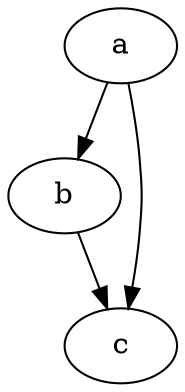

# Kom igång

@knowvah/dot-engine är en trogen TypeScript-portering av [Graphviz](https://graphviz.org/).
Det tolkar språket DOT, kör Graphviz layoutmotorer och skapar SVG — i
ren TypeScript, utan C: ingen inbyggd Graphviz-binär och ingen WASM-portering.

::: tip Ny till biblioteket?
Läs [Översikt](/sv/guide/overview) först — den kartlägger pipelinen
(tolka/bygg → layout → rendera / läs geometri) och de tre ingångspunkterna
(`@knowvah/dot-engine`, `@knowvah/dot-engine/api`, `@knowvah/dot-engine/render`) så att du vet
vilken dörr du ska använda innan du installerar.
:::

## Installera

@knowvah/dot-engine är publicerat på npm:

```bash
npm i @knowvah/dot-engine
```

Inga körtidsberoenden. Paketet `canvas` är ett valfritt peer-beroende som
bara behövs för värdtrogen textmätning i Node — se
[Textmätning](/sv/guide/text-measurement). Paketet levereras med tre ingångspunkter
(`@knowvah/dot-engine`, `@knowvah/dot-engine/api`, `@knowvah/dot-engine/render`), var och en med
egna typdeklarationer i `.d.ts`, deklarationskartor och källkartor — ”gå till
definition” hoppar in i den riktiga TypeScript-källkoden, som levereras tillsammans med
bygget.

Så här bygger du från källkod i stället:

```bash
git clone https://github.com/knowvah/dot-engine.git
cd dot-engine
npm install
npm run build        # → dist/index.js (ESM bundle, via esbuild) + .d.ts
```

## Rendera en graf

```ts
import { renderSvg } from '@knowvah/dot-engine';

const dot = `
  digraph {
    a -> b;
    b -> c;
    a -> c;
  }
`;

const svg = renderSvg(dot, 'dot');
console.log(svg); // <svg ...>...</svg>
```

`renderSvg(dotSource, engine)` tolkar DOT-källkoden, kör den angivna
[layoutmotorn](/sv/guide/engines), renderar till SVG och returnerar SVG-strängen.

Här är exakt den grafen, renderad på den här sidan av motorn själv (via
[`@knowvah/vitepress-plugin-dot`](https://www.npmjs.com/package/@knowvah/vitepress-plugin-dot)):



Ny till DOT? Det är ett litet textbaserat språk för att beskriva grafer — den
kanoniska **[DOT-språkreferensen](https://graphviz.org/doc/info/lang.html)** är
syntaxguiden, och [Översikt](/sv/guide/overview#what-is-dot-what-is-graphviz)
har en kort introduktion i ett stycke.

## Nästa steg

- [Översikt](/sv/guide/overview) — den mentala modellen och de tre ingångspunkterna.
- [Layoutmotorer](/sv/guide/engines) — de åtta motorerna och när du använder var och en.
- [Bygg en graf i kod](/sv/guide/build-a-graph) — byggaren `createGraph`.
- [Receptsamling](/sv/guide/recipes) — uppgiftsorienterade lösningar som går att köra.
- [Läs beräknad geometri](/sv/guide/geometry) — positioner och splines via
  `getLayout`.
- [Arbeta med bilder](/sv/guide/images) — infogning, driftsättning och CSP.
- [Typer](/sv/guide/types) — de publika datastrukturerna och hur de hänger ihop.
- [Använd i webbläsaren](/sv/guide/browser) — paketering och kroken `setImageSizer`.
- [API-referens](/sv/guide/api) — hela den publika ytan.
- [Lekplats](/sv/playground) — redigera DOT och se SVG direkt i din webbläsare.
