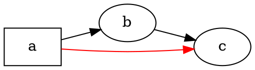

# Översikt

@knowvah/dot-engine är en rad-för-rad-portering av [Graphviz](https://graphviz.org/) till TypeScript:
DOT-källkod (eller en graf som byggts i kod) går in, SVG — eller JSON, xdot, DOT eller
en bildkarta — kommer ut, helt beräknat i TypeScript utan inbyggd
Graphviz-binär och utan WASM. Om du ännu inte har renderat något, börja med
[Kom igång](/sv/guide/getting-started); den här sidan är kartan som ligger
ovanför — vad biblioteket gör och vilken av dess tre ingångspunkter
du ska välja.

## Vad är DOT? Vad är Graphviz? {#what-is-dot-what-is-graphviz}

**DOT** är ett litet språk i ren text för att beskriva grafer — noder, kanter
och deras attribut:



Det är hela indataformatet: deklarera noder, förbind dem med `->` (riktad)
eller `--` (oriktad) och sätt attribut inom `[...]`. Den fullständiga grammatiken —
satser, delgrafer, portar, HTML-liknande etiketter och varje attribut — definieras
i den kanoniska **[DOT-språkreferensen](https://graphviz.org/doc/info/lang.html)**
(med den fullständiga [attributlistan](https://graphviz.org/doc/info/attrs.html) vid sidan
av). `@knowvah/dot-engine` tolkar det språket exakt som originalet — så all
DOT som C-verktygen godtar är DOT som det här biblioteket godtar.

**Graphviz** är det öppna verktygspaket för grafvisualisering som DOT skapades
för. Det föddes vid **AT&T Bell Labs** (Murray Hill, NJ) — en grundläggande teknisk
rapport av Eleftherios Koutsofios och Stephen North är daterad **1991** — och
underhålls i dag under **Eclipse Public License** (samma licens som den här
porteringen har). Det här biblioteket är en trogen nyimplementation i TypeScript; C-koden
är den specifikation vi matchar inom en snäv tolerans. För det ursprungliga
projektet:

- **[graphviz.org](https://graphviz.org/)** — den officiella projektwebbplatsen med dokumentation och
  referenser för DOT och attribut.
- **[gitlab.com/graphviz/graphviz](https://gitlab.com/graphviz/graphviz)** — den
  kanoniska C-källkod vi porterar från.
- **[Graphviz på Wikipedia](https://en.wikipedia.org/wiki/Graphviz)** — historik och
  bakgrund.

## Pipelinen

Varje rendering, oavsett vilken ingångspunkt som startar den, följer samma
mönster: skaffa en `Graph` (genom att tolka DOT eller bygga en programmatiskt), kör en
layoutmotor över den och antingen serialisera resultatet eller läs tillbaka den beräknade
geometrin från samma grafobjekt.

```graphviz
digraph pipeline {
  rankdir=LR;
  bgcolor="transparent";
  node [shape=box, style=rounded, fontname="Helvetica", fontsize=11];
  edge [fontname="Helvetica", fontsize=10];

  src  [label="DOT source"];
  api  [label="createGraph()"];
  g    [label="Graph"];
  eng  [label="layout engine\n(dot · neato · fdp · sfdp ·\ncirco · twopi · osage · patchwork)"];
  out  [label="SVG / JSON / xdot /\nDOT / imagemap"];
  snap [label="LayoutSnapshot\n(nodes, edges, bounds)"];

  src -> g [label="parse()"];
  api -> g [label=".graph"];
  g -> eng;
  eng -> out  [label="render()"];
  eng -> snap [label="getLayout()"];
}
```

Det finns inget separat anrop för att ”köra layout”: `renderSvg` och `render` utlöser
layout som en del av renderingen, och de beräknade koordinaterna (nodpositioner,
kantsplines, begränsningsruta) behålls på `Graph`-objektet efteråt.
`getLayout` kör inte om layouten — den läser geometri som ett tidigare `render`-anrop
redan har beräknat, så den anropas alltid *efter* `render`, på samma
graf.

## De tre ingångspunkterna — vilken dörr?

@knowvah/dot-engine levereras med tre ingångspunkter: rotpaketet återexporterar allt
från de andra två, så du behöver bara gå förbi det när du vill ha en
smalare importyta.

| Jag vill …                                            | Använd                                 |
|--------------------------------------------------------|-----------------------------------------|
| Göra om DOT-text till en SVG-sträng, snabbt             | `@knowvah/dot-engine` — `renderSvg(dot, engine)` |
| Tolka DOT utan att rendera det                          | `@knowvah/dot-engine` — `parse(dot)`             |
| Konfigurera textmätning eller bildupplösning globalt    | `@knowvah/dot-engine` — `setTextMeasurer`, `setImageSizer`, `setImageResolver` |
| Bygga en graf i kod, utan DOT-text                      | `@knowvah/dot-engine/api` — `createGraph`, `addEdge` |
| Läsa tillbaka beräknade positioner för noder/kanter/kluster | `@knowvah/dot-engine/api` — `getLayout`      |
| Rendera till ett annat format än SVG (JSON, xdot, DOT, bildkarta) | `@knowvah/dot-engine/render` — `render(g, format, opts?)` |
| Driva en egen canvas-/WebGL-/PDF-backend                | `@knowvah/dot-engine/render` — `getDrawOps`      |

`@knowvah/dot-engine/api` är dörren för att *bygga och inspektera*: konstruera en graf
programmatiskt och läs geometri från den. `@knowvah/dot-engine/render` är
dörren för *utdata*: gör om en graf (från antingen `parse()` eller byggaren) till
ett serialiserat format eller en strukturerad ström av ritoperationer. Rotpaketet
`@knowvah/dot-engine` återexporterar båda, plus bekvämlighetsfunktionen `renderSvg` för
engångsrendering och de globala konfigurationskrokarna — de flesta projekt importerar bara från
roten.

## Koordinatsystem, kortfattat

Graphviz inbyggda koordinater har y uppåt och origo nere till vänster — den
konvention som layoutmotorerna räknar i. De flesta skärm- och canvas-konsumenter
vill ha y nedåt och origo uppe till vänster. `getLayout` använder som standard `yAxis:
'down'` och vänder åt dig; de råa strängformaten (`svg`, `json`, `xdot`,
`plain`) bär de ursprungliga koordinaterna med y uppåt oförändrade. Se
[Läs beräknad geometri](/sv/guide/geometry) för hela koordinatreferensen,
och [Receptsamling](/sv/guide/recipes) för mönstret för att vända och förena när du
behöver blanda `getLayout`-utdata med ett rått formats koordinater.

## Omfattningsgräns

@knowvah/dot-engine renderar till SVG, JSON, xdot, DOT och HTML-bildkartor (`imap` /
`cmapx`) — de deterministiska, sträng- eller strukturbaserade utdataformaten. Det
producerar inga rasterbilder (PNG, JPEG) eller PDF och har ingen grafisk visare;
det ligger utanför ramen för en webbläsarsäker portering i ren TypeScript. Kända
skillnader mot den inbyggda Graphvizs beteende — inte luckor i utdataformat, utan
ställen där portens utdata avviker — spåras på sidan
[Avvikelser](/sv/divergences).

## Så går du vidare

- [Kom igång](/sv/guide/getting-started) — installera och rendera din första graf.
- [Layoutmotorer](/sv/guide/engines) — de åtta motorerna och när du använder var och en.
- [Bygg en graf i kod](/sv/guide/build-a-graph) — byggaren i `@knowvah/dot-engine/api`.
- [Läs beräknad geometri](/sv/guide/geometry) — `getLayout`, koordinatsystem, enheter.
- [Receptsamling](/sv/guide/recipes) — vanliga uppgiftsbaserade mönster.
- [Arbeta med bilder](/sv/guide/images) — `setImageSizer`, `setImageResolver`, infogning.
- [Typreferens](/sv/guide/types) — fullständiga former för varje exporterad typ.
- [API-referens](/reference/) — genererad dokumentation per symbol.
- [Ordlista](/sv/guide/glossary) — terminologi för Graphviz och @knowvah/dot-engine.
