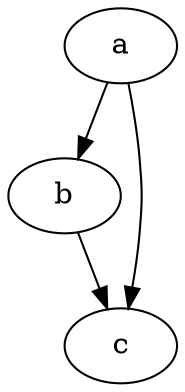

# Başlarken

@knowvah/dot-engine, [Graphviz](https://graphviz.org/)'in sadık bir TypeScript portudur.
DOT dilini ayrıştırır, Graphviz'in yerleşim motorlarını çalıştırır ve SVG üretir — saf
TypeScript ile, C olmadan: yerel Graphviz ikilisi yok, WASM portu yok.

::: tip Kitaplığa yeni misiniz?
Önce [Genel bakış](/tr/guide/overview) sayfasını okuyun — işlem hattını
(ayrıştır/oluştur → yerleşim → işle / geometriyi oku) ve üç giriş noktasını
(`@knowvah/dot-engine`, `@knowvah/dot-engine/api`, `@knowvah/dot-engine/render`) haritalar;
böylece kurulumdan önce hangi kapıyı kullanacağınızı bilirsiniz.
:::

## Kurulum

@knowvah/dot-engine npm'de yayımlanmıştır:

```bash
npm i @knowvah/dot-engine
```

Çalışma zamanı bağımlılığı yoktur. `canvas` paketi isteğe bağlı bir eş bağımlılıktır
(peer dependency); yalnızca Node'da ana makineye sadık metin ölçümü için gerekir —
bkz. [Metin ölçümü](/tr/guide/text-measurement). Paket üç giriş noktasıyla gelir
(`@knowvah/dot-engine`, `@knowvah/dot-engine/api`, `@knowvah/dot-engine/render`); her birinin
kendi `.d.ts` tür bildirimleri, bildirim eşlemeleri ve kaynak eşlemeleri vardır —
“tanıma git” gerçek TypeScript kaynağına atlar; kaynak, derlemenin yanında dağıtılır.

Bunun yerine kaynaktan derlemek için:

```bash
git clone https://github.com/knowvah/dot-engine.git
cd dot-engine
npm install
npm run build        # → dist/index.js (ESM bundle, via esbuild) + .d.ts
```

## Graf işleme

```ts
import { renderSvg } from '@knowvah/dot-engine';

const dot = `
  digraph {
    a -> b;
    b -> c;
    a -> c;
  }
`;

const svg = renderSvg(dot, 'dot');
console.log(svg); // <svg ...>...</svg>
```

`renderSvg(dotSource, engine)`, DOT kaynağını ayrıştırır, adı verilen
[yerleşim motorunu](/tr/guide/engines) çalıştırır, SVG'ye işler ve SVG dizgisini döndürür.

İşte aynı graf; bu sayfada motorun kendisi tarafından işlendi
([`@knowvah/vitepress-plugin-dot`](https://www.npmjs.com/package/@knowvah/vitepress-plugin-dot)
aracılığıyla):



DOT'a yeni misiniz? Graf tanımlamak için kullanılan küçük bir düz metin dilidir —
sözdizimi kılavuzu kanonik **[DOT dili referansıdır](https://graphviz.org/doc/info/lang.html)**;
[Genel bakış](/tr/guide/overview#what-is-dot-what-is-graphviz) sayfasında da tek
paragraflık bir başlangıç yazısı vardır.

## Sonraki adımlar

- [Genel bakış](/tr/guide/overview) — zihinsel model ve üç giriş noktası.
- [Yerleşim motorları](/tr/guide/engines) — sekiz motor ve her birinin ne zaman kullanılacağı.
- [Kodla graf oluşturma](/tr/guide/build-a-graph) — `createGraph` oluşturucusu.
- [Tarifler](/tr/guide/recipes) — göreve yönelik, çalıştırılabilir çözümler.
- [Hesaplanan geometriyi okuma](/tr/guide/geometry) — `getLayout` ile konumlar ve
  spline'lar.
- [Görsellerle çalışma](/tr/guide/images) — gömme, dağıtım ve CSP.
- [Türler](/tr/guide/types) — genel veri şekilleri ve birbirleriyle ilişkileri.
- [Tarayıcıda kullanım](/tr/guide/browser) — paketleme ve `setImageSizer` kancası.
- [API referansı](/tr/guide/api) — genel yüzeyin tamamı.
- [Deneme Alanı](/tr/playground) — DOT'u düzenleyin ve SVG'yi tarayıcınızda canlı görün.
