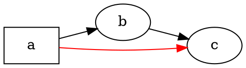

# Genel bakış

@knowvah/dot-engine, [Graphviz](https://graphviz.org/)'in satır satır bir TypeScript portudur:
DOT kaynak kodu (veya kodda oluşturulmuş bir graf) girer, SVG — ya da JSON, xdot, DOT veya
bir görüntü haritası — çıkar; her şey yerel Graphviz ikilisi ve WASM olmadan, tamamen
TypeScript ile hesaplanır. Henüz bir şey işlemediyseniz
[Başlarken](/tr/guide/getting-started) sayfasından başlayın; bu sayfa onun üzerinde
duran haritadır — kitaplığın ne yaptığını ve üç giriş noktasından hangisine
başvurmanız gerektiğini anlatır.

## DOT nedir? Graphviz nedir? {#what-is-dot-what-is-graphviz}

**DOT**, graf tanımlamak için kullanılan küçük, düz metin bir dildir — düğümler, kenarlar
ve öznitelikleri:



Girdi biçiminin tamamı budur: düğümleri bildirin, `->` (yönlü) veya `--` (yönsüz) ile
bağlayın ve öznitelikleri `[...]` içinde ayarlayın. Dilbilgisinin tamamı — deyimler, alt
graflar, portlar, HTML benzeri etiketler ve her öznitelik — kanonik
**[DOT dili referansında](https://graphviz.org/doc/info/lang.html)** tanımlanmıştır
(yanında tam [öznitelik listesi](https://graphviz.org/doc/info/attrs.html) vardır).
`@knowvah/dot-engine` bu dili özgün sürümle aynı şekilde ayrıştırır — yani C araçlarının
kabul ettiği her DOT, bu kitaplığın da kabul ettiği DOT'tur.

**Graphviz**, DOT'un kendisi için yaratıldığı açık kaynaklı graf görselleştirme
araç takımıdır. **AT&T Bell Labs**'te (Murray Hill, NJ) doğdu — Eleftherios Koutsofios ve
Stephen North'un temel bir teknik raporu **1991** tarihlidir — ve bugün **Eclipse Public
License** altında sürdürülmektedir (bu portun taşıdığı lisansla aynıdır). Bu kitaplık,
onun sadık bir TypeScript yeniden uygulamasıdır; C kodu, sıkı bir toleransla
eşleştirdiğimiz belirtimdir. Özgün proje için:

- **[graphviz.org](https://graphviz.org/)** — resmî proje sitesi; belgeler ile DOT ve
  öznitelik referansları burada.
- **[gitlab.com/graphviz/graphviz](https://gitlab.com/graphviz/graphviz)** — port ettiğimiz
  kanonik C kaynağı.
- **[Wikipedia'da Graphviz](https://en.wikipedia.org/wiki/Graphviz)** — tarihçe ve
  arka plan.

## İşlem hattı

Her işleme, hangi giriş noktası başlatırsa başlatsın aynı biçimi izler: bir `Graph` elde
edin (DOT'u ayrıştırarak veya programatik olarak oluşturarak), üzerinde bir yerleşim motoru
çalıştırın, ardından sonucu ya serileştirin ya da hesaplanan geometriyi aynı graf
nesnesinden geri okuyun.

```graphviz
digraph pipeline {
  rankdir=LR;
  bgcolor="transparent";
  node [shape=box, style=rounded, fontname="Helvetica", fontsize=11];
  edge [fontname="Helvetica", fontsize=10];

  src  [label="DOT source"];
  api  [label="createGraph()"];
  g    [label="Graph"];
  eng  [label="layout engine\n(dot · neato · fdp · sfdp ·\ncirco · twopi · osage · patchwork)"];
  out  [label="SVG / JSON / xdot /\nDOT / imagemap"];
  snap [label="LayoutSnapshot\n(nodes, edges, bounds)"];

  src -> g [label="parse()"];
  api -> g [label=".graph"];
  g -> eng;
  eng -> out  [label="render()"];
  eng -> snap [label="getLayout()"];
}
```

Ayrı bir “yerleşimi çalıştır” çağrısı yoktur: `renderSvg` ve `render`, yerleşimi
işlemenin bir parçası olarak tetikler; hesaplanan koordinatlar (düğüm konumları, kenar
spline'ları, sınırlayıcı kutu) sonrasında `Graph` nesnesi üzerinde saklanır. `getLayout`
yerleşimi yeniden çalıştırmaz — daha önceki bir `render` çağrısının zaten hesapladığı
geometriyi okur; bu yüzden her zaman `render` sonrasında, aynı graf üzerinde çağrılır.

## Üç giriş noktası — hangi kapı?

@knowvah/dot-engine üç giriş noktasıyla gelir: kök paket diğer ikisindeki her şeyi yeniden
dışa aktarır; bu yüzden yalnızca daha dar bir içe aktarma yüzeyi istediğinizde onun
ötesine geçmeniz gerekir.

| Yapmak istediğim…                                      | Kullanılacak                           |
|--------------------------------------------------------|-----------------------------------------|
| DOT metnini hızla bir SVG dizgisine çevirmek            | `@knowvah/dot-engine` — `renderSvg(dot, engine)` |
| DOT'u işlemeden ayrıştırmak                             | `@knowvah/dot-engine` — `parse(dot)`             |
| Metin ölçümünü veya görsel çözümlemeyi genel olarak yapılandırmak | `@knowvah/dot-engine` — `setTextMeasurer`, `setImageSizer`, `setImageResolver` |
| DOT metni olmadan kodda graf oluşturmak                 | `@knowvah/dot-engine/api` — `createGraph`, `addEdge` |
| Hesaplanan düğüm/kenar/küme konumlarını geri okumak     | `@knowvah/dot-engine/api` — `getLayout`          |
| SVG dışındaki bir biçime (JSON, xdot, DOT, görüntü haritası) işlemek | `@knowvah/dot-engine/render` — `render(g, format, opts?)` |
| Özel bir canvas/WebGL/PDF arka ucunu sürmek             | `@knowvah/dot-engine/render` — `getDrawOps`      |

`@knowvah/dot-engine/api`, *oluştur + incele* kapısıdır: programatik olarak bir graf
oluşturun ve geometriyi üzerinden okuyun. `@knowvah/dot-engine/render` ise *çıktı*
kapısıdır: bir grafı (`parse()` veya oluşturucudan gelen) serileştirilmiş bir biçime ya da
yapılandırılmış bir çizim işlemi akışına dönüştürür. Kök `@knowvah/dot-engine` paketi
ikisini de, ayrıca tek adımlık `renderSvg` kolaylık işlevini ve genel yapılandırma
kancalarını yeniden dışa aktarır — çoğu proje yalnızca kökten içe aktarır.

## Koordinat çerçeveleri, kısaca

Yerel graphviz koordinatları y-yukarı yönlüdür ve başlangıç noktası sol alttadır —
yerleşim motorlarının hesapladığı gelenek budur. Ekran ve canvas tüketicilerinin çoğu,
başlangıcı sol üstte olan y-aşağı yönlü düzeni ister. `getLayout` varsayılan olarak
`yAxis: 'down'` kullanır ve sizin için çevirir; ham dizgi biçimleri (`svg`, `json`, `xdot`,
`plain`) yerel y-yukarı koordinatları değiştirmeden taşır. Tam koordinat başvurusu için
bkz. [Hesaplanan geometriyi okuma](/tr/guide/geometry); `getLayout` çıktısını ham bir
biçimin koordinatlarıyla karıştırmanız gerektiğinde kullanılacak çevir-ve-uzlaştır
deseni için ise [Tarifler](/tr/guide/recipes) sayfasına bakın.

## Kapsam sınırı

@knowvah/dot-engine; SVG, JSON, xdot, DOT ve HTML görüntü haritalarına (`imap` /
`cmapx`) işler — deterministik, dizgi veya yapı tabanlı çıktı biçimleri. Raster görüntü
(PNG, JPEG) veya PDF üretmez ve GUI görüntüleyicisi yoktur; bunlar, tarayıcıda güvenle
çalışan saf TypeScript bir portun kapsamı dışındadır. Yerel Graphviz davranışından bilinen
farklar — çıktı biçimindeki eksikler değil, portun çıktısının ayrıştığı yerler —
[Farklılıklar](/tr/divergences) sayfasında izlenir.

## Sonraki adım

- [Başlarken](/tr/guide/getting-started) — kurun ve ilk grafınızı işleyin.
- [Yerleşim motorları](/tr/guide/engines) — sekiz motor ve her birinin ne zaman kullanılacağı.
- [Kodla graf oluşturma](/tr/guide/build-a-graph) — `@knowvah/dot-engine/api` oluşturucusu.
- [Hesaplanan geometriyi okuma](/tr/guide/geometry) — `getLayout`, koordinat çerçeveleri, birimler.
- [Tarifler](/tr/guide/recipes) — yaygın göreve dayalı desenler.
- [Görseller](/tr/guide/images) — `setImageSizer`, `setImageResolver`, gömme.
- [Türler referansı](/tr/guide/types) — dışa aktarılan her türün tam şekilleri.
- [API referansı](/reference/) — oluşturulmuş, sembol başına belgeler.
- [Sözlük](/tr/guide/glossary) — Graphviz ve @knowvah/dot-engine terminolojisi.
