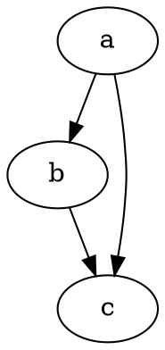

# 快速开始

@knowvah/dot-engine 是 [Graphviz](https://graphviz.org/) 的忠实 TypeScript 移植版。
它解析 DOT 语言，运行 Graphviz 的布局引擎，并输出 SVG——纯 TypeScript 实现，无需 C：
没有原生 Graphviz 二进制文件，也没有 WASM 移植版。

::: tip 初次接触这个库？
请先阅读[概览](/zh-cn/guide/overview)——它梳理了流水线
（解析/构建 → 布局 → 渲染 / 读取几何信息）以及三个入口点
（`@knowvah/dot-engine`、`@knowvah/dot-engine/api`、`@knowvah/dot-engine/render`），
让您在安装之前就知道该走哪个入口。
:::

## 安装

@knowvah/dot-engine 已发布到 npm：

```bash
npm i @knowvah/dot-engine
```

零运行时依赖。`canvas` 包是可选的对等依赖，仅在 Node 中需要与宿主字体一致的文本测量时才用到——
参见[文本测量](/zh-cn/guide/text-measurement)。该包提供三个入口点
（`@knowvah/dot-engine`、`@knowvah/dot-engine/api`、`@knowvah/dot-engine/render`），
每个入口都带有各自的 `.d.ts` 类型声明、声明映射和源映射——“跳转到定义”会直接进入真正的
TypeScript 源代码，源代码与构建产物一同发布。

如需改为从源代码构建：

```bash
git clone https://github.com/knowvah/dot-engine.git
cd dot-engine
npm install
npm run build        # → dist/index.js (ESM bundle, via esbuild) + .d.ts
```

## 渲染一个图

```ts
import { renderSvg } from '@knowvah/dot-engine';

const dot = `
  digraph {
    a -> b;
    b -> c;
    a -> c;
  }
`;

const svg = renderSvg(dot, 'dot');
console.log(svg); // <svg ...>...</svg>
```

`renderSvg(dotSource, engine)` 会解析 DOT 源代码，运行指定名称的
[布局引擎](/zh-cn/guide/engines)，渲染为 SVG，并返回 SVG 字符串。

下面就是这个图，由引擎本身在本页上渲染（通过
[`@knowvah/vitepress-plugin-dot`](https://www.npmjs.com/package/@knowvah/vitepress-plugin-dot)）：



刚接触 DOT？它是一种用于描述图的小型纯文本语言——权威的
**[DOT 语言参考](https://graphviz.org/doc/info/lang.html)** 是语法指南，
[概览](/zh-cn/guide/overview#what-is-dot-what-is-graphviz)中有一段简短的入门介绍。

## 后续步骤

- [概览](/zh-cn/guide/overview)——心智模型与三个入口点。
- [布局引擎](/zh-cn/guide/engines)——八种引擎及其适用场景。
- [用代码构建图](/zh-cn/guide/build-a-graph)——`createGraph` 构建器。
- [实践方案](/zh-cn/guide/recipes)——面向任务、可直接运行的解决方案。
- [读取计算出的几何信息](/zh-cn/guide/geometry)——通过 `getLayout` 获取位置与样条。
- [使用图像](/zh-cn/guide/images)——内联、部署与 CSP。
- [类型](/zh-cn/guide/types)——公共数据结构及其相互关系。
- [在浏览器中使用](/zh-cn/guide/browser)——打包与 `setImageSizer` 钩子。
- [API 参考](/zh-cn/guide/api)——完整的公共接口。
- [演练场](/zh-cn/playground)——在浏览器中编辑 DOT 并实时查看 SVG。
