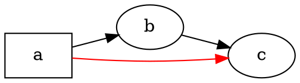

# 概览

@knowvah/dot-engine 是 [Graphviz](https://graphviz.org/) 的逐行 TypeScript 移植版：
输入 DOT 源代码（或在代码中构建的图），输出 SVG——或 JSON、xdot、DOT、图像映射（image map）——
全部在 TypeScript 中计算，无需原生 Graphviz 二进制文件，也无需 WASM。
如果您还没有渲染过任何内容，请先阅读[快速开始](/zh-cn/guide/getting-started)；
本页是位于其上的一张地图——说明这个库在做什么，以及三个入口点中该选哪一个。

## 什么是 DOT？什么是 Graphviz？ {#what-is-dot-what-is-graphviz}

**DOT** 是一种用于描述图的小型纯文本语言——包含节点、边及其属性：



这就是全部的输入格式：声明节点，用 `->`（有向）或 `--`（无向）连接它们，并在 `[...]` 中设置属性。
完整的语法——语句、子图、端口、类 HTML 标签以及每一个属性——都定义在权威的
**[DOT 语言参考](https://graphviz.org/doc/info/lang.html)** 中
（旁边还有完整的[属性列表](https://graphviz.org/doc/info/attrs.html)）。
`@knowvah/dot-engine` 对该语言的解析与上游完全一致——因此 C 版工具能接受的任何 DOT，
本库同样能接受。

**Graphviz** 是 DOT 为之而生的开源图可视化工具包。它起源于 **AT&T 贝尔实验室**
（新泽西州默里山）——Eleftherios Koutsofios 与 Stephen North 的一份奠基性技术报告
可追溯到 **1991** 年——如今在 **Eclipse Public License** 下维护（与本移植版采用的许可证相同）。
本库是对它的忠实 TypeScript 重新实现；C 代码就是规范，我们在严格的容差内与之保持一致。
关于原始项目：

- **[graphviz.org](https://graphviz.org/)**——官方项目网站，包含文档以及 DOT / 属性参考。
- **[gitlab.com/graphviz/graphviz](https://gitlab.com/graphviz/graphviz)**——
  我们所移植的权威 C 源代码。
- **[Wikipedia 上的 Graphviz](https://en.wikipedia.org/wiki/Graphviz)**——历史与背景。

## 流水线

无论由哪个入口点触发，每次渲染都遵循相同的流程：先得到一个 `Graph`
（通过解析 DOT 或以编程方式构建），在其上运行布局引擎，然后要么序列化结果，
要么从同一个图对象上读回计算出的几何信息。

```graphviz
digraph pipeline {
  rankdir=LR;
  bgcolor="transparent";
  node [shape=box, style=rounded, fontname="Helvetica", fontsize=11];
  edge [fontname="Helvetica", fontsize=10];

  src  [label="DOT source"];
  api  [label="createGraph()"];
  g    [label="Graph"];
  eng  [label="layout engine\n(dot · neato · fdp · sfdp ·\ncirco · twopi · osage · patchwork)"];
  out  [label="SVG / JSON / xdot /\nDOT / imagemap"];
  snap [label="LayoutSnapshot\n(nodes, edges, bounds)"];

  src -> g [label="parse()"];
  api -> g [label=".graph"];
  g -> eng;
  eng -> out  [label="render()"];
  eng -> snap [label="getLayout()"];
}
```

没有单独的“运行布局”调用：`renderSvg` 和 `render` 会在渲染过程中触发布局，
计算出的坐标（节点位置、边样条、边界框）随后保留在 `Graph` 对象上。
`getLayout` 不会重新运行布局——它读取先前 `render` 调用已经计算好的几何信息，
因此总是在 `render` 之后、针对同一个图调用。

## 三个入口点——该选哪一个？

@knowvah/dot-engine 提供三个入口点：根包会重新导出另外两个入口点的全部内容，
因此只有当您想要更窄的导入范围时，才需要越过它直接导入。

| 我想要… | 使用 |
|--------------------------------------------------------|-----------------------------------------|
| 快速把 DOT 文本变成 SVG 字符串 | `@knowvah/dot-engine` — `renderSvg(dot, engine)` |
| 只解析 DOT 而不渲染 | `@knowvah/dot-engine` — `parse(dot)` |
| 全局配置文本测量或图像解析 | `@knowvah/dot-engine` — `setTextMeasurer`、`setImageSizer`、`setImageResolver` |
| 在代码中构建图，不使用 DOT 文本 | `@knowvah/dot-engine/api` — `createGraph`、`addEdge` |
| 读回计算出的节点/边/簇位置 | `@knowvah/dot-engine/api` — `getLayout` |
| 渲染为 SVG 以外的格式（JSON、xdot、DOT、图像映射） | `@knowvah/dot-engine/render` — `render(g, format, opts?)` |
| 驱动自定义的 canvas/WebGL/PDF 后端 | `@knowvah/dot-engine/render` — `getDrawOps` |

`@knowvah/dot-engine/api` 是*构建 + 检查*入口：以编程方式构造图，并从中读取几何信息。
`@knowvah/dot-engine/render` 是*输出*入口：把图（来自 `parse()` 或构建器均可）
转换为序列化格式或结构化的绘制操作流。根包 `@knowvah/dot-engine` 会重新导出这两者，
外加一次性的便捷函数 `renderSvg` 和全局配置钩子——大多数项目只需从根包导入。

## 简述坐标系

Graphviz 原生坐标是 y 轴向上、原点在左下角——这是布局引擎计算时采用的约定。
大多数屏幕和 canvas 的使用者想要的是 y 轴向下、原点在左上角。`getLayout` 默认使用
`yAxis: 'down'`，并为您完成翻转；原始字符串格式（`svg`、`json`、`xdot`、`plain`）
则原样携带原生的 y 轴向上坐标。完整的坐标参考请参阅
[读取计算出的几何信息](/zh-cn/guide/geometry)；
需要把 `getLayout` 的输出与原始格式的坐标混用时，翻转并对齐的做法请参阅
[实践方案](/zh-cn/guide/recipes)。

## 范围边界

@knowvah/dot-engine 可渲染为 SVG、JSON、xdot、DOT 和 HTML 图像映射（`imap` / `cmapx`）——
即确定性的、基于字符串或结构的输出格式。它不生成位图图像（PNG、JPEG）或 PDF，
也没有 GUI 查看器；对于与浏览器兼容的纯 TypeScript 移植版而言，这些都不在范围之内。
与原生 Graphviz 行为的已知差异——并非输出格式上的缺失，而是该移植版输出与之不同的地方——
记录在[差异](/zh-cn/divergences)页面中。

## 接下来去哪里

- [快速开始](/zh-cn/guide/getting-started)——安装并渲染您的第一个图。
- [布局引擎](/zh-cn/guide/engines)——八种引擎及其适用场景。
- [用代码构建图](/zh-cn/guide/build-a-graph)——`@knowvah/dot-engine/api` 构建器。
- [读取计算出的几何信息](/zh-cn/guide/geometry)——`getLayout`、坐标系、单位。
- [实践方案](/zh-cn/guide/recipes)——常见的按任务组织的模式。
- [图像](/zh-cn/guide/images)——`setImageSizer`、`setImageResolver`、内联。
- [类型参考](/zh-cn/guide/types)——每个导出类型的完整结构。
- [API 参考](/reference/)——生成的逐符号文档。
- [术语表](/zh-cn/guide/glossary)——Graphviz 与 @knowvah/dot-engine 术语。
