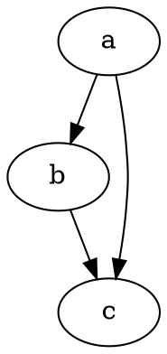

# 快速入門

@knowvah/dot-engine 是 [Graphviz](https://graphviz.org/) 的忠實 TypeScript 移植版。
它會解析 DOT 語言、執行 Graphviz 的版面配置引擎，並輸出 SVG——
全程使用純 TypeScript——不用 C：沒有原生 Graphviz 二進位檔，也沒有 WASM 移植版。

::: tip 初次接觸這個函式庫？
請先閱讀[概覽](/zh-tw/guide/overview)——它說明了處理管線
（解析／建構 → 版面配置 → 轉譯／讀取幾何資訊）以及三個進入點
（`@knowvah/dot-engine`、`@knowvah/dot-engine/api`、`@knowvah/dot-engine/render`），
讓您在安裝之前就知道該走哪一個入口。
:::

## 安裝 {#install}

@knowvah/dot-engine 已發佈在 npm 上：

```bash
npm i @knowvah/dot-engine
```

執行期零相依。`canvas` 套件是選用的對等相依套件，
僅在 Node 中需要貼近主機的文字量測時才用到——請參閱
[文字量測](/zh-tw/guide/text-measurement)。此套件提供三個進入點
（`@knowvah/dot-engine`、`@knowvah/dot-engine/api`、`@knowvah/dot-engine/render`），每個都附有
各自的 `.d.ts` 型別宣告、宣告對應檔與原始碼對應檔——「跳至定義」會直接跳進真正的
TypeScript 原始碼，原始碼與建置結果一併發佈。

若要改為從原始碼建置：

```bash
git clone https://github.com/knowvah/dot-engine.git
cd dot-engine
npm install
npm run build        # → dist/index.js (ESM bundle, via esbuild) + .d.ts
```

## 轉譯一張圖 {#render-a-graph}

```ts
import { renderSvg } from '@knowvah/dot-engine';

const dot = `
  digraph {
    a -> b;
    b -> c;
    a -> c;
  }
`;

const svg = renderSvg(dot, 'dot');
console.log(svg); // <svg ...>...</svg>
```

`renderSvg(dotSource, engine)` 會解析 DOT 原始碼、執行指名的
[版面配置引擎](/zh-tw/guide/engines)、轉譯為 SVG，並回傳 SVG 字串。

以下就是同一張圖，由引擎本身在本頁轉譯（透過
[`@knowvah/vitepress-plugin-dot`](https://www.npmjs.com/package/@knowvah/vitepress-plugin-dot)）：



初次接觸 DOT？它是一種用來描述圖的小型純文字語言——標準的
**[DOT 語言參考](https://graphviz.org/doc/info/lang.html)** 就是語法指南，而
[概覽](/zh-tw/guide/overview#what-is-dot-what-is-graphviz)
有一段簡短的入門說明。

## 後續步驟 {#next-steps}

- [概覽](/zh-tw/guide/overview)——心智模型與三個進入點。
- [版面配置引擎](/zh-tw/guide/engines)——八種引擎，以及各自的適用時機。
- [以程式碼建構圖](/zh-tw/guide/build-a-graph)——`createGraph` 建構器。
- [實作範例](/zh-tw/guide/recipes)——以任務為導向、可直接執行的解法。
- [讀取計算出的幾何資訊](/zh-tw/guide/geometry)——透過
  `getLayout` 取得位置與樣條。
- [使用圖片](/zh-tw/guide/images)——內嵌、部署與 CSP。
- [型別](/zh-tw/guide/types)——公開的資料形狀及其相互關係。
- [在瀏覽器中使用](/zh-tw/guide/browser)——打包與 `setImageSizer` 掛鉤。
- [API 參考](/zh-tw/guide/api)——完整的公開介面。
- [遊樂場](/zh-tw/playground)——在瀏覽器中編輯 DOT 並即時查看 SVG。
