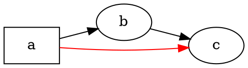

# 概覽

@knowvah/dot-engine 是 [Graphviz](https://graphviz.org/) 的逐行 TypeScript 移植版：
輸入 DOT 原始碼（或以程式碼建構的圖），輸出 SVG——或 JSON、xdot、DOT、
圖像地圖——全部以 TypeScript 計算，不需要原生 Graphviz 二進位檔，也不需要 WASM。
若您還沒轉譯過任何東西，請從[快速入門](/zh-tw/guide/getting-started)開始；
本頁是位於其上的地圖——說明這個函式庫在做什麼，以及該使用它的三個進入點中的哪一個。

## 什麼是 DOT？什麼是 Graphviz？ {#what-is-dot-what-is-graphviz}

**DOT** 是一種用來描述圖的小型純文字語言——包含節點、邊及其屬性：



這就是全部的輸入格式：宣告節點、以 `->`（有向）或 `--`（無向）連接它們，並在
`[...]` 中設定屬性。完整的文法——陳述式、子圖、連接埠、類 HTML 標籤，以及每一個屬性——
都定義在標準的 **[DOT 語言參考](https://graphviz.org/doc/info/lang.html)** 中
（旁邊另有完整的[屬性清單](https://graphviz.org/doc/info/attrs.html)）。
`@knowvah/dot-engine` 解析該語言的方式與上游完全相同——因此 C 版工具能接受的任何 DOT，
這個函式庫也都能接受。

**Graphviz** 是 DOT 當初為其而生的開放原始碼圖形視覺化工具組。它起源於
**AT&T 貝爾實驗室**（美國紐澤西州 Murray Hill）——由 Eleftherios Koutsofios 與
Stephen North 撰寫的一份奠基性技術報告可追溯至 **1991** 年——如今在
**Eclipse Public License** 下維護（與這個移植版採用的授權相同）。本函式庫是它的忠實
TypeScript 重新實作；C 程式碼就是規格，我們以嚴格的容許誤差與之相符。
關於原始專案：

- **[graphviz.org](https://graphviz.org/)**——官方專案網站，提供文件以及
  DOT／屬性參考。
- **[gitlab.com/graphviz/graphviz](https://gitlab.com/graphviz/graphviz)**——我們
  所移植的標準 C 原始碼。
- **[維基百科上的 Graphviz](https://en.wikipedia.org/wiki/Graphviz)**——歷史與
  背景。

## 處理管線 {#the-pipeline}

無論由哪個進入點觸發，每一次轉譯都遵循相同的流程：取得一個 `Graph`（透過解析 DOT 或以程式建構），
在其上執行版面配置引擎，然後序列化結果，或從同一個圖物件讀回計算出的幾何資訊。

```graphviz
digraph pipeline {
  rankdir=LR;
  bgcolor="transparent";
  node [shape=box, style=rounded, fontname="Helvetica", fontsize=11];
  edge [fontname="Helvetica", fontsize=10];

  src  [label="DOT source"];
  api  [label="createGraph()"];
  g    [label="Graph"];
  eng  [label="layout engine\n(dot · neato · fdp · sfdp ·\ncirco · twopi · osage · patchwork)"];
  out  [label="SVG / JSON / xdot /\nDOT / imagemap"];
  snap [label="LayoutSnapshot\n(nodes, edges, bounds)"];

  src -> g [label="parse()"];
  api -> g [label=".graph"];
  g -> eng;
  eng -> out  [label="render()"];
  eng -> snap [label="getLayout()"];
}
```

沒有獨立的「執行版面配置」呼叫：`renderSvg` 與 `render` 會在轉譯過程中觸發版面配置，
而計算出的座標（節點位置、邊樣條、邊界框）之後會保留在 `Graph` 物件上。
`getLayout` 不會重新執行版面配置——它讀取的是先前 `render` 呼叫已計算好的幾何資訊，
因此一律要在同一張圖上於 `render` *之後*呼叫。

## 三個進入點——該選哪一個？ {#the-three-entry-points-which-door}

@knowvah/dot-engine 提供三個進入點：根套件會重新匯出另外兩個的所有內容，
因此只有在您想要較窄的匯入範圍時，才需要繞過它。

| 我想要…                                            | 使用                                    |
|--------------------------------------------------------|-----------------------------------------|
| 快速把 DOT 文字轉成 SVG 字串                  | `@knowvah/dot-engine` — `renderSvg(dot, engine)` |
| 只解析 DOT 而不轉譯                          | `@knowvah/dot-engine` — `parse(dot)`             |
| 全域設定文字量測或圖片解析 | `@knowvah/dot-engine` — `setTextMeasurer`, `setImageSizer`, `setImageResolver` |
| 以程式碼建構圖，不使用 DOT 文字                      | `@knowvah/dot-engine/api` — `createGraph`, `addEdge` |
| 讀回計算出的節點／邊／叢集位置           | `@knowvah/dot-engine/api` — `getLayout`          |
| 轉譯成 SVG 以外的格式（JSON、xdot、DOT、圖像地圖） | `@knowvah/dot-engine/render` — `render(g, format, opts?)` |
| 驅動自訂的 canvas／WebGL／PDF 後端                  | `@knowvah/dot-engine/render` — `getDrawOps`      |

`@knowvah/dot-engine/api` 是*建構與檢視*的入口：以程式方式建構圖，並從中讀取幾何資訊。
`@knowvah/dot-engine/render` 是*輸出*的入口：把圖（來自 `parse()` 或建構器）轉成序列化格式，
或結構化的繪製操作串流。根套件 `@knowvah/dot-engine` 會重新匯出兩者，另外還有一次完成的
便利函式 `renderSvg` 以及全域設定掛鉤——大多數專案只會從根套件匯入。

## 座標系統簡介 {#coordinate-frames-briefly}

原生 Graphviz 座標是 y 軸向上、原點在左下角——這是版面配置引擎計算時採用的慣例。
大多數螢幕與 canvas 的使用端需要 y 軸向下、原點在左上角。`getLayout` 預設為 `yAxis:
'down'`，並會替您翻轉；原始的字串格式（`svg`、`json`、`xdot`、
`plain`）則原封不動地保留原生 y 軸向上的座標。完整的座標參考請見
[讀取計算出的幾何資訊](/zh-tw/guide/geometry)，而當您需要把 `getLayout` 的輸出與原始格式的座標混用時，
翻轉並對齊的做法請見[實作範例](/zh-tw/guide/recipes)。

## 範圍界線 {#scope-boundary}

@knowvah/dot-engine 可轉譯為 SVG、JSON、xdot、DOT 與 HTML 圖像地圖（`imap` /
`cmapx`）——也就是具確定性、以字串或結構為基礎的輸出格式。它不會產生點陣圖（PNG、JPEG）
或 PDF，也沒有圖形介面檢視器；對於可在瀏覽器中安全執行的純 TypeScript 移植版而言，
這些都不在範圍內。與原生 Graphviz 行為的已知差異——不是輸出格式上的缺口，
而是移植版輸出有所不同之處——記錄在
[已知差異](/zh-tw/divergences)頁面。

## 接下來看什麼 {#where-to-go-next}

- [快速入門](/zh-tw/guide/getting-started)——安裝並轉譯您的第一張圖。
- [版面配置引擎](/zh-tw/guide/engines)——八種引擎，以及各自的適用時機。
- [以程式碼建構圖](/zh-tw/guide/build-a-graph)——`@knowvah/dot-engine/api` 建構器。
- [讀取計算出的幾何資訊](/zh-tw/guide/geometry)——`getLayout`、座標系統、單位。
- [實作範例](/zh-tw/guide/recipes)——常見的任務導向做法。
- [圖片](/zh-tw/guide/images)——`setImageSizer`、`setImageResolver`、內嵌。
- [型別參考](/zh-tw/guide/types)——每個匯出型別的完整形狀。
- [API 參考](/reference/)——依符號產生的文件。
- [詞彙表](/zh-tw/guide/glossary)——Graphviz 與 @knowvah/dot-engine 的術語。
