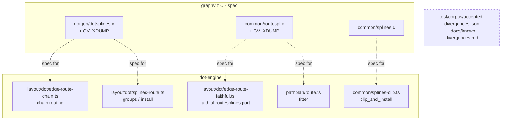

<!-- SPDX-License-Identifier: EPL-2.0 -->

# Suspect components

T6a writes land in the port boxes the RCA names; T6b writes land in `REG`.
Input `2621.dot` traits that shape suspicion: rankdir=BT (frame maps),
newrank=true (aux-edge ranking — see memory `newrank-minlen0-aux-edge-calloc`),
clusters (corridor windows), huge fan-in/fan-out rows (long-edge chains —
memory `long-edge-undersegment-done`, `hub-fanin-b100`).
