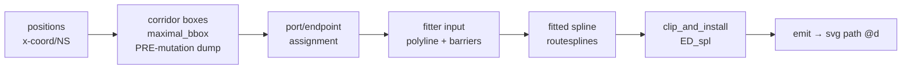
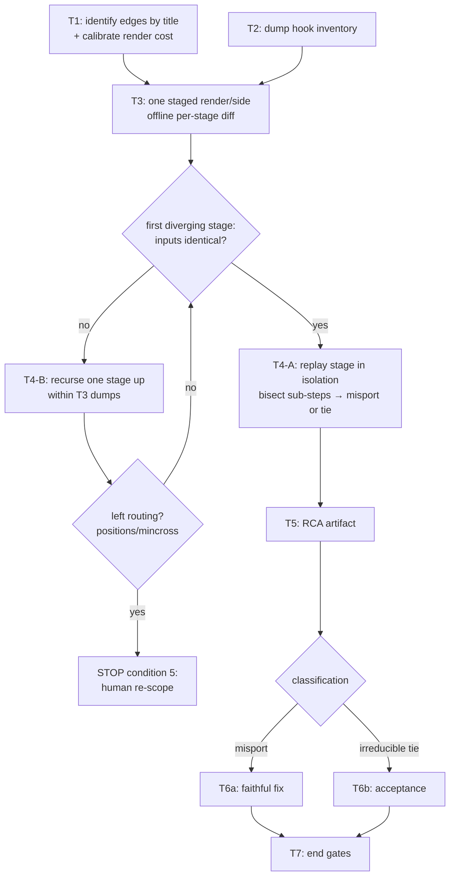

<!-- SPDX-License-Identifier: EPL-2.0 -->

# Route-stage pipeline and localization flow

## The dot spline pipeline stages (dump points)

```mermaid
flowchart LR
    A[positions<br/>x-coord/NS] --> B[corridor boxes<br/>maximal_bbox<br/>PRE-mutation dump]
    B --> C[port/endpoint<br/>assignment]
    C --> D[fitter input<br/>polyline + barriers]
    D --> E[fitted spline<br/>routesplines]
    E --> F[clip_and_install<br/>ED_spl]
    F --> G[emit → svg path @d]
```

## Localization decision flow

```mermaid
flowchart TD
    T1[T1: identify edges by title<br/>+ calibrate render cost] --> T3
    T2[T2: dump hook inventory] --> T3
    T3[T3: one staged render/side<br/>offline per-stage diff] --> Q{first diverging stage:<br/>inputs identical?}
    Q -- yes --> A[T4-A: replay stage in isolation<br/>bisect sub-steps → misport or tie]
    Q -- no --> B[T4-B: recurse one stage up<br/>within T3 dumps]
    B --> S{left routing?<br/>positions/mincross}
    S -- yes --> STOP[STOP condition 5:<br/>human re-scope]
    S -- no --> Q
    A --> T5[T5: RCA artifact]
    T5 --> R{classification}
    R -- misport --> T6a[T6a: faithful fix]
    R -- irreducible tie --> T6b[T6b: acceptance]
    T6a --> T7[T7: end gates]
    T6b --> T7
```
