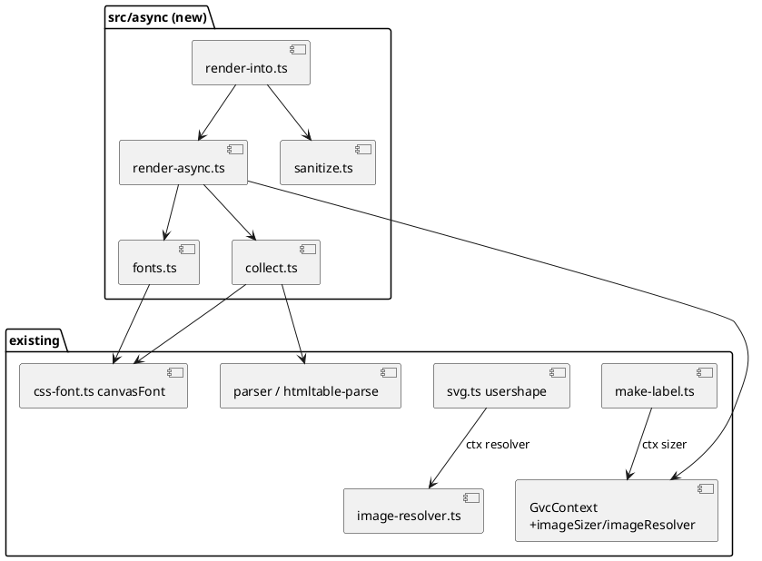

# Component map

```plantuml
@startuml
package "src/async (new)" {
  [render-async.ts] as RA
  [render-into.ts] as RI
  [collect.ts] as C
  [fonts.ts] as F
  [sanitize.ts] as S
}
package "existing" {
  [GvcContext\n+imageSizer/imageResolver] as CTX
  [make-label.ts] as ML
  [image-resolver.ts] as IR
  [svg.ts usershape] as SVG
  [css-font.ts canvasFont] as CF
  [parser / htmltable-parse] as P
}
RI --> RA
RI --> S
RA --> C
RA --> F
RA --> CTX
C --> P
C --> CF
F --> CF
ML --> CTX : ctx sizer
SVG --> IR : ctx resolver
@enduml
```
