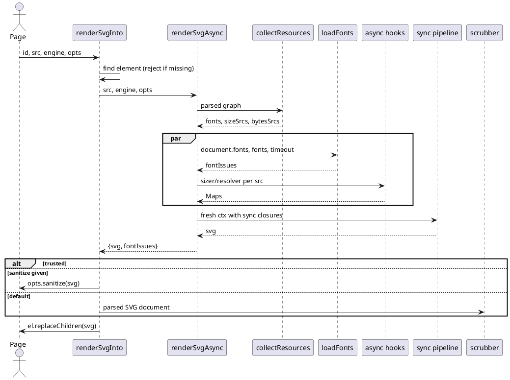

# Data flow: renderSvgInto

```plantuml
@startuml
actor Page
participant renderSvgInto as RI
participant renderSvgAsync as RA
participant collectResources as C
participant loadFonts as F
participant "async hooks" as H
participant "sync pipeline" as SP
participant scrubber as S
Page -> RI : id, src, engine, opts
RI -> RI : find element (reject if missing)
RI -> RA : src, engine, opts
RA -> C : parsed graph
C --> RA : fonts, sizeSrcs, bytesSrcs
par
  RA -> F : document.fonts, fonts, timeout
  F --> RA : fontIssues
  RA -> H : sizer/resolver per src
  H --> RA : Maps
end
RA -> SP : fresh ctx with sync closures
SP --> RA : svg
RA --> RI : {svg, fontIssues}
alt trusted
else sanitize given
  RI -> Page : opts.sanitize(svg)
else default
  RI -> S : parsed SVG document
end
RI -> Page : el.replaceChildren(svg)
@enduml
```
